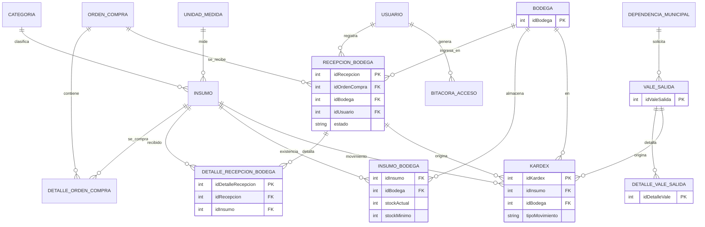

# Plan de Desarrollo — Módulo de Bodega y Recepción

**Proyecto:** Sistema Web para la Gestión de la Cadena de Suministro de Proveedores — Municipalidad de Panajachel
**Autor del proyecto:** Bryan Danilo de León Ixtán
**Fuentes:** DERCAS (versión final, 27/07/2026) y Tesis Final
**Fecha del plan:** 5 de octubre de 2026

---

## 1. Resumen y alcance del módulo

El módulo de **Bodega y Recepción** controla la entrada física de insumos, el almacenamiento y la consulta del inventario. Es el punto donde la Orden de Compra aprobada se convierte en existencias reales y donde se alimenta el **Kardex digital**.

### 1.1 Qué incluye (según DERCAS y prototipo)

| # | Funcionalidad | Origen |
|---|---|---|
| 1 | Registro de recepciones contra una Orden de Compra (completa, parcial o con novedades) | Proceso 6 del DERCAS; Prototipo "Nueva Recepción" |
| 2 | Verificación ítem por ítem: *Recibido / Rechazar / Faltante* | Prototipo |
| 3 | Actualización automática de stock al finalizar la recepción | Proceso crítico 2 |
| 4 | Kardex digital (entradas, salidas, saldo) con trazabilidad | Proceso crítico 5; ER: `KARDEX` |
| 5 | Inventario general consultable, con filtros | Módulo de Bodega y Recepción |
| 6 | Alertas de stock mínimo ("Crítico" / "Bajo") | Dashboard y Proceso crítico 5 |
| 7 | Comprobante de recepción (acta) | Tesis: caso de uso de recepción |
| 8 | Despacho con Vale de Salida (autorización y rebaja de stock) | Proceso crítico 4 (ver nota en 2.2) |
| 9 | Catálogos: bodegas, categorías, unidades de medida, insumos | ER |
| 10 | Bitácora de auditoría de cada acción | Proceso crítico 6 y 8 |

### 1.2 Qué queda fuera (Delimitaciones del DERCAS)

- Lectores de código de barras, RFID, básculas o sensores.
- Sub-almacenes o bodegas fuera del Almacén Municipal de Panajachel (el modelo permite varias `BODEGA`, pero solo se operará la bodega central).
- Migración de datos históricos en papel.
- Timbrado automático de vales sin firma de un usuario autorizado.
- Emisión de FEL, integración con SICOIN/Guatecompras, pagos y rastreo GPS.
- Acceso directo de la Contraloría: solo se generan reportes e historial.

---

## 2. Hallazgos en los documentos que conviene resolver antes de programar

Al cruzar el ER, el diccionario de datos y el stack encontré inconsistencias. Las decisiones que tomé en este plan están marcadas como **[Propuesta]**.

### 2.1 Tecnologías

| Tema | Qué dicen los documentos | Decisión del plan |
|---|---|---|
| Backend | El stack (sección Arquitectura y Figura 6 de la Tesis) indica **Node.js**, pero la *Revisión Documental* del DERCAS menciona **.NET Core** | Se usa **Node.js** (aparece en la descripción del stack y en el diagrama de arquitectura). Conviene corregir la mención de .NET Core en el DERCAS |
| Nube | El DERCAS lista **Azure**; el diagrama de la Tesis muestra **Railway** como infraestructura de aplicación (con Azure/Docker en gestión y despliegue) | Desplegar en **Railway** con contenedores Docker; Azure queda como alternativa. Confirmar con el asesor |
| Sintaxis SQL | El diccionario de datos usa `IDENTITY(1,1)` y `GETDATE()` (SQL Server) pero el motor es **PostgreSQL v15+** | Se traduce a PostgreSQL: `GENERATED ALWAYS AS IDENTITY` y `now()` |
| Framework Node / ORM | No se especifican | **[Propuesta]** Express + `pg` (o Prisma) |

### 2.2 Modelo de datos

El **diagrama ER** (Figura 10 de la Tesis / pág. 70 del DERCAS) es la referencia principal, pero difiere del diccionario de datos del DERCAS:

| Elemento | ER (diagrama) | Diccionario / Tesis | Decisión del plan |
|---|---|---|---|
| Bodega | `BODEGA` | No aparece | Se usa la del ER |
| Recepción | `RECEPCION_BODEGA` | `Recepción Insumo` con `estado` | Se usa el ER **y se agrega `estado`** [Propuesta] |
| Detalle de recepción | **No aparece** | `DetalleRecepcion` (cantidadRecibida, cantidadAceptada) | **Se agrega `DETALLE_RECEPCION_BODEGA`**: sin ella no se puede registrar recepción parcial ni rechazos [Propuesta] |
| Stock | `INSUMO` sin campos de stock | `Insumo.stockActual / stockMinimo` | **Se agrega `INSUMO_BODEGA`** (aparece en el diagrama de objetos de la Tesis) para stock por bodega y stock mínimo [Propuesta] |
| Movimientos | `KARDEX` (con stockAnterior/stockActual) | `MovimientoInventario` (con idUsuario, referencia) | Se usa `KARDEX` y se agrega `id_usuario` [Propuesta] |
| Vale de salida | **No aparece** | `Vale Salida` y `DetalleValeSalida` | El DERCAS describe el despacho como proceso crítico, por lo que se incluye como **Sprint 3**. Confirmar si entra en este entregable |

---

## 3. Stack tecnológico

### 3.1 Definido en los documentos

| Capa | Tecnología | Uso en el módulo |
|---|---|---|
| Frontend | **React**, HTML5, CSS3 | Pantallas del prototipo; consume JSON de la API |
| Backend | **Node.js** | API REST, reglas de negocio y transacciones |
| Base de datos | **PostgreSQL v15+** | Integridad referencial y transacciones ACID |
| Contenedores | **Docker** | Entorno reproducible (API, BD) |
| Control de versiones | **Git + GitHub** | Repositorio y ramas por funcionalidad |
| Pruebas de API | **Postman** | Colección de pruebas del módulo |
| Despliegue | **Railway / Azure** (ver 2.1), SSL/TLS | Publicación del servicio |
| Arquitectura | **MVC**, metodología **Scrum** | Organización del código y sprints |

### 3.2 Librerías complementarias **[Propuesta — no están en los documentos]**

| Área | Librería sugerida |
|---|---|
| API | Express, `cors`, `helmet` |
| Acceso a datos | `pg` + `node-pg-migrate` (o Prisma) |
| Validación | `zod` |
| Autenticación | `jsonwebtoken`, `bcrypt` |
| Frontend | Vite, React Router, TanStack Query, React Hook Form |
| Reportes | `pdfkit` (PDF), `exceljs` (Excel): el DERCAS pide exportar en ambos formatos |
| Pruebas | Jest + Supertest |

### 3.3 Estructura de carpetas sugerida (MVC)

```
bodega-module/
├── backend/
│   ├── src/
│   │   ├── config/            # db, env, logger
│   │   ├── middlewares/       # auth, permisos (RBAC), validación, errores
│   │   ├── models/            # acceso a datos (bodega, insumo, recepcion, kardex, vale)
│   │   ├── services/          # reglas de negocio y transacciones
│   │   ├── controllers/       # capa HTTP
│   │   ├── routes/
│   │   └── app.js
│   ├── migrations/            # DDL versionado
│   ├── seeds/                 # catálogos y datos de prueba
│   ├── tests/
│   └── Dockerfile
├── frontend/
│   └── src/
│       ├── pages/bodega/      # BodegaHome, Recepcion, Inventario, Kardex, Vales
│       ├── components/
│       ├── services/api.js
│       └── hooks/
├── docker-compose.yml
└── postman/Bodega.postman_collection.json
```

---

## 4. Modelo de datos del módulo (siguiendo el ER)

### 4.1 Diagrama del módulo

Las entidades marcadas con `*` son propuestas (ver sección 2.2). Las demás provienen del ER.



### 4.2 Diccionario de las tablas propias del módulo

| Tabla | Campos clave | Notas |
|---|---|---|
| `bodega` | id_bodega, nombre_bodega, ubicacion, encargado, activo | Del ER. Se carga una sola bodega (Almacén Municipal) |
| `insumo` | id_insumo, id_categoria, id_unidad_medida, codigo_insumo, nombre, descripcion, precio_referencial, activo | Del ER. `codigo_insumo` es el SKU que muestra el prototipo (ej. IN-001-PB) |
| `categoria`, `unidad_medida` | Ver ER | Catálogos |
| `insumo_bodega`* | (id_insumo, id_bodega) PK, stock_actual, stock_minimo | Reemplaza `stockActual/stockMinimo` del diccionario |
| `recepcion_bodega` | id_recepcion, id_orden_compra, id_bodega, id_usuario, numero_comprobante, fecha_recepcion, observaciones, **estado*** | Estados: `En Proceso`, `Completa`, `Parcial`, `Con Novedades`, `Cancelada` |
| `detalle_recepcion_bodega`* | id_detalle_recepcion, id_recepcion, id_insumo, cantidad_esperada, cantidad_recibida, cantidad_aceptada, estado_item, observacion | `estado_item`: `Pendiente`, `Recibido`, `Rechazado`, `Faltante` |
| `kardex` | id_kardex, id_insumo, id_bodega, id_recepcion, id_vale_salida*, tipo_movimiento, cantidad, stock_anterior, stock_actual, fecha_movimiento, id_usuario* | **Solo inserción** (inmutable) |
| `vale_salida`*, `detalle_vale_salida`* | Según diccionario del DERCAS | Estados: `Pendiente`, `Autorizado`, `Entregado`, `Cancelado` |

### 4.3 DDL en PostgreSQL

> En la base de datos se usa `snake_case` (PostgreSQL pliega a minúsculas los identificadores sin comillas). La API devuelve `camelCase` para coincidir con el ER y el diccionario.
> Se asume que ya existen `usuario`, `proveedor`, `orden_compra`, `detalle_orden_compra` y `dependencia_municipal` de otros módulos.

```sql
-- 001_catalogos_bodega.sql
CREATE TABLE bodega (
  id_bodega     INT GENERATED ALWAYS AS IDENTITY PRIMARY KEY,
  nombre_bodega VARCHAR(100) NOT NULL,
  ubicacion     VARCHAR(255),
  encargado     VARCHAR(100),
  activo        BOOLEAN NOT NULL DEFAULT TRUE
);

CREATE TABLE categoria (
  id_categoria   INT GENERATED ALWAYS AS IDENTITY PRIMARY KEY,
  descripcion    VARCHAR(100) NOT NULL UNIQUE,
  activo         BOOLEAN NOT NULL DEFAULT TRUE,
  fecha_registro TIMESTAMPTZ NOT NULL DEFAULT now()
);

CREATE TABLE unidad_medida (
  id_unidad_medida INT GENERATED ALWAYS AS IDENTITY PRIMARY KEY,
  descripcion      VARCHAR(50) NOT NULL UNIQUE,
  simbolo          VARCHAR(10) NOT NULL,
  activo           BOOLEAN NOT NULL DEFAULT TRUE
);

CREATE TABLE insumo (
  id_insumo         INT GENERATED ALWAYS AS IDENTITY PRIMARY KEY,
  id_categoria      INT NOT NULL REFERENCES categoria(id_categoria),
  id_unidad_medida  INT NOT NULL REFERENCES unidad_medida(id_unidad_medida),
  codigo_insumo     VARCHAR(30) NOT NULL UNIQUE,
  nombre            VARCHAR(100) NOT NULL,
  descripcion       VARCHAR(255),
  precio_referencial NUMERIC(12,2),
  activo            BOOLEAN NOT NULL DEFAULT TRUE,
  fecha_registro    TIMESTAMPTZ NOT NULL DEFAULT now()
);

-- 002_inventario.sql  [Propuesta: INSUMO_BODEGA]
CREATE TABLE insumo_bodega (
  id_insumo    INT NOT NULL REFERENCES insumo(id_insumo),
  id_bodega    INT NOT NULL REFERENCES bodega(id_bodega),
  stock_actual INT NOT NULL DEFAULT 0 CHECK (stock_actual >= 0),
  stock_minimo INT NOT NULL DEFAULT 0 CHECK (stock_minimo >= 0),
  PRIMARY KEY (id_insumo, id_bodega)
);

-- 003_recepcion.sql
CREATE TABLE recepcion_bodega (
  id_recepcion       INT GENERATED ALWAYS AS IDENTITY PRIMARY KEY,
  id_orden_compra    INT NOT NULL REFERENCES orden_compra(id_orden_compra),
  id_bodega          INT NOT NULL REFERENCES bodega(id_bodega),
  id_usuario         INT NOT NULL REFERENCES usuario(id_usuario),
  numero_comprobante VARCHAR(30) NOT NULL UNIQUE,
  fecha_recepcion    TIMESTAMPTZ NOT NULL DEFAULT now(),
  estado             VARCHAR(20) NOT NULL DEFAULT 'En Proceso'
    CHECK (estado IN ('En Proceso','Completa','Parcial','Con Novedades','Cancelada')),
  observaciones      TEXT
);

CREATE TABLE detalle_recepcion_bodega (
  id_detalle_recepcion INT GENERATED ALWAYS AS IDENTITY PRIMARY KEY,
  id_recepcion      INT NOT NULL REFERENCES recepcion_bodega(id_recepcion) ON DELETE CASCADE,
  id_insumo         INT NOT NULL REFERENCES insumo(id_insumo),
  cantidad_esperada INT NOT NULL CHECK (cantidad_esperada > 0),
  cantidad_recibida INT NOT NULL DEFAULT 0 CHECK (cantidad_recibida >= 0),
  cantidad_aceptada INT NOT NULL DEFAULT 0 CHECK (cantidad_aceptada >= 0),
  estado_item       VARCHAR(12) NOT NULL DEFAULT 'Pendiente'
    CHECK (estado_item IN ('Pendiente','Recibido','Rechazado','Faltante')),
  observacion       VARCHAR(255),
  CHECK (cantidad_aceptada <= cantidad_recibida),
  UNIQUE (id_recepcion, id_insumo)
);

-- 004_vales.sql  [Propuesta: Sprint 3]
CREATE TABLE vale_salida (
  id_vale_salida          INT GENERATED ALWAYS AS IDENTITY PRIMARY KEY,
  id_dependencia          INT NOT NULL REFERENCES dependencia_municipal(id_dependencia),
  id_usuario_solicitante  INT NOT NULL REFERENCES usuario(id_usuario),
  id_usuario_autoriza     INT REFERENCES usuario(id_usuario), -- NULL hasta autorizar
  fecha_salida            TIMESTAMPTZ NOT NULL DEFAULT now(),
  justificacion           TEXT,
  estado                  VARCHAR(20) NOT NULL DEFAULT 'Pendiente'
    CHECK (estado IN ('Pendiente','Autorizado','Entregado','Cancelado'))
);

CREATE TABLE detalle_vale_salida (
  id_detalle_vale INT GENERATED ALWAYS AS IDENTITY PRIMARY KEY,
  id_vale_salida  INT NOT NULL REFERENCES vale_salida(id_vale_salida) ON DELETE CASCADE,
  id_insumo       INT NOT NULL REFERENCES insumo(id_insumo),
  cantidad_salida INT NOT NULL CHECK (cantidad_salida > 0),
  observacion     VARCHAR(255)
);

-- 005_kardex.sql
CREATE TABLE kardex (
  id_kardex        BIGINT GENERATED ALWAYS AS IDENTITY PRIMARY KEY,
  id_insumo        INT NOT NULL REFERENCES insumo(id_insumo),
  id_bodega        INT NOT NULL REFERENCES bodega(id_bodega),
  id_recepcion     INT REFERENCES recepcion_bodega(id_recepcion),
  id_vale_salida   INT REFERENCES vale_salida(id_vale_salida),
  id_usuario       INT NOT NULL REFERENCES usuario(id_usuario),
  tipo_movimiento  VARCHAR(10) NOT NULL CHECK (tipo_movimiento IN ('Entrada','Salida','Ajuste')),
  cantidad         INT NOT NULL CHECK (cantidad > 0),
  stock_anterior   INT NOT NULL,
  stock_actual     INT NOT NULL CHECK (stock_actual >= 0),
  fecha_movimiento TIMESTAMPTZ NOT NULL DEFAULT now(),
  CHECK (
    (tipo_movimiento = 'Entrada' AND id_recepcion IS NOT NULL) OR
    (tipo_movimiento = 'Salida'  AND id_vale_salida IS NOT NULL) OR
    (tipo_movimiento = 'Ajuste')
  )
);
CREATE INDEX ix_kardex_insumo_fecha ON kardex (id_insumo, fecha_movimiento DESC);

-- El Kardex es un registro de auditoría: no se modifica ni se borra
CREATE FUNCTION kardex_inmutable() RETURNS trigger AS $$
BEGIN
  RAISE EXCEPTION 'El Kardex no admite UPDATE ni DELETE; corrija con un movimiento de ajuste';
END; $$ LANGUAGE plpgsql;

CREATE TRIGGER trg_kardex_inmutable
  BEFORE UPDATE OR DELETE ON kardex
  FOR EACH ROW EXECUTE FUNCTION kardex_inmutable();
```

> `tipo_movimiento = 'Ajuste'` es una **[Propuesta]** para las auditorías de inventario físico que menciona el DERCAS (contraste entre existencias teóricas y conteo real).

---

## 5. Reglas de negocio

### 5.1 Recepción de insumos (flujo del Proceso 6 del DERCAS)

```
Buscar OC aprobada/enviada → Crear recepción (En Proceso)
   → Verificar cada ítem (Recibido / Rechazar / Faltante)
   → Finalizar y cargar a inventario → Kardex + stock + comprobante
```

| Regla | Descripción |
|---|---|
| RN-01 | Solo se recibe contra una OC en estado `Aprobada` o `Enviada` |
| RN-02 | Al crear la recepción se precargan los ítems de `detalle_orden_compra` como `Pendiente` con `cantidad_esperada` |
| RN-03 | `cantidad_aceptada <= cantidad_recibida` y la suma aceptada acumulada por ítem no puede exceder lo ordenado (no se acepta sobre-recepción) |
| RN-04 | Estado final: **Completa** si todo lo ordenado fue aceptado; **Parcial** si hay faltantes; **Con Novedades** si hay rechazos o daños |
| RN-05 | Solo las cantidades **aceptadas** generan movimiento de `Entrada` en el Kardex |
| RN-06 | La OC pasa a `Entregada` cuando todo lo ordenado está aceptado; si no, permanece abierta para nuevas recepciones parciales **[Propuesta: estado intermedio `Recibida Parcial`]** |
| RN-07 | Los ítems `Rechazado` o `Faltante` exigen una observación (alimenta el historial y los reclamos al proveedor) |
| RN-08 | **Segregación de funciones:** el usuario que emitió la OC no puede registrar su recepción (Normas de Control Interno citadas en el DERCAS) |
| RN-09 | Finalizar es **atómico**: o se guardan recepción, Kardex, stock, estado de OC y bitácora, o no se guarda nada |

### 5.2 Kardex e inventario

| Regla | Descripción |
|---|---|
| RN-10 | Cada movimiento guarda `stock_anterior` y `stock_actual`; el saldo nunca es negativo |
| RN-11 | El Kardex es inmutable. Un error se corrige con un movimiento de `Ajuste` con justificación |
| RN-12 | Alerta **Crítico** si `stock_actual < 50 %` del mínimo; **Bajo** si `stock_actual <= stock_minimo` **[Propuesta: umbral inferido del prototipo, donde Papel Bond 12/50 = Crítico y Tóner 4/5 = Bajo. Confirmar con la Encargada de Inventario]** |

### 5.3 Vale de salida (Sprint 3)

| Regla | Descripción |
|---|---|
| RN-13 | Flujo: `Pendiente → Autorizado → Entregado` (o `Cancelado`) |
| RN-14 | Solo un usuario con permiso de autorización (jefe de la dependencia / responsable) puede autorizar |
| RN-15 | Al marcar `Entregado` se valida existencia, se rebaja stock y se registra `Salida` en Kardex, todo en una transacción |
| RN-16 | No hay timbrado automático: la firma/autorización la hace un usuario identificado (Delimitaciones) |

### 5.4 Transacción de finalización (esquema)

```js
// services/recepcion.service.js
async function finalizarRecepcion(idRecepcion, usuario) {
  const client = await pool.connect();
  try {
    await client.query('BEGIN');

    const recep = await recepcionModel.obtenerParaFinalizar(client, idRecepcion); // FOR UPDATE
    validarEstado(recep, 'En Proceso');
    validarSegregacion(recep.ordenCompra.idUsuario, usuario.id);   // RN-08

    for (const item of recep.detalle) {
      if (item.cantidadAceptada === 0) continue;
      // Bloquea la fila de existencia para evitar condiciones de carrera
      const ib = await inventarioModel.bloquear(client, item.idInsumo, recep.idBodega);
      const nuevo = ib.stockActual + item.cantidadAceptada;
      await inventarioModel.actualizarStock(client, ib, nuevo);
      await kardexModel.insertar(client, {
        idInsumo: item.idInsumo, idBodega: recep.idBodega, idRecepcion,
        tipoMovimiento: 'Entrada', cantidad: item.cantidadAceptada,
        stockAnterior: ib.stockActual, stockActual: nuevo, idUsuario: usuario.id
      });
    }

    const estado = calcularEstadoRecepcion(recep.detalle);          // RN-04
    await recepcionModel.cerrar(client, idRecepcion, estado);
    await ordenCompraModel.actualizarEstadoPorRecepcion(client, recep.idOrdenCompra); // RN-06
    await bitacoraModel.registrar(client, usuario.id, `Finaliza recepción ${idRecepcion}`);

    await client.query('COMMIT');
  } catch (e) {
    await client.query('ROLLBACK');
    throw e;
  } finally {
    client.release();
  }
}
```

---

## 6. API REST (Node.js)

Prefijo `/api`. Todas las rutas requieren JWT y permiso del submenú correspondiente.

| Recurso | Endpoint | Descripción |
|---|---|---|
| **Catálogos** | `GET/POST/PUT /bodegas`, `/categorias`, `/unidades-medida`, `/insumos` | CRUD; la baja es lógica (`activo = false`) |
| | `PUT /inventario/:idInsumo/stock-minimo` | Define el stock mínimo por bodega |
| **Inventario** | `GET /inventario?bodegaId=&categoriaId=&q=&bajoStock=` | Inventario general con filtros y paginación |
| | `GET /inventario/alertas` | Insumos en estado Crítico/Bajo (para el dashboard) |
| **OC pendientes** | `GET /ordenes-compra/pendientes-recepcion?numero=` | Búsqueda para "Nueva Recepción" |
| **Recepciones** | `POST /recepciones` | Crea la recepción `En Proceso` desde una OC |
| | `GET /recepciones?estado=&desde=&hasta=` | Historial reciente / completo |
| | `GET /recepciones/:id` | Detalle con ítems |
| | `PATCH /recepciones/:id/items/:idDetalle` | Marca Recibido / Rechazado / Faltante y cantidades |
| | `POST /recepciones/:id/finalizar` | Ejecuta la transacción (5.4) |
| | `POST /recepciones/:id/cancelar` | Solo si está `En Proceso` |
| | `GET /recepciones/:id/comprobante` | Comprobante/acta en PDF para imprimir |
| **Kardex** | `GET /kardex?insumoId=&bodegaId=&desde=&hasta=&tipo=` | Consulta de movimientos con saldo |
| | `POST /kardex/ajustes` | Ajuste por conteo físico (justificación obligatoria) |
| **Vales** | `POST /vales-salida` · `PATCH /vales-salida/:id/autorizar` · `/entregar` · `/cancelar` | Ciclo del vale (Sprint 3) |
| **Resumen** | `GET /bodega/resumen?mes=` | Recepciones exitosas, devoluciones/rechazos, órdenes pendientes |
| **Reportes** | `GET /reportes/existencias`, `/kardex`, `/consumo-dependencia` con `?formato=pdf\|xlsx` | Exportables para fiscalización |

Formato de error uniforme: `{ "codigo": "STOCK_INSUFICIENTE", "mensaje": "...", "detalle": {...} }`.

---

## 7. Frontend (React) — pantallas según el prototipo

| Pantalla (prototipo) | Ruta | Componentes principales |
|---|---|---|
| **Bodega y Recepción** (principal) | `/bodega` | `AlertasStock`, `ResumenMensual`, `RecepcionActiva`, `HistorialReciente`, botón *Nueva Recepción* |
| **Nueva Recepción** (modal) | modal en `/bodega` | Campos *N.º Orden de Compra* y *Proveedor*; botón *Cargar Orden para Recepción* (deja la OC en "EN PROCESO") |
| **Verificación de ítems** | `/bodega/recepciones/:id` | Tabla Producto/SKU · Esperado · botones **Recibido / Rechazar / Faltante**; *Cancelar Recepción*; **Finalizar y Cargar a Inventario** |
| **Inventario completo** | `/bodega/inventario` | Tabla con filtros, semáforo de stock, enlace al Kardex del insumo |
| **Kardex** | `/bodega/kardex` | Filtros por insumo/fecha, saldo acumulado, exportar |
| **Vales de salida** | `/bodega/vales` | Listado, creación y autorización |
| **Catálogos** | `/bodega/catalogos` | Bodegas, categorías, unidades, insumos |

Criterios de interfaz:

- Colores de estado coherentes con el prototipo: verde (Completo/Recibido), rojo (Rechazado/Crítico), ámbar (Faltante).
- Al pulsar *Rechazar* o *Faltante* se abre un campo de observación obligatorio (RN-07).
- Confirmación antes de *Finalizar*, con resumen de lo que se cargará.
- Los menús se muestran según los permisos de `MENU/SUBMENU/PERMISO` del ER.

---

## 8. Seguridad, roles y auditoría

El ER define `USUARIO → ROL → PERMISO → SUBMENU → MENU`, además de `BITACORA_ACCESO`.

| Rol (según DERCAS) | Permisos en Bodega |
|---|---|
| Encargado/a de Almacén y Suministros | Recepciones, inventario, Kardex, vales (entrega), catálogos |
| Encargado de Compras y asistente | Solo consulta de recepciones e inventario |
| DAFIM | Consulta de inventario, Kardex y reportes |
| Alcalde Municipal | Consulta y reportes |
| Dependencias municipales | Consulta de existencias; solicitud de vales |
| Soporte técnico | Catálogos y usuarios; sin movimientos de Kardex |

Medidas obligatorias:

1. JWT con expiración corta y contraseñas con `bcrypt` (el diccionario ya prevé `contrasenaHash`).
2. Middleware de permisos por ruta y acción (`ver`, `crear`, `finalizar`, `autorizar`).
3. Validación de entrada con `zod` y consultas parametrizadas (evita inyección SQL).
4. Bitácora de cada acción sensible: usuario, acción, IP y fecha.
5. HTTPS/TLS en producción (aparece en el diagrama de arquitectura).
6. Variables sensibles solo por entorno; nunca en el repositorio.

---

## 9. Plan de trabajo por sprints (Scrum)

El cronograma de la Tesis fija: pruebas del **21 al 30 de octubre**, manuales del 31 de octubre al 15 de noviembre, capacitación del 18 al 22 de noviembre y entrega oficial el **23 de noviembre de 2026**. El plan siguiente cabe en esa ventana. **Las fechas son indicativas**: ajústelas según lo que ya esté construido.

### Sprint 0 — Preparación (5–6 oct)

| Tarea | Entregable |
|---|---|
| Confirmar decisiones de la sección 2 (Node vs .NET, Railway vs Azure, tablas propuestas, vales de salida) | Acta de decisiones |
| Crear repositorio en GitHub, ramas `main` / `develop` / `feature/*` | Repositorio |
| `docker-compose` con API + PostgreSQL 15 | Entorno local reproducible |
| Configurar migraciones y seeds | Carpeta `migrations/` |
| Verificar dependencias de otros módulos: `usuario`, `rol/permiso`, `orden_compra`, `detalle_orden_compra` (o *seeds* temporales) | Datos de prueba de OC |

### Sprint 1 — Datos y catálogos (7–9 oct)

| Tarea | Entregable |
|---|---|
| Migraciones 001–003 (catálogos, `insumo_bodega`, recepción) | Esquema creado |
| Seeds: bodega central, categorías (construcción, papelería, limpieza), unidades, 15–20 insumos con stock mínimo | Datos base |
| CRUD de bodegas, categorías, unidades, insumos (API + pantallas) | Catálogos operativos |
| `GET /inventario` y `/inventario/alertas` | Inventario consultable |
| Pantalla de inventario con semáforo | Vista de inventario |
| Colección Postman v1 | Pruebas de API |

**Criterio de aceptación:** un usuario con rol Bodega ve el inventario filtrado por categoría y las alertas de stock bajo.

### Sprint 2 — Recepción de insumos (núcleo) (12–16 oct)

| Tarea | Entregable |
|---|---|
| Búsqueda de OC pendientes de recepción | Endpoint + modal *Nueva Recepción* |
| Crear recepción `En Proceso` con ítems precargados | `POST /recepciones` |
| Verificación de ítems (Recibido/Rechazar/Faltante, cantidades, observaciones) | Pantalla de verificación |
| Migración 005 (Kardex + trigger de inmutabilidad) | Tabla `kardex` |
| Transacción de finalización (5.4) con reglas RN-01 a RN-09 | `POST /recepciones/:id/finalizar` |
| Comprobante de recepción en PDF | `GET /recepciones/:id/comprobante` |
| Historial reciente y resumen mensual | Pantalla principal de Bodega |
| Pruebas unitarias e integración de las reglas | Reporte de pruebas |

**Criterios de aceptación:**

- *Dada* una OC con 3 ítems, *cuando* se marca 1 como Recibido completo, 1 como Rechazado y 1 como Faltante y se finaliza, *entonces* la recepción queda `Con Novedades`, solo el ítem aceptado genera una Entrada en Kardex y el stock sube exactamente esa cantidad.
- *Dada* una recepción finalizada, *cuando* se intenta modificar o borrar un movimiento del Kardex, *entonces* el sistema lo rechaza.
- *Dado* que el usuario emitió la OC, *cuando* intenta registrar su recepción, *entonces* el sistema lo impide (RN-08).
- *Dado* un fallo a mitad de la finalización, *entonces* no queda ningún dato parcial guardado.

### Sprint 3 — Kardex, vales de salida y alertas (19–23 oct)

| Tarea | Entregable |
|---|---|
| Consulta de Kardex por insumo, fecha y tipo, con saldo | `GET /kardex` + pantalla |
| Ajustes por conteo físico con justificación | `POST /kardex/ajustes` |
| Migración 004 (vales) y flujo Pendiente → Autorizado → Entregado | API + pantallas de vales |
| Salida de stock con validación de existencia (RN-15) | Rebaja y Kardex de Salida |
| Notificación de alertas en el dashboard general | Widget de stock bajo |

**Criterio de aceptación:** un vale autorizado y entregado rebaja el stock, genera la Salida en el Kardex y queda ligado a la dependencia solicitante; no se puede entregar más de lo existente.

### Sprint 4 — Reportes, pruebas y despliegue (26–30 oct)

| Tarea | Entregable |
|---|---|
| Reportes de existencias, Kardex y consumo por dependencia en **PDF y Excel** | Exportables |
| Pruebas de integración, rendimiento y seguridad/RBAC (fase "Prueba y mantenimiento" del cronograma) | Informe de pruebas |
| Despliegue en Railway con Docker y SSL/TLS; variables de entorno | Ambiente de producción |
| Pruebas piloto con la Encargada de Inventario (UAT) | Acta de aceptación |
| Corrección de hallazgos | Versión estable |

### Después (según cronograma de la Tesis)

- 31 oct – 8 nov: manual de usuario (Bodega incluida).
- 9 – 15 nov: manual técnico y de arquitectura.
- 18 – 22 nov: capacitación al personal de Almacén y Suministros.
- 23 nov: entrega oficial.

---

## 10. Estrategia de pruebas

| Nivel | Qué se prueba | Herramienta |
|---|---|---|
| Unitarias | Cálculo de estado de recepción, umbrales de alerta, validaciones | Jest |
| Integración | Transacción de finalización, trigger de Kardex, concurrencia (dos recepciones simultáneas del mismo insumo) | Jest + Supertest + PostgreSQL en Docker |
| API | Colección con casos positivos y negativos (permisos, datos inválidos, sobre-recepción) | Postman |
| Seguridad | Acceso sin token, acceso con rol incorrecto, inyección SQL en filtros | Postman / manual |
| Aceptación (UAT) | Flujo completo con datos reales de la bodega | Encargada de Inventario |

Casos críticos de regresión: recepción completa, parcial y con rechazos; OC con varias recepciones; vale con stock insuficiente; cancelación de recepción en proceso; el Kardex reproduce exactamente el saldo del inventario.

---

## 11. Despliegue y operación

| Elemento | Detalle |
|---|---|
| Contenedores | `Dockerfile` para API y frontend; `docker-compose` para desarrollo |
| Base de datos | PostgreSQL 15+ gestionado en Railway (o Azure); respaldos automáticos |
| CI/CD **[Propuesta]** | GitHub Actions: instalar, probar y desplegar al fusionar en `main` |
| Migraciones | Se ejecutan al desplegar, nunca a mano en producción |
| Conectividad | El DERCAS advierte cortes de internet por equipo de red antiguo: la interfaz debe mostrar errores claros y evitar perder una recepción en curso (guardado de cada ítem al marcarlo) |

---

## 12. Riesgos y mitigaciones

| Riesgo | Mitigación |
|---|---|
| Módulos de Compras/Órdenes aún sin terminar | Usar *seeds* de OC para avanzar y integrar después |
| Inconsistencias entre ER y diccionario | Cerrar las decisiones del Sprint 0 antes de migrar |
| Conexión inestable en la municipalidad | Guardado incremental; reintentos; mensajes claros |
| Poco tiempo del personal para validar (limitación del DERCAS) | Sesiones cortas con el prototipo; UAT al final de cada sprint |
| Retrasos por trámite de acceso a información (Unidad de Información Pública) | Solicitar con anticipación los formatos de Kardex y vales reales |
| Diferencias entre stock del sistema y existencias físicas al iniciar | Carga inicial de saldos mediante movimiento de `Ajuste` documentado (la migración de históricos en papel está fuera de alcance) |

---

## 13. Definición de terminado (Definition of Done)

- [ ] Migraciones aplicadas en limpio desde cero.
- [ ] Endpoints documentados y probados en Postman.
- [ ] Reglas RN-01 a RN-16 cubiertas con pruebas automatizadas.
- [ ] Ninguna operación de stock fuera de transacción.
- [ ] Todas las acciones sensibles registran bitácora.
- [ ] Permisos verificados por rol en backend y frontend.
- [ ] Reportes exportan a PDF y Excel.
- [ ] Desplegado con HTTPS y validado por la Encargada de Inventario.
- [ ] Documentación actualizada (manual de usuario y técnico).

---

## 14. Preguntas abiertas para confirmar

1. ¿El **Vale de Salida** forma parte de este entregable, dado que no aparece en el ER?
2. ¿Backend definitivo en **Node.js**? (el DERCAS menciona también .NET Core en un párrafo).
3. ¿Despliegue final en **Railway** o **Azure**?
4. ¿Se aprueban `DETALLE_RECEPCION_BODEGA` e `INSUMO_BODEGA` como ampliaciones del ER?
5. ¿Qué umbrales definen "Crítico" y "Bajo" para la Encargada de Inventario?
6. ¿Se acepta recepción de más unidades de las ordenadas, o se rechaza (RN-03)?
