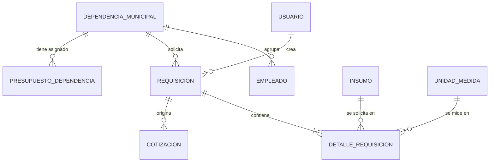
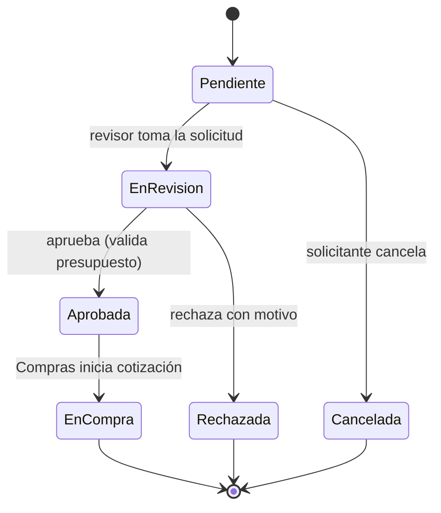

# Plan de desarrollo — Módulo de Dependencias y Solicitudes

**Proyecto:** Sistema Web para la Gestión de la Cadena de Suministro de Proveedores — Municipalidad de Panajachel
**Fuentes:** DERCAS (27/07/2026), Tesis Final y prototipo (pantallas "Dependencias y Solicitudes" y "Formulario de Solicitud")
**Metodología:** Scrum por sprints, arquitectura MVC

> Convención: lo marcado como **(propuesta)** es una recomendación mía que los documentos no mencionan. Queda a tu decisión.

---

## 1. Objetivo y alcance

**Qué dicen los documentos.** El "Módulo de Dependencias y Solicitudes" canaliza el levantamiento de necesidades de las áreas municipales: permite crear y gestionar formularios de solicitud de compra con ítem, cantidad, prioridad, justificación y lugar de entrega, **validando en tiempo real el presupuesto asignado disponible** para cada unidad. El DERCAS agrega que el sistema notifica el estado del trámite al departamento solicitante y verifica que la cantidad esté justificada para evitar duplicidad o sobrecostos. El catálogo de dependencias se administra desde el módulo de Configuración.

**Dentro del alcance**

- Catálogo de dependencias municipales (DMP, DMM, DIGAM, OMSAN, DAFIM, Secretaría, Oficina de Agua, Obras Públicas, etc.).
- Registro de solicitudes de compra (requisiciones) con sus ítems.
- Validación de presupuesto disponible por dependencia.
- Flujo de estados: creación, revisión, aprobación o rechazo.
- Listado maestro agrupado por dependencia, con filtros, KPIs, impresión y exportación.
- Bitácora de las acciones.

**Fuera del alcance de este módulo**

- Cotización, comparativo de proformas y orden de compra (módulo de Proformas).
- Facturación y pagos, y recepción en bodega.
- Certificación presupuestaria formal ante DAFIM/SICOIN: el DERCAS excluye la integración con SICOIN, por lo que aquí solo se controla el saldo interno.

## 2. Dependencias con otros módulos

- **Usuarios:** se asume que ya existen `usuario`, `rol`, `permiso`, `empleado`, `authenticate`, `authorize` y la bitácora. El empleado pertenece a una dependencia, y de ahí sale la dependencia por defecto del solicitante.
- **Insumos / Bodega:** las solicitudes referencian `INSUMO`, `CATEGORIA` y `UNIDAD_MEDIDA`. Si ese catálogo aún no existe, hay que crearlo antes del Sprint 3 (ver sección 9).

## 3. Stack tecnológico (según los documentos)

| Capa | Tecnología |
|---|---|
| Frontend | React, HTML5, CSS3 (diseño responsivo) |
| Backend | Node.js, API REST con JSON |
| Base de datos | PostgreSQL 15+ |
| Despliegue | Docker, Microsoft Azure; el diagrama muestra Railway con SSL/TLS |
| Versiones y pruebas | Git, GitHub, Postman |

**Complementos sugeridos (propuesta):** `zod` para validación, `Jest` + `Supertest` para pruebas, y una librería de exportación a CSV/PDF (por ejemplo `json2csv` y `pdfkit`) para los botones de imprimir y descargar.

## 4. Modelo entidad-relación

### 4.1 Lo que define el ER de la tesis

| Entidad | Atributos (según el ER) |
|---|---|
| `DEPENDENCIA_MUNICIPAL` | **idDependencia** PK, nombreDependencia, ubicacion, activo, fechaRegistro |
| `REQUISICION` | **idRequisicion** PK, idUsuario FK, idDependencia FK, codigoRequisicion, justificacion (TEXT), estado, fechaSolicitud |
| `EMPLEADO` | idDependencia FK (ya definido en el módulo de Usuarios) |
| `INSUMO` | idInsumo PK, idCategoria FK, idUnidadMedida FK, codigoInsumo, nombre, descripcion, precioReferencial, activo |
| `CATEGORIA`, `UNIDAD_MEDIDA` | Catálogos de apoyo |

El diagrama muestra además que `REQUISICION` se relaciona con `COTIZACION` (módulo de Proformas). El recorte del ER que aparece en la tesis no muestra el detalle de la requisición.

### 4.2 Lo que el ER no cubre y el módulo necesita

| Requisito documentado o del prototipo | Falta en el ER | Cambio propuesto |
|---|---|---|
| Ítems de la solicitud (ítem, cantidad, observaciones) | No se ve tabla de detalle | `detalle_requisicion`, equivalente a `DetalleSolicitud` del diccionario del DERCAS |
| Prioridad (Baja/Media/Alta/Urgente) | No existe | `requisicion.prioridad` |
| "Validar presupuesto asignado disponible" y "Estado de Presupuesto: Q 4.5M, 64% ejecutado" | No existe ninguna entidad de presupuesto | `presupuesto_dependencia` por dependencia y período fiscal (la sección de Configuración menciona el "período fiscal activo") |
| Lugar de entrega | No existe | `requisicion.lugar_entrega` |
| Tipo de solicitud ("Compra de Materiales") | No existe | `requisicion.tipo_solicitud` o catálogo `tipo_solicitud` |
| Notas para aprobación | No existe | `requisicion.notas_aprobacion` |

### 4.3 Diferencias entre fuentes (resolver antes de codificar)

| # | Situación | Criterio del plan |
|---|---|---|
| D-1 | El ER llama a la entidad `REQUISICION` con `codigoRequisicion`; el DERCAS la llama `SolicitudCompra` y el prototipo muestra códigos `#SC-2024-042`. | Tabla `requisicion` (sigue el ER). El código se genera con el formato `SC-AAAA-NNN` del prototipo. |
| D-2 | Estados distintos: DERCAS `Pendiente / Aprobada / Rechazada / En Compra`; prototipo `En Revisión / Aprobado / Pagado`. | Un solo conjunto, en la sección 5.3. Hay que confirmarlo con el Encargado de Compras. |
| D-3 | Prioridad: DERCAS `Baja / Normal / Alta / Urgente`; prototipo `Baja / Media / Urgente`. | Uso `Baja / Media / Alta / Urgente`; confirma si "Media" reemplaza a "Normal". |
| D-4 | El prototipo captura **un ítem por solicitud** (nombre libre, cantidad, unidad), mientras el DERCAS modela solicitud con varios detalles ligados a `INSUMO`. | El modelo soporta varios ítems; la primera versión de la interfaz puede mostrar uno, como el prototipo. El ítem se elige del catálogo de insumos o, si no existe, se escribe en `descripcion_libre` **(propuesta)**. |
| D-5 | El DERCAS usa sintaxis de SQL Server (`IDENTITY`, `GETDATE()`) y menciona .NET en la factibilidad; el stack es Node.js y PostgreSQL. | Se adapta a PostgreSQL y Node.js. |

## 5. Base de datos

### 5.1 Relaciones



### 5.2 Migración PostgreSQL

Las tablas `dependencia_municipal`, `empleado` y `usuario` ya salen del módulo de Usuarios. Aquí solo se agregan o amplían las del módulo. Si el catálogo de insumos aún no existe, ver la sección 9.

```sql
-- 020_modulo_dependencias.sql  (PostgreSQL 15+)

-- Ajustes al catálogo de dependencias
ALTER TABLE dependencia_municipal
  ADD COLUMN IF NOT EXISTS siglas VARCHAR(10) UNIQUE;          -- DMP, DAFIM, OMSAN...

CREATE TABLE periodo_fiscal (
  id_periodo   INT GENERATED ALWAYS AS IDENTITY PRIMARY KEY,
  anio         INT NOT NULL UNIQUE,
  activo       BOOLEAN NOT NULL DEFAULT FALSE
);
CREATE UNIQUE INDEX uq_periodo_activo ON periodo_fiscal (activo) WHERE activo;

CREATE TABLE presupuesto_dependencia (
  id_presupuesto INT GENERATED ALWAYS AS IDENTITY PRIMARY KEY,
  id_dependencia INT NOT NULL REFERENCES dependencia_municipal(id_dependencia),
  id_periodo     INT NOT NULL REFERENCES periodo_fiscal(id_periodo),
  monto_asignado NUMERIC(12,2) NOT NULL CHECK (monto_asignado >= 0),
  UNIQUE (id_dependencia, id_periodo)
);

CREATE TABLE requisicion (
  id_requisicion     INT GENERATED ALWAYS AS IDENTITY PRIMARY KEY,
  codigo_requisicion VARCHAR(20) NOT NULL UNIQUE,             -- SC-2026-001
  id_usuario         INT NOT NULL REFERENCES usuario(id_usuario),
  id_dependencia     INT NOT NULL REFERENCES dependencia_municipal(id_dependencia),
  id_periodo         INT NOT NULL REFERENCES periodo_fiscal(id_periodo),
  tipo_solicitud     VARCHAR(40) NOT NULL DEFAULT 'Compra de Materiales',
  justificacion      TEXT NOT NULL,
  lugar_entrega      VARCHAR(150),
  prioridad          VARCHAR(10) NOT NULL DEFAULT 'Media'
                     CHECK (prioridad IN ('Baja','Media','Alta','Urgente')),
  estado             VARCHAR(15) NOT NULL DEFAULT 'Pendiente'
                     CHECK (estado IN ('Pendiente','En Revisión','Aprobada','Rechazada','En Compra','Cancelada')),
  monto_estimado     NUMERIC(12,2) NOT NULL DEFAULT 0 CHECK (monto_estimado >= 0),
  notas_aprobacion   TEXT,
  id_usuario_revisor INT REFERENCES usuario(id_usuario),
  fecha_solicitud    TIMESTAMP NOT NULL DEFAULT now(),
  fecha_resolucion   TIMESTAMP
);

CREATE TABLE detalle_requisicion (
  id_detalle         INT GENERATED ALWAYS AS IDENTITY PRIMARY KEY,
  id_requisicion     INT NOT NULL REFERENCES requisicion(id_requisicion) ON DELETE CASCADE,
  id_insumo          INT REFERENCES insumo(id_insumo),
  descripcion_libre  VARCHAR(150),
  id_unidad_medida   INT NOT NULL REFERENCES unidad_medida(id_unidad_medida),
  cantidad           NUMERIC(12,2) NOT NULL CHECK (cantidad > 0),
  precio_estimado    NUMERIC(12,2) NOT NULL DEFAULT 0,
  observaciones      VARCHAR(255),
  CHECK (id_insumo IS NOT NULL OR descripcion_libre IS NOT NULL)
);

CREATE INDEX idx_req_dependencia ON requisicion (id_dependencia, fecha_solicitud DESC);
CREATE INDEX idx_req_estado      ON requisicion (estado);
CREATE INDEX idx_det_req         ON detalle_requisicion (id_requisicion);
```

### 5.3 Estados y transiciones



`En Compra` lo cambia el módulo de Proformas; la transición queda como contrato entre módulos. El estado "Pagado" del prototipo pertenece a Facturación y no se escribe aquí.

### 5.4 Presupuesto disponible

```
disponible = monto_asignado − (suma de monto_estimado de requisiciones
              Aprobadas o En Compra del período activo de esa dependencia)
```

- Se calcula con una consulta; **no se guarda** como columna, para evitar que quede desfasado.
- Es lo que muestra el recuadro verde "Presupuesto restante" del formulario, y el avance del 64 % del encabezado (ejecutado ÷ presupuesto total).
- Sobre qué cuenta como "ejecutado" (aprobado, comprometido o pagado) hay que definir una regla con DAFIM, ver D-6 en la sección 10.

### 5.5 Datos semilla

- **Dependencias**: DMP, DMM, DIGAM, OMSAN, DAFIM, Secretaría, Oficina de Agua, Obras Públicas, Compras y Almacén (las que citan los documentos y el prototipo).
- **Período fiscal 2026** activo y presupuesto de ejemplo por dependencia solo para desarrollo.
- **Menú "Dependencias"** y su submenú, con permisos para Administrador, Compras, DAFIM y las propias dependencias solicitantes.

## 6. Backend (rutas `/api`)

### 6.1 Estructura

```
backend/src/
├── routes/        dependencias.routes.js, requisiciones.routes.js
├── controllers/   dependencias.controller.js, requisiciones.controller.js
├── services/
│   ├── dependencias.service.js
│   ├── requisiciones.service.js      # reglas, estados, código SC-AAAA-NNN
│   └── presupuesto.service.js        # disponible, ejecutado, validación
├── repositories/  dependencias.repository.js, requisiciones.repository.js
├── validators/
└── migrations/020_modulo_dependencias.sql
```

### 6.2 Endpoints

| Método | Ruta | Descripción |
|---|---|---|
| GET / POST | `/api/dependencias` | Lista y alta de dependencias |
| GET / PUT | `/api/dependencias/:id` | Detalle y edición |
| PATCH | `/api/dependencias/:id/estado` | Activar o desactivar |
| GET | `/api/dependencias/:id/presupuesto` | Asignado, ejecutado y disponible del período activo |
| GET | `/api/presupuesto/resumen` | Presupuesto total y % ejecutado (tarjeta "Estado de Presupuesto") |
| PUT | `/api/dependencias/:id/presupuesto` | Asignar o ajustar el monto del período (rol DAFIM/Admin) |
| GET | `/api/requisiciones` | Listado maestro. Filtros: `dependencia`, `estado`, `prioridad`, `desde`, `hasta`, búsqueda, paginación; agrupable por dependencia |
| GET | `/api/requisiciones/resumen` | KPIs: total, pendientes (con promedio de días), monto solicitado del mes, % ejecución |
| GET | `/api/requisiciones/:id` | Detalle con ítems y bitácora de estados ("Ver") |
| POST | `/api/requisiciones` | Crea la solicitud con sus ítems |
| PUT | `/api/requisiciones/:id` | Edita mientras esté `Pendiente` |
| PATCH | `/api/requisiciones/:id/estado` | Revisa, aprueba, rechaza o cancela, con notas |
| GET | `/api/requisiciones/exportar` | CSV/PDF del listado filtrado (botones imprimir y descargar) |
| GET | `/api/tipos-solicitud`, `/api/unidades-medida` | Catálogos para los selectores del formulario |

Todas pasan por `authenticate` y `authorize`; los listados de una dependencia solicitante se filtran siempre por su propia dependencia.

### 6.3 Flujo de `POST /api/requisiciones`

1. Validar entrada: dependencia activa, cantidad mayor que 0, justificación obligatoria, unidad válida, ítem del catálogo o descripción libre.
2. Forzar la dependencia del solicitante si su rol no es de Compras, DAFIM o Administrador.
3. **Abrir transacción.**
4. Calcular `monto_estimado` (cantidad × precio estimado de cada ítem).
5. Consultar el presupuesto disponible. Si el monto lo supera, rechazar con `422` y mostrar el saldo; así se cumple la "validación en tiempo real" del DERCAS.
6. Generar el código `SC-AAAA-NNN` con una secuencia por año, dentro de la transacción, para no repetir números con usuarios concurrentes.
7. Insertar `requisicion` y `detalle_requisicion`; registrar en bitácora.
8. Confirmar y notificar a quien revisa **(propuesta: notificación en el sistema; correo opcional)**.

### 6.4 Reglas de negocio

1. Una solicitud solo se edita o cancela en `Pendiente`.
2. Aprobar o rechazar requiere el rol autorizado (DAFIM/Alcalde según el flujo del DERCAS) y deja usuario, fecha y notas; **rechazar exige motivo**.
3. Al aprobar se vuelve a validar el presupuesto, porque el saldo pudo cambiar desde que se creó.
4. Una dependencia desactivada no recibe nuevas solicitudes, pero conserva su historial. **No se borran dependencias ni solicitudes.**
5. La solicitud no cambia de dependencia después de creada.
6. Toda transición de estado queda en bitácora, con el estado anterior y el nuevo, para la trazabilidad que pide la fiscalización.
7. "Sin duplicidad" (DERCAS): al crear, advertir si la misma dependencia pidió el mismo ítem en los últimos N días **(propuesta: N = 30)**. Es una advertencia, no un bloqueo.

## 7. Frontend (React)

### 7.1 Archivos sugeridos

Siguen la convención usada en el módulo de Proveedores:

| Archivo | Responsabilidad |
|---|---|
| `api/dependencias.ts`, `api/requisiciones.ts` | Cliente HTTP y tipos de las respuestas |
| `useDependenciasController.ts` | Estado de la pantalla: listado, filtros, KPIs, presupuesto, paginación |
| `DependenciasView` | Pantalla "Dependencias y Solicitudes" |
| `SolicitudFormModal` | "Formulario de Solicitud" |
| `SolicitudDetalle` | Vista de "Ver" con ítems e historial de estados |
| `ConfigDependenciasView` | Administración del catálogo, dentro de Configuración |

### 7.2 Comportamiento esperado, según el prototipo

- **Filtro por dependencia** ("Todas las Dependencias") y buscador superior.
- **Tarjeta "Estado de Presupuesto"** con barra de avance, % ejecutado y total, desde `/presupuesto/resumen`.
- **Listado maestro agrupado por dependencia** (filas de encabezado en verde), con columnas código, ítem, cantidad con unidad, prioridad, estado (insignias de color), fecha y acciones "Ver" y menú ⋮. Paginación ("Mostrando 1–5 de 15") y botones de imprimir y descargar.
- **Tarjetas inferiores:** Total solicitudes (con comparación contra el mes anterior), Pendientes (con promedio de días), Monto solicitado del mes y Ejecución.
- **Formulario:** dependencia/unidad, tipo de solicitud, nombre del ítem, cantidad, unidad, justificación, **recuadro de presupuesto restante que se actualiza al cambiar la dependencia o el monto**, y notas para aprobación. Botón deshabilitado si el monto excede el saldo.
- **Notificaciones** (toast) de éxito o error, confirmación antes de cancelar o rechazar, y estados de carga, vacío y error, por la conexión inestable documentada.
- El menú "Dependencias" y las acciones de aprobar solo aparecen a quien tiene el permiso.

## 8. Plan de trabajo por sprints

Una semana por sprint con un solo desarrollador; ajusta a tu disponibilidad. El cronograma de la tesis prevé la base de datos y el backend/frontend entre el 05/06 y el 17/09/2026.

### Sprint 0 — Alineación (1–2 días)

- Cerrar las decisiones de la sección 10, en especial estados, prioridad y regla de "ejecutado".
- Confirmar que Usuarios expone `authenticate`, `authorize` y bitácora, y que existe el catálogo de insumos.
- Rama `feature/dependencias` y colección de Postman.

### Sprint 1 — Base de datos y catálogo de dependencias

- Migración `020`, semillas, CRUD de dependencias y su pantalla de Configuración.
- **Criterio de aceptación:** se crea, edita y desactiva una dependencia; las siglas no se repiten; las restricciones rechazan prioridad y estado inválidos.

### Sprint 2 — Presupuesto

- `periodo_fiscal`, `presupuesto_dependencia`, servicio de disponible/ejecutado y endpoints de resumen.
- Tarjeta "Estado de Presupuesto".
- **Criterio de aceptación:** el disponible coincide con el cálculo manual de un caso de prueba; sin período activo se devuelve un error claro.

### Sprint 3 — Solicitudes: crear y listar

- `requisiciones.service` con código SC-AAAA-NNN, validación de presupuesto, transacción y bitácora.
- Listado maestro con filtros, agrupación, paginación y KPIs; formulario de solicitud.
- **Criterio de aceptación:** una solicitud que excede el saldo se rechaza con el mensaje correcto; dos solicitudes simultáneas no repiten código; el solicitante solo ve su dependencia.

### Sprint 4 — Flujo de aprobación

- Cambios de estado con roles, motivo obligatorio al rechazar, revalidación de presupuesto al aprobar y vista de detalle con historial.
- Notificación al revisor y al solicitante.
- **Criterio de aceptación:** un rol sin permiso recibe `403`; cada transición queda registrada; el presupuesto disponible baja al aprobar.

### Sprint 5 — Exportación, pruebas y despliegue

- Exportación a CSV/PDF e impresión del listado.
- Pruebas unitarias del servicio de presupuesto y de integración, matriz RBAC rol × endpoint y revisión de seguridad.
- Despliegue con Docker y SSL/TLS; manual de usuario del módulo.

## 9. Dependencia pendiente: catálogo de insumos

Si el módulo de Bodega/Insumos todavía no está construido, hay que crear antes `categoria`, `unidad_medida` e `insumo` con los campos del ER (`codigoInsumo`, `nombre`, `descripcion`, `precioReferencial`, `activo`). Mientras tanto, la solicitud puede funcionar solo con `descripcion_libre`, y el vínculo con el catálogo se activa después.

## 10. Decisiones pendientes

- **D-1** ¿Se acepta `requisicion` como nombre de tabla (ER) en vez de `solicitud_compra` (DERCAS)?
- **D-2** Conjunto final de estados. El plan propone Pendiente, En Revisión, Aprobada, Rechazada, En Compra y Cancelada.
- **D-3** ¿"Media" reemplaza a "Normal" en la prioridad?
- **D-4** ¿Un ítem por solicitud (prototipo) o varios desde la primera versión?
- **D-5** ¿Se aprueba agregar `periodo_fiscal` y `presupuesto_dependencia`? Sin ellas no se puede cumplir la validación presupuestaria que piden los documentos.
- **D-6** Qué cuenta como presupuesto "ejecutado": solo aprobado, aprobado más comprometido en orden de compra, o pagado. Definirlo con DAFIM.
- **D-7** ¿Quién aprueba según el monto (Jefe de la dependencia, DAFIM, Alcalde)? Los documentos mencionan DAFIM y Alcalde pero no umbrales.
- **D-8** ¿Las notificaciones son solo dentro del sistema o también por correo?

## 11. Definición de terminado

- [ ] Una solicitud nunca se crea ni se aprueba por un monto superior al presupuesto disponible.
- [ ] Los códigos SC-AAAA-NNN son únicos aun con usuarios concurrentes.
- [ ] Cada transición de estado queda en bitácora con usuario, fecha y estados anterior y nuevo.
- [ ] Un usuario de una dependencia no ve ni modifica solicitudes de otra.
- [ ] El listado, los KPIs y la exportación coinciden entre sí con los mismos filtros.
- [ ] El frontend no usa datos de ejemplo: todo viene de la API.
- [ ] La migración corre desde cero en PostgreSQL 15.
- [ ] Colección de Postman y manual de usuario actualizados.
