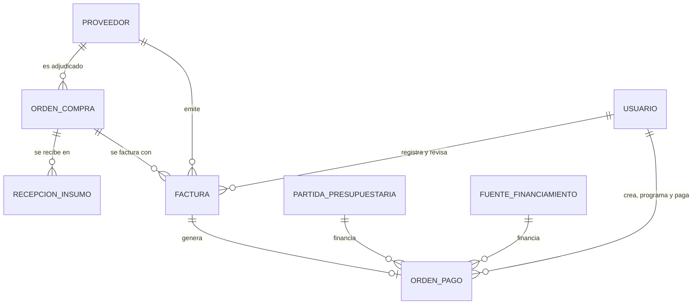
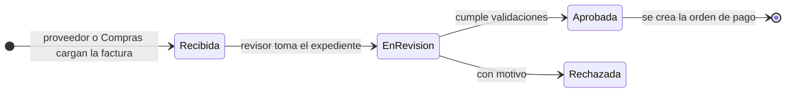
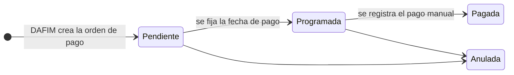

# Plan de desarrollo — Módulo de Facturación y Pagos

**Proyecto:** Sistema Web para la Gestión de la Cadena de Suministro de Proveedores — Municipalidad de Panajachel
**Fuentes:** DERCAS (27/07/2026), Tesis Final y prototipo (pantallas "Facturación y Órdenes de Pago", "Nueva Orden de Pago" y "Órdenes y Facturas" del portal)
**Metodología:** Scrum por sprints, arquitectura MVC

> Convención: lo marcado como **(propuesta)** es una recomendación mía que los documentos no mencionan. Queda a tu decisión.

---

## 1. Objetivo y alcance

**Qué dicen los documentos.** El "Módulo de Facturación y Pagos" gestiona el flujo financiero: permite el **registro de facturas recibidas**, la **creación de órdenes de pago**, la **asignación de la partida presupuestaria o fuente de financiamiento** y la visualización de un **cronograma interactivo de pagos** (DERCAS). El proceso n.º 6 de la tesis lo describe así: el proveedor carga la factura electrónica (FEL) emitida a crédito, vinculada a la orden de compra; DAFIM revisa el expediente, registra la cuenta por pagar y programa la fecha de pago según el plazo acordado (por ejemplo, 30 días). El proveedor consulta el estado de sus pagos desde el portal.

**Dentro del alcance**

- Registro de facturas (carga de PDF/XML desde el portal o registro manual por personal municipal).
- Validación de la factura contra la orden de compra y lo recibido en bodega.
- Revisión y aprobación de la factura (Compras y DAFIM).
- Órdenes de pago con partida presupuestaria y fuente de financiamiento.
- Programación de pagos, cronograma, alertas de vencimiento y registro **manual** del pago realizado.
- KPIs, historial, exportación de reporte y bitácora.
- Parte del portal del proveedor: "Órdenes y Facturas" y la carga de facturas.

**Fuera del alcance (delimitaciones del DERCAS)**

- Emisión o certificación de FEL ante la SAT: solo se registra y controla la factura que adjunta el proveedor.
- Integración con SICOIN, Guatecompras o bancos, y procesamiento automático de pagos o transferencias. La tesis lo confirma: la orden de pago no ejecuta transferencias y requiere un registro manual complementario.
- Contabilidad general, **planillas de pago de personal** y declaraciones de impuestos.

> **Aviso importante sobre el modelo de datos.** Ni el diccionario de datos del DERCAS ni la descripción del ER en la tesis incluyen entidades de **factura**, **orden de pago** o **partida presupuestaria**. La tesis solo menciona que el modelo "evita la duplicidad en los comprobantes". El recorte del diagrama que aparece en los documentos tampoco las muestra. Por eso, **todo el modelo de este módulo es propuesta mía**, construido sobre lo que sí definen los documentos: `ORDEN_COMPRA`, `PROVEEDOR`, la recepción de bodega y la descripción del proceso.

## 2. Dependencias con otros módulos

| Módulo | Qué se usa |
|---|---|
| **Usuarios** | `usuario`, `rol`, `permiso`, `authenticate`, `authorize`, bitácora, `notificacion` |
| **Proveedores** | `proveedor`, `proveedor_usuario`; el portal identifica al proveedor por su cuenta |
| **Proformas** | `orden_compra`, `detalle_orden_compra`, y `cotizacion.condiciones_pago` (texto libre, ej. "30 días crédito") |
| **Bodega** | `recepcion_insumo` y `detalle_recepcion` del DERCAS: cantidad efectivamente recibida de cada orden |
| **Dependencias** | Para informes de ejecución por dependencia (a través de `orden_compra → requisicion`) |

**Ajuste necesario en Proformas (propuesta):** agregar `orden_compra.plazo_credito_dias`. Hoy el plazo de crédito solo existe como texto libre en la cotización, y la fecha de vencimiento de la factura necesita un número.

## 3. Stack tecnológico (según los documentos)

| Capa | Tecnología |
|---|---|
| Frontend | React, HTML5, CSS3 (diseño responsivo) |
| Backend | Node.js, API REST con JSON |
| Base de datos | PostgreSQL 15+ |
| Despliegue | Docker, Microsoft Azure; el diagrama muestra Railway con SSL/TLS |
| Versiones y pruebas | Git, GitHub, Postman |

**Complementos sugeridos (propuesta):** `multer` para recibir PDF y XML, `node-cron` para las alertas de vencimiento, `fast-xml-parser` para leer el XML de la factura (opcional), `pdfkit` o `json2csv` para el reporte, `zod`, `Jest` + `Supertest`.

## 4. Modelo de datos

### 4.1 Lo que sí existe en los documentos

| Entidad | Fuente | Uso en este módulo |
|---|---|---|
| `ORDEN_COMPRA` (`montoTotal`, `estado`, `idProveedor`) | DERCAS y ER | La factura se vincula a una orden de compra |
| `DETALLE_ORDEN_COMPRA` (cantidad, precio unitario, subtotal) | DERCAS | Valorizar lo recibido |
| `RECEPCION_INSUMO` / `DETALLE_RECEPCION` (estado: Completa, Parcial, Con Novedades) | DERCAS | Confirmar qué se recibió antes de pagar |
| `PROVEEDOR`, `USUARIO`, `BITACORA_ACCESO` | ER | Identidad y auditoría |

### 4.2 Lo que se propone crear

| Entidad | Para qué |
|---|---|
| `factura` | Registro de la factura electrónica del proveedor, con sus archivos y estado de revisión |
| `orden_pago` | Compromiso de pago de una factura, con fecha de vencimiento, programación y registro del pago |
| `partida_presupuestaria` | Catálogo de partidas o renglones (el DERCAS pide asignarla) |
| `fuente_financiamiento` | Catálogo de fuentes (el DERCAS pide "partida o fuente") |
| `v_factura_estado` (vista) | Estado visible combinado: Pendiente, Vencido, Pagado, que usa el historial |

### 4.3 Diferencias entre fuentes (resolver antes de codificar)

| # | Situación | Criterio del plan |
|---|---|---|
| D-1 | El modal "Nueva Orden de Pago" tiene tres pestañas: **Factura, Contrato y Planilla**. El DERCAS excluye las planillas de pago de personal, y "contrato" no se define en ningún documento. | La primera versión solo cubre **Factura**. Las otras dos pestañas se ocultan o se deshabilitan. |
| D-2 | La tesis dice que al registrar una factura el sistema validará el **NPG de Guatecompras** y el estado del proveedor "en tiempo real". El DERCAS excluye expresamente la integración con Guatecompras. | Sigo el DERCAS (delimitación): el NPG es un **campo opcional que se escribe a mano**, sin validación externa. |
| D-3 | El prototipo crea la orden de pago con proveedor y concepto en texto libre. El proceso de la tesis exige factura vinculada a una orden de compra y revisión del expediente. | La orden de pago nace de una **factura aprobada**; proveedor y concepto se toman de ella. |
| D-4 | Estados distintos: internamente se ven Vencido / Pendiente / Pagado; en el portal, Pagado / Pendiente / En Proceso. | Un modelo único con estados reales y estados **derivados** para cada pantalla (ver 5.3). |
| D-5 | El modal no pide partida ni fuente, pero el DERCAS exige asignarlas. | Se agregan los selectores. Obligatorios al aprobar la orden de pago (propuesta). |
| D-6 | El diccionario del DERCAS usa sintaxis de SQL Server; el stack es PostgreSQL. | Se adapta a PostgreSQL. |

## 5. Base de datos

### 5.1 Relaciones



### 5.2 Migración PostgreSQL

`UNIQUE NULLS NOT DISTINCT` requiere PostgreSQL 15 o superior, que es la versión que indican los documentos.

```sql
-- 040_modulo_facturacion.sql  (PostgreSQL 15+)

-- Ajuste a Proformas: plazo de crédito numérico
ALTER TABLE orden_compra
  ADD COLUMN IF NOT EXISTS plazo_credito_dias INT CHECK (plazo_credito_dias >= 0);

CREATE TABLE partida_presupuestaria (
  id_partida  INT GENERATED ALWAYS AS IDENTITY PRIMARY KEY,
  codigo      VARCHAR(20)  NOT NULL UNIQUE,
  descripcion VARCHAR(150) NOT NULL,
  activo      BOOLEAN NOT NULL DEFAULT TRUE
);

CREATE TABLE fuente_financiamiento (
  id_fuente   INT GENERATED ALWAYS AS IDENTITY PRIMARY KEY,
  codigo      VARCHAR(20)  NOT NULL UNIQUE,
  descripcion VARCHAR(150) NOT NULL,
  activo      BOOLEAN NOT NULL DEFAULT TRUE
);

CREATE TABLE factura (
  id_factura          INT GENERATED ALWAYS AS IDENTITY PRIMARY KEY,
  id_orden_compra     INT NOT NULL REFERENCES orden_compra(id_orden_compra),
  id_proveedor        INT NOT NULL REFERENCES proveedor(id_proveedor),
  serie               VARCHAR(20),
  numero_factura      VARCHAR(30) NOT NULL,
  numero_autorizacion VARCHAR(40),                       -- identificador FEL, si viene en el XML
  npg                 VARCHAR(20),                       -- Guatecompras, captura manual opcional
  fecha_emision       DATE NOT NULL,
  monto_total         NUMERIC(12,2) NOT NULL CHECK (monto_total > 0),
  plazo_credito_dias  INT NOT NULL DEFAULT 0 CHECK (plazo_credito_dias >= 0),
  fecha_vencimiento   DATE NOT NULL,
  estado              VARCHAR(15) NOT NULL DEFAULT 'Recibida'
                      CHECK (estado IN ('Recibida','En Revisión','Aprobada','Rechazada')),
  motivo_rechazo      VARCHAR(255),
  observaciones       TEXT,
  origen              VARCHAR(10) NOT NULL DEFAULT 'PORTAL' CHECK (origen IN ('PORTAL','MANUAL')),
  archivo_pdf_nombre  VARCHAR(150),
  archivo_pdf_ruta    VARCHAR(255),
  archivo_xml_nombre  VARCHAR(150),
  archivo_xml_ruta    VARCHAR(255),
  id_usuario_registra INT NOT NULL REFERENCES usuario(id_usuario),
  id_usuario_revisa   INT REFERENCES usuario(id_usuario),
  fecha_registro      TIMESTAMPTZ NOT NULL DEFAULT now(),
  fecha_revision      TIMESTAMPTZ,
  CHECK (fecha_vencimiento >= fecha_emision),
  UNIQUE NULLS NOT DISTINCT (id_proveedor, serie, numero_factura)   -- evita facturas duplicadas
);
CREATE UNIQUE INDEX uq_factura_autorizacion
  ON factura (numero_autorizacion) WHERE numero_autorizacion IS NOT NULL;

CREATE TABLE orden_pago (
  id_orden_pago         INT GENERATED ALWAYS AS IDENTITY PRIMARY KEY,
  numero_orden_pago     VARCHAR(20) NOT NULL UNIQUE,     -- OP-2026-001
  id_factura            INT NOT NULL REFERENCES factura(id_factura),
  id_proveedor          INT NOT NULL REFERENCES proveedor(id_proveedor),
  concepto              VARCHAR(255) NOT NULL,
  monto                 NUMERIC(12,2) NOT NULL CHECK (monto > 0),
  id_partida            INT REFERENCES partida_presupuestaria(id_partida),
  id_fuente             INT REFERENCES fuente_financiamiento(id_fuente),
  fecha_vencimiento     DATE NOT NULL,
  fecha_pago_programada DATE,
  fecha_pago_real       DATE,
  referencia_pago       VARCHAR(60),                     -- cheque o transferencia, captura manual
  estado                VARCHAR(12) NOT NULL DEFAULT 'Pendiente'
                        CHECK (estado IN ('Pendiente','Programada','Pagada','Anulada')),
  motivo_anulacion      VARCHAR(255),
  alerta_48h            BOOLEAN NOT NULL DEFAULT FALSE,
  alerta_24h            BOOLEAN NOT NULL DEFAULT FALSE,
  id_usuario_crea       INT NOT NULL REFERENCES usuario(id_usuario),
  id_usuario_programa   INT REFERENCES usuario(id_usuario),
  id_usuario_paga       INT REFERENCES usuario(id_usuario),
  fecha_registro        TIMESTAMPTZ NOT NULL DEFAULT now(),
  CHECK (estado <> 'Pagada' OR (fecha_pago_real IS NOT NULL AND referencia_pago IS NOT NULL))
);
-- Una orden de pago vigente por factura (las anuladas no cuentan)
CREATE UNIQUE INDEX uq_op_factura_vigente ON orden_pago (id_factura) WHERE estado <> 'Anulada';

CREATE INDEX idx_factura_estado       ON factura (estado);
CREATE INDEX idx_factura_vencimiento  ON factura (fecha_vencimiento);
CREATE INDEX idx_factura_oc           ON factura (id_orden_compra);
CREATE INDEX idx_op_estado_venc       ON orden_pago (estado, fecha_vencimiento);
CREATE INDEX idx_op_programada        ON orden_pago (fecha_pago_programada) WHERE estado = 'Programada';

-- Estado visible para el historial
CREATE VIEW v_factura_estado AS
SELECT f.id_factura, f.id_proveedor, f.numero_factura, f.fecha_emision, f.monto_total,
       f.fecha_vencimiento, f.estado AS estado_factura,
       op.id_orden_pago, op.estado AS estado_pago,
       CASE
         WHEN op.estado = 'Pagada'          THEN 'Pagado'
         WHEN f.estado  = 'Rechazada'       THEN 'Rechazada'
         WHEN f.fecha_vencimiento < CURRENT_DATE THEN 'Vencido'
         ELSE 'Pendiente'
       END AS estado_visible
FROM factura f
LEFT JOIN orden_pago op ON op.id_factura = f.id_factura AND op.estado <> 'Anulada';
```

### 5.3 Estados





**Estados derivados (propuesta)**

| Pantalla | Estado | Condición |
|---|---|---|
| Interna | Pagado | La orden de pago está `Pagada` |
| Interna | Vencido | No pagada y `fecha_vencimiento` anterior a hoy |
| Interna | Pendiente | Cualquier otro caso |
| Portal | Pagado | Su orden de pago está `Pagada` |
| Portal | En Proceso | Tiene factura recibida, en revisión o aprobada, o pago programado |
| Portal | Pendiente | La orden de compra aún no tiene factura cargada |

### 5.4 Datos semilla

- **Menú "Facturación"** con el submenú "Facturas y Órdenes de Pago", con permisos para Administrador, Encargado de Compras (revisión), DAFIM (órdenes de pago y pagos) y Alcalde (consulta).
- **Portal:** el submenú "Órdenes y Facturas" ya queda sembrado por el módulo de Proveedores.
- **Partidas y fuentes de financiamiento:** el catálogo real **no está en los documentos**. Debe proporcionarlo DAFIM; en desarrollo se usan valores de ejemplo.

## 6. Backend (rutas `/api`)

### 6.1 Estructura

```
backend/src/
├── routes/        facturas.routes.js, ordenesPago.routes.js, cronogramaPagos.routes.js, portalFacturas.routes.js
├── controllers/
├── services/
│   ├── facturas.service.js       # registro, validaciones, revisión
│   ├── conciliacion.service.js   # orden de compra ↔ recepción ↔ factura
│   ├── ordenesPago.service.js    # crear, programar, registrar pago, anular
│   ├── cronograma.service.js
│   └── alertasPago.job.js        # tarea programada de vencimientos
├── repositories/
├── validators/
└── migrations/040_modulo_facturacion.sql
```

### 6.2 Endpoints internos

| Método | Ruta | Descripción |
|---|---|---|
| GET | `/api/facturacion/resumen` | KPIs: total por pagar del mes, facturas pendientes (con las que están en revisión), vencimientos próximos |
| GET | `/api/facturas` | Historial con filtros: estado (visible), proveedor, fechas, vencidas, búsqueda por número |
| GET | `/api/facturas/:id` | Detalle con comparación contra la orden de compra y lo recibido |
| POST | `/api/facturas` | Registro manual (por Compras) con PDF y XML |
| GET | `/api/facturas/:id/archivo/:tipo` | Descarga de PDF o XML, solo con permiso |
| PATCH | `/api/facturas/:id/revision` | Acciones `iniciar`, `aprobar`, `rechazar` (motivo obligatorio al rechazar) |
| GET | `/api/ordenes-pago` | Lista con filtros |
| POST | `/api/ordenes-pago` | Crea la orden de pago desde una factura aprobada: concepto, monto, partida, fuente, vencimiento |
| PATCH | `/api/ordenes-pago/:id/programar` | Fija la fecha de pago |
| PATCH | `/api/ordenes-pago/:id/pago` | Registra el pago realizado: fecha y referencia |
| PATCH | `/api/ordenes-pago/:id/anular` | Anula con motivo, antes del pago |
| GET | `/api/cronograma-pagos?mes=AAAA-MM` | Pagos programados y vencimientos del mes, y alertas del día ("Vence mañana") |
| GET | `/api/facturacion/exportar` | "Exportar Reporte" en CSV o PDF con los filtros aplicados |
| GET / POST / PUT | `/api/partidas`, `/api/fuentes-financiamiento` | Catálogos, dentro de Configuración |

### 6.3 Endpoints del portal del proveedor

Filtran siempre por el `id_proveedor` de la cuenta autenticada. **Un proveedor nunca ve facturas de otro.**

| Método | Ruta | Descripción |
|---|---|---|
| GET | `/api/portal/ordenes-facturas` | Órdenes de compra adjudicadas con su estado de pago (Pagado, En Proceso, Pendiente), según la tabla de estados derivados |
| POST | `/api/portal/facturas` | "Carga rápida de factura": selecciona la orden de compra, adjunta PDF y XML, indica número, fecha y monto |
| GET | `/api/portal/facturas` y `/:id` | Sus facturas y su estado; si fue rechazada, el motivo |

El prototipo muestra la zona de arrastre sin pedir la orden de compra; hay que pedirla (o deducirla del XML) para poder vincular la factura.

### 6.4 Validaciones al registrar una factura

El proceso de la tesis y su sección de análisis piden que las facturas coincidan con lo que entró a bodega. Se aplican, dentro de una transacción con bloqueo de la fila de la orden de compra (`SELECT … FOR UPDATE`) para evitar sobrefacturar con dos cargas simultáneas:

1. **Proveedor:** la orden de compra pertenece al proveedor que factura.
2. **Estado:** la orden de compra está aprobada y tiene **al menos una recepción** registrada en Bodega.
3. **Duplicados:** no existe otra factura con la misma serie y número del proveedor, ni el mismo número de autorización.
4. **Monto:** el total facturado acumulado (sin contar las rechazadas) más esta factura **no supera el monto recibido valorizado** (cantidad recibida × precio unitario de la orden). Tolerancia: cero, configurable (propuesta).
5. **Vencimiento:** `fecha_vencimiento = fecha_emision + plazo_credito_dias` (el plazo sale de la orden de compra; Compras puede corregirlo con justificación).
6. **Archivos:** PDF y XML válidos, con límite de tamaño (propuesta: 5 MB), almacenados fuera de la carpeta pública.
7. **Lectura del XML (opcional, propuesta):** si se incluye, se leen número, fecha, monto y NIT del emisor para prellenar y comprobar que coinciden con lo digitado. Revisa la estructura real del XML FEL antes de implementarlo; no es una validación contra la SAT.

### 6.5 Reglas de negocio

1. **Flujo de aprobación:** el proveedor (o Compras) carga la factura → Compras revisa el expediente → DAFIM aprueba la parte contable y crea la orden de pago. Según la tesis, las dos áreas participan.
2. **Orden de pago solo de facturas `Aprobada`;** monto igual o menor al de la factura. Una sola orden de pago vigente por factura en la primera versión.
3. **Partida y fuente obligatorias** antes de programar el pago (propuesta; ver D-7 de la sección 10).
4. **Separación de funciones (propuesta):** quien crea la orden de pago no la programa ni registra el pago.
5. **El pago se registra a mano.** No hay conexión bancaria: se anota fecha y referencia (cheque o transferencia). Sin esos datos no se puede marcar `Pagada`.
6. **Facturas, órdenes y pagos no se borran.** Una orden `Pagada` es inmodificable; solo se anula antes del pago, con motivo.
7. **Alertas de vencimiento:** una tarea programada genera notificaciones **48 y 24 horas antes** del vencimiento de facturas u órdenes sin pagar, como indica la configuración de notificaciones del prototipo ("Alertas de Vencimiento"). Las banderas `alerta_48h` y `alerta_24h` evitan avisos repetidos. Se respetan las preferencias de notificación del usuario.
8. Toda acción (registro, revisión, orden, programación, pago, anulación, descarga de archivo) queda en bitácora con usuario, fecha y estado anterior y nuevo.

### 6.6 KPIs de la pantalla principal

| Tarjeta | Definición propuesta |
|---|---|
| Total por pagar (mes) | Suma de órdenes de pago `Pendiente` o `Programada` con vencimiento en el mes; la variación compara con el mismo cálculo del mes anterior |
| Facturas pendientes | Facturas `Recibida`, `En Revisión` o `Aprobada` sin pago; el subtítulo cuenta las `En Revisión` ("en revisión técnica") |
| Vencimientos próximos | Órdenes o facturas sin pagar con vencimiento dentro de N días (propuesta: 7) o ya vencidas |

El prototipo no explica cómo se calculan; las definiciones anteriores son mías y están en las decisiones pendientes.

## 7. Frontend (React)

### 7.1 Archivos sugeridos

Siguen la convención de los módulos anteriores:

| Archivo | Responsabilidad |
|---|---|
| `api/facturacion.ts`, `api/portalFacturas.ts` | Clientes HTTP y tipos |
| `useFacturacionController.ts` | Estado: KPIs, historial, filtros, calendario |
| `FacturacionView` | Pantalla "Facturación y Órdenes de Pago" |
| `CronogramaPagos` | Calendario mensual con marcas de vencimiento y alertas |
| `FacturaDetalleDrawer` | Detalle, comparación con orden de compra y recepción, y acciones de revisión |
| `NuevaOrdenPagoModal` | Creación de la orden de pago desde una factura aprobada |
| `CargarFacturaZone` | Zona de arrastre PDF/XML, usada en el portal y en la pantalla interna |
| `PortalOrdenesFacturasView` | Pantalla "Órdenes y Facturas" del proveedor |

### 7.2 Comportamiento esperado, según el prototipo

- **Tarjetas:** Total por pagar, Facturas pendientes y Vencimientos próximos, más el recuadro verde de carga de PDF/XML.
- **Cronograma de pagos:** calendario mensual con navegación entre meses, días con pago o vencimiento marcados, y debajo la lista de alertas ("Vence Mañana" en rojo, "Pago Programado" en verde).
- **Historial:** tabla con número de factura, proveedor, fecha de emisión, monto y estado (Vencido, Pendiente, Pagado), con filtro "Todos los estados" y botón "Exportar Reporte".
- **Nueva orden de pago:** modal con proveedor, concepto, monto y fecha de vencimiento; en esta versión se completa desde la factura elegida, con selectores de partida y fuente, y las pestañas Contrato y Planilla deshabilitadas.
- **Portal:** lista de órdenes de compra con descripción, monto, estado y fecha.
- Confirmaciones antes de rechazar, anular o registrar un pago; notificaciones (toast); y estados de carga, vacío y error por la conexión inestable que documenta el proyecto.
- Los montos se muestran con formato de quetzales y dos decimales, y las fechas en formato local.

## 8. Plan de trabajo por sprints

Cinco sprints más un Sprint 0, de una semana cada uno, con un solo desarrollador.

> **Nota de calendario.** El cronograma de la tesis ubica la "lógica de Compras/Pagos" hasta el 17/09/2026, el despliegue inicial del 05/10 al 20/10 y las pruebas del 21/10 al 30/10; hoy es 05/10. Este módulo depende de Proformas y Bodega, así que no se puede terminar antes que ellos. Si el tiempo es corto, propongo un **alcance mínimo**: registro y revisión de facturas, orden de pago con partida y fuente, y registro manual del pago (Sprints 1 al 3 reducidos). El cronograma interactivo, las alertas, la lectura del XML y la exportación quedan para una segunda entrega.

### Sprint 0 — Alineación (1–2 días)

- Cerrar las decisiones de la sección 10, en especial D-1 a D-3.
- Obtener de DAFIM el catálogo de partidas y fuentes.
- Confirmar con el módulo de Bodega cómo se relaciona la recepción con el detalle de la orden de compra (por insumo o por ítem de la orden).
- Rama `feature/facturacion` y colección de Postman.

### Sprint 1 — Base de datos y catálogos

- Migración `040`, vista `v_factura_estado`, semillas, permisos y CRUD de partidas y fuentes.
- **Criterio de aceptación:** las restricciones rechazan una factura duplicada, dos órdenes de pago vigentes para la misma factura y una orden `Pagada` sin referencia.

### Sprint 2 — Registro de facturas

- Carga desde el portal y registro manual, subida de PDF/XML, validaciones de la sección 6.4 y listado con KPIs.
- **Criterio de aceptación:** se rechaza una factura de un proveedor distinto al de la orden, otra que excede lo recibido y una duplicada; dos cargas simultáneas no superan el monto recibido.

### Sprint 3 — Revisión y orden de pago

- Flujo de revisión (Compras y DAFIM), creación de la orden de pago con partida y fuente, y notificaciones al proveedor.
- Pantalla "Órdenes y Facturas" del portal con los estados derivados.
- **Criterio de aceptación:** un rol sin permiso recibe `403`; el proveedor ve el motivo de un rechazo; el que crea la orden de pago no puede programarla.

### Sprint 4 — Programación, pago y cronograma

- Programación y registro manual del pago, calendario, alertas de 48 y 24 horas con la tarea programada.
- **Criterio de aceptación:** una orden que vence en dos días genera un único aviso de 48 horas y otro de 24; el calendario coincide con los datos de la lista.

### Sprint 5 — Reportes, pruebas y despliegue

- Exportación del reporte, pruebas unitarias del cálculo de monto recibido y de las validaciones, pruebas de integración, matriz RBAC rol × endpoint.
- Revisión de seguridad: descarga de archivos, tipo y tamaño de lo que se sube, acceso entre proveedores, inyección SQL.
- Despliegue con Docker y SSL/TLS, y manual de usuario del módulo.

## 9. Riesgos

| Riesgo | Mitigación |
|---|---|
| El módulo de Bodega todavía no registra recepciones | Es un requisito previo; sin recepciones no se pueden validar facturas. Coordinar el orden de desarrollo |
| Sobrefacturación por cargas simultáneas | Bloqueo de la fila de la orden de compra y transacción |
| Archivos sensibles (facturas) expuestos | Almacenarlos fuera de la ruta pública y descargarlos solo con permiso |
| Dos usuarios registran el mismo pago | La orden `Pagada` es inmodificable y el cambio de estado verifica el estado previo |
| Catálogo de partidas no disponible a tiempo | Pedirlo a DAFIM en el Sprint 0; usar datos de ejemplo mientras tanto |
| El pago manual puede no coincidir con la realidad bancaria | Referencia obligatoria y bitácora; conciliación bancaria queda fuera del alcance |
| Alcance mayor al tiempo disponible | Recortar al alcance mínimo de la nota de calendario |

## 10. Decisiones pendientes

- **D-1** El modelo de datos de este módulo no existe en los documentos. ¿Se aprueban `factura`, `orden_pago`, `partida_presupuestaria` y `fuente_financiamiento`? Conviene además agregarlas al ER y al diccionario del DERCAS.
- **D-2** ¿Se acepta que la primera versión solo cubra **Factura** y se oculten Contrato y Planilla? Las planillas están excluidas por el DERCAS.
- **D-3** El NPG de Guatecompras: ¿captura manual opcional (según la delimitación) o se necesita algún tipo de validación? La tesis y el DERCAS se contradicen.
- **D-4** ¿Se aprueba `orden_compra.plazo_credito_dias` y que el vencimiento se calcule desde ahí?
- **D-5** Un solo pago por factura, o pagos parciales de una misma factura. El plan asume un pago.
- **D-6** ¿Cuál es la tolerancia permitida entre lo facturado y lo recibido? El plan asume cero.
- **D-7** ¿Partida y fuente son obligatorias al crear la orden de pago, o solo antes de programarla? ¿Se debe validar saldo por partida? Los documentos no definen presupuesto por partida, solo por dependencia.
- **D-8** Cómo se enlaza la recepción de bodega con el detalle de la orden de compra, para valorizar lo recibido.
- **D-9** Definición de las tarjetas: qué cuenta como "Total por pagar (mes)", cuántos días definen un "vencimiento próximo" y con qué se compara el "+12 %".
- **D-10** Quién autoriza el pago según el monto (DAFIM, Alcalde o ambos). Los documentos no dan umbrales.
- **D-11** ¿Se lee el XML de la factura para prellenar los datos? Requiere conocer el formato exacto que usan los proveedores.
- **D-12** Dónde se almacenan los PDF y XML. Es la misma decisión pendiente del módulo de Proformas.
- **D-13** Con los pagos registrados, el presupuesto "ejecutado" de Dependencias se puede medir en tres niveles: estimado, adjudicado y pagado. ¿Cuál se muestra como ejecución?

## 11. Definición de terminado

- [ ] No se puede registrar dos veces la misma factura de un proveedor.
- [ ] El total facturado de una orden de compra nunca supera lo recibido en bodega.
- [ ] Solo se crea una orden de pago de una factura aprobada, con partida y fuente.
- [ ] Una orden `Pagada` exige fecha y referencia y no se puede modificar.
- [ ] Quien crea la orden de pago no puede programarla ni registrar el pago.
- [ ] Ningún proveedor ve facturas ni pagos de otro.
- [ ] Las alertas de 48 y 24 horas se generan una sola vez por orden.
- [ ] Toda acción queda en bitácora con usuario, fecha y estados anterior y nuevo.
- [ ] El frontend no usa datos de ejemplo: todo viene de la API.
- [ ] La migración corre desde cero en PostgreSQL 15.
- [ ] Colección de Postman y manual de usuario actualizados.
