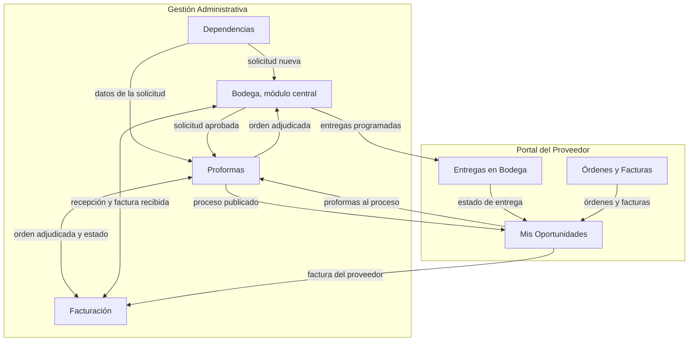
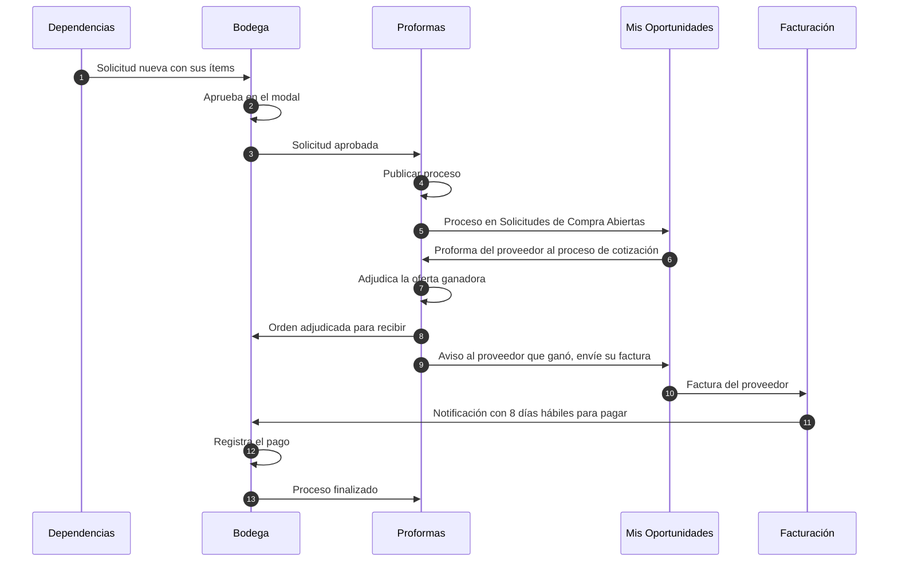
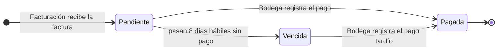
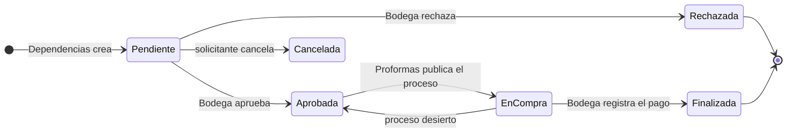

# Plan del flujo de trabajo con Bodega como módulo central

**Proyecto:** Sistema Web para la Gestión de la Cadena de Suministro de Proveedores — Municipalidad de Panajachel
**Fuentes:** tus dos notas manuscritas (diagrama y "Flujo de trabajo"), el DERCAS, la Tesis Final, el prototipo y los planes anteriores de cada módulo
**Metodología:** Scrum por sprints, arquitectura MVC
**Stack (según los documentos):** React, Node.js (API REST), PostgreSQL 15+, Docker, Git/GitHub y Postman

> Este plan sigue **tu flujo tal como lo escribiste**. Donde tu flujo cambia lo que decían los documentos o mis planes anteriores, lo marco en la sección 2. Lo marcado como **(propuesta)** es una decisión mía que tus notas no cubren.

---

## 1. Tu flujo, tal como lo entendí

### 1.1 Texto

1. **Dependencias:** al crear una nueva solicitud, intercambia información con Bodega.
2. **Bodega** tiene un **modal** donde recibe la solicitud y la **aprueba**. El modal ofrece dos opciones: enviarla a **Proformas** o enviarla **directamente al proveedor** en el portal.
3. **Todas** las solicitudes que apruebe Bodega llegan al módulo de **Proformas**.
4. En Proformas se hace **Publicar proceso**; la solicitud queda **Aprobada**.
5. El proceso se envía a **Mis Oportunidades**, donde llega a **Solicitudes de Compra Abiertas**.
6. Desde esa opción, el proveedor envía la información de sus **proformas** al **proceso de cotización** del módulo de Proformas.
7. Cuando se **adjudica**: se envía a **Bodega** y se **avisa al proveedor que ganó** para que **envíe su factura** al módulo de **Facturación**.
8. **Facturación** recibe la factura y envía una **notificación a Bodega**: desde ese momento tiene **8 días hábiles** para efectuar el **pago**.
9. Con el pago **termina el proceso**.
10. **Bodega es el módulo central y de manejo de pagos.**

### 1.2 Diagrama



### 1.3 Secuencia



## 2. Dónde este flujo se aparta de los documentos y de mis planes anteriores

Seguí tu flujo, pero conviene que veas estas diferencias antes de empezar, porque cambian responsables y reglas.

| Tema | DERCAS, tesis y planes anteriores | Tu flujo | Cómo lo resuelve este plan |
|---|---|---|---|
| Quién aprueba la solicitud | Un revisor de Dependencias/DAFIM (el plan de Dependencias dejaba abierta la decisión D-3) | **Bodega** | Bodega aprueba y rechaza desde un modal |
| Qué hace Proformas con una solicitud | Compras la recibe y publica | Igual, y además Bodega puede enviarla **directo** al proveedor | Dos botones en el modal (sección 5.2). En ambos casos queda registrada en Proformas |
| Aprobación de la orden de compra | DAFIM y Alcalde la autorizan (DERCAS, proceso 5) | **No aparece**: se adjudica y pasa a Bodega | La orden se genera al adjudicar y queda en estado `Enviada`. La aprobación pasa a ser un parámetro apagado (`APROBACION_OC`, ver D-4) |
| Cuándo se factura | El proveedor factura **después de la recepción**, y Facturación valida contra lo recibido | El proveedor factura **al ganar**, antes de entregar | Facturación recibe la factura sin exigir recepción. El control contra lo recibido se hace **al pagar** y es configurable (D-5) |
| Revisión de la factura | Compras revisa y DAFIM aprueba | Facturación "recibe" y notifica a Bodega | Validación **automática** (duplicados, proveedor, monto contra la orden). Sin revisión manual en dos pasos |
| Quién paga | Facturación y DAFIM crean, programan y pagan | **Bodega** maneja los pagos | Bodega registra el pago. Facturación crea la obligación de pago al recibir la factura |
| Plazo de pago | Plazo de crédito acordado en la orden (por ejemplo 30 días) | **8 días hábiles** desde que Facturación recibe la factura | El plazo se calcula con días hábiles; el plazo de crédito deja de usarse |
| Fin del proceso | Cierre con el expediente digital | El proceso **termina con el pago** | Al pagar, la solicitud pasa a `Finalizada` |
| Entregas del portal | El proveedor proponía la fecha | La flecha va de **Bodega hacia** Entregas en Bodega | Bodega programa y el proveedor consulta |

**Un riesgo que conviene dejar por escrito.** Con este flujo, Bodega aprueba las solicitudes, recibe la mercadería y registra los pagos. El DERCAS cita las Normas de Control Interno (custodia de activos y registro de movimientos) y el proceso 8 habla de "permisos restringidos según el perfil". Concentrar todo en un rol reduce la separación de funciones. No cambio tu flujo, pero propongo mitigarlo con bitácora completa, el reporte de pagos por usuario y una **segunda autorización opcional** para pagos grandes (D-6).

## 3. Trazabilidad: cada frase de tu flujo y dónde se cumple

| Req. | Lo que pediste | Dónde se implementa | Sección |
|---|---|---|---|
| R1 | Dependencias intercambia información con Bodega al crear la solicitud | El formulario consulta a Bodega (catálogo y existencias) y al enviar la solicitud llega a Bodega | 5.1 |
| R2 | Modal en Bodega para recibir y aprobar | Bandeja "Solicitudes por Aprobar" con el modal de aprobación | 5.2 |
| R3 | Opción de enviar a Proformas o directo al proveedor | Dos acciones de aprobación en el modal | 5.2 |
| R4 | Toda solicitud aprobada por Bodega llega a Proformas | La aprobación siempre crea o expone la solicitud en Proformas | 5.2 y 5.3 |
| R5 | Publicar proceso, solicitud Aprobada | Bandeja de Proformas y acción "Publicar proceso" | 5.3 |
| R6 | El proceso llega a Mis Oportunidades, en Solicitudes de Compra Abiertas | Tabla del portal renombrada y alimentada por el proceso publicado | 5.4 |
| R7 | El proveedor envía proformas al proceso de cotización | "Enviar Cotización" en esa tabla | 5.4 |
| R8 | Al adjudicar, se manda a Bodega | La adjudicación crea la orden de compra y la deja en Bodega | 5.3 y 5.5 |
| R9 | Avisar al proveedor que ganó y que envíe su factura a Facturación | Notificación y botón "Enviar Factura" | 5.4 |
| R10 | Facturación recibe la factura | `POST /api/portal/facturas` y registro en Facturación | 5.6 |
| R11 | Facturación notifica a Bodega | Evento `FACTURA_RECIBIDA` | 5.6 y 7 |
| R12 | Bodega tiene 8 días hábiles para pagar | Obligación de pago con fecha límite calculada en días hábiles y recordatorios | 5.7 y 6 |
| R13 | El pago termina el proceso | Estado `Finalizada` | 5.7 |
| R14 | Bodega es el módulo central y de pagos | Bodega concentra aprobación, recepción y pagos | 5.2, 5.5 y 5.7 |
| R15 | Todas las flechas del diagrama | Tabla de conexiones | 4 |

## 4. Conexiones del diagrama

Cada flecha de tu diagrama es un envío de información concreto. **Cada dato tiene un solo dueño**: el módulo que lo envía no escribe en las tablas del receptor; llama a un servicio público o emite un evento.

| Flecha | Qué viaja | Cómo |
|---|---|---|
| Dependencias → Bodega | La solicitud nueva con ítems, prioridad, justificación y lugar de entrega | Evento `REQ_CREADA`; aparece en la bandeja de Bodega |
| Dependencias → Proformas | Datos de la solicitud (dependencia, ítems, monto estimado) para armar el proceso | Proformas **lee** la solicitud; solo puede publicarla si Bodega la aprobó |
| Bodega → Proformas | Solicitud aprobada, con el destino elegido | Evento `REQ_APROBADA`; en el modo directo, Bodega llama a `procesos.service.publicarDirecto()` |
| Proformas → Mis Oportunidades | Proceso publicado: ítems, fecha límite, presupuesto de referencia | Invitaciones; aparece en "Solicitudes de Compra Abiertas" |
| Mis Oportunidades → Proformas | Cotización del proveedor con precios por ítem | `POST /api/portal/cotizaciones` |
| Proformas → Bodega | Orden de compra adjudicada, para recibir y para vigilar el pago | Evento `ADJUDICADA`; la orden aparece en "Órdenes por recibir" |
| Proformas ↔ Facturación | Hacia Facturación: orden, proveedor y monto, para validar la factura. De vuelta: factura recibida y pagada, para actualizar el expediente | Lectura de la orden; eventos `FACTURA_RECIBIDA` y `PAGO_REGISTRADO` |
| Mis Oportunidades → Facturación | Factura del proveedor (PDF y XML) | `POST /api/portal/facturas` |
| Bodega ↔ Facturación | De Bodega: lo recibido por orden (vista `v_recibido_oc`). De Facturación: aviso de factura recibida con el plazo de 8 días hábiles | Vista de solo lectura y evento `FACTURA_RECIBIDA` |
| Bodega → Entregas en Bodega | Fecha, hora y encargado de cada entrega | Bodega programa; el portal consulta |
| Entregas en Bodega → Mis Oportunidades | Estado de la entrega (Pendiente, Programada, Completada) | `GET /api/portal/oportunidades` lo incluye |
| Órdenes y Facturas → Mis Oportunidades | Estado de cada orden, su factura y su pago | `GET /api/portal/oportunidades` lo incluye. Mis Oportunidades es la **pantalla central** del portal |

## 5. Cómo funciona cada módulo en este flujo

### 5.1 Dependencias (R1)

- Al crear una solicitud, el formulario **recibe de Bodega** el catálogo de insumos, la unidad de medida y la existencia actual, y muestra el **presupuesto restante** de la dependencia. Es mi lectura de "recibir la información" (D-3).
- Al enviar, la solicitud queda `Pendiente` y se emite `REQ_CREADA`, que la deja en la bandeja de Bodega y avisa al Encargado de Almacén.
- La dependencia **ya no aprueba**: solo crea, consulta el estado y recibe avisos.
- El estado "Pagado" del listado sale de la vista `v_expediente`, y la solicitud pasa a `Finalizada` al pagarse.

### 5.2 Bodega: aprobación de solicitudes (R2, R3, R4, R14)

**Pantalla nueva: "Solicitudes por Aprobar"** dentro de Bodega, con una insignia de pendientes en el menú.

**Modal de aprobación**

| Zona | Contenido |
|---|---|
| Encabezado | Código `SC-AAAA-NNN`, dependencia, solicitante, fecha, prioridad, lugar de entrega |
| Ítems | Insumo, cantidad solicitada, unidad, **existencia actual en bodega** y precio de referencia |
| Contexto | Presupuesto restante de la dependencia y justificación |
| Notas | Notas de aprobación (obligatorias al rechazar) |
| Acciones | **Rechazar**, **Aprobar y enviar a Proformas** y **Aprobar y enviar al proveedor** |

**Qué hace cada acción**

| Acción | Efecto |
|---|---|
| Rechazar | La solicitud pasa a `Rechazada` y el solicitante recibe el motivo |
| Aprobar y enviar a Proformas | Pasa a `Aprobada` con destino `PROFORMAS`. Aparece en la bandeja de Proformas, donde Compras la publica |
| Aprobar y enviar al proveedor | Pasa a `Aprobada` con destino `DIRECTO`. El modal pide **proveedores** (activos y con cuenta de portal), **fecha límite** y **mínimo de ofertas**. El sistema **crea y publica el proceso en Proformas** en el mismo paso (origen `DIRECTO`) y el proveedor lo recibe en Mis Oportunidades |

**Cómo interpreto "directamente al proveedor".** Tu texto también dice que *todas* las solicitudes aprobadas por Bodega llegan a Proformas. Para que ambas frases sean ciertas, la opción directa no se salta Proformas: crea el proceso ahí de forma automática, y Compras lo sigue desde su pantalla (comparativa, adjudicación). Si lo que querías era una compra directa **sin** proceso de cotización, dímelo, porque cambia el diseño (D-2).

### 5.3 Proformas (R4, R5, R8)

- **Bandeja "Solicitudes aprobadas"** con las de destino `PROFORMAS` que aún no tienen proceso. Desde ahí se ejecuta **Publicar proceso** (fecha límite, proveedores invitados, mínimo de ofertas). La solicitud queda `Aprobada` y pasa a `En Compra` al publicarse.
- Los procesos de origen `DIRECTO` aparecen ya publicados en la misma lista, marcados como "Directo desde Bodega".
- Recepción de cotizaciones, comparativa y adjudicación funcionan como en el plan de Proformas.
- **Al adjudicar** (R8 y R9), en una sola transacción:
  1. Se marca la cotización ganadora como `Aceptada` y las demás como `Rechazada`.
  2. Se genera la **orden de compra** y queda en estado `Enviada`, sin aprobación intermedia (D-4).
  3. Se emite `ADJUDICADA`: la orden llega a Bodega, el proveedor ganador recibe el aviso de que debe enviar su factura, y los no seleccionados reciben su resultado.
- Si el proceso queda desierto, la solicitud vuelve a `Aprobada` y reaparece en la bandeja de Proformas (D-12).

### 5.4 Portal: Mis Oportunidades (R6, R7, R9)

Es la **pantalla central del portal**, como muestra tu diagrama: recibe de Proformas, de Entregas en Bodega y de Órdenes y Facturas.

| Elemento | Qué hace |
|---|---|
| Tabla **"Solicitudes de Compra Abiertas"** (en el prototipo se llama "Activas") | Procesos a los que el proveedor fue invitado, con fecha límite, presupuesto y estado |
| Pestañas | Todas, Pendientes de Cotizar, Enviadas y **Adjudicadas** (nueva) |
| Acción **Enviar Cotización** | Abre el formulario de precios por ítem, tiempo de entrega, condiciones y PDF. Llega al proceso de cotización de Proformas (R7) |
| Estado **Adjudicado** | Muestra "Usted ganó. Envíe su factura" y el botón **Enviar Factura** (R9) |
| Acción **Enviar Factura** | Abre la carga de factura con la orden ya seleccionada, número, serie, fecha, monto y PDF/XML. Envía a Facturación (R10) |
| Resumen | Cotizaciones enviadas, órdenes adjudicadas y facturas pendientes, con el próximo pago |

**Órdenes y Facturas** muestra el historial de órdenes con su factura y estado de pago (Pagado, En Proceso, Pendiente) y permite el mismo envío de factura. **Entregas en Bodega** muestra las entregas que Bodega programó.

### 5.5 Bodega: recepción (R8, R14)

- La orden adjudicada aparece en **"Órdenes por recibir"** (el modal "Nueva Recepción" del prototipo la busca ahí).
- Bodega **programa la entrega** (fecha, hora, encargado) y el proveedor la ve en Entregas en Bodega.
- La recepción por ítem (Recibido, Rechazar, Faltante), el stock y el Kardex siguen el plan de Bodega.
- Lo recibido por orden se expone a Facturación en la vista `v_recibido_oc`.

### 5.6 Facturación (R10, R11)

- **Recibe** la factura enviada desde el portal (o registrada a mano por personal municipal) y la valida **automáticamente**:
  1. El proveedor de la factura es el de la orden.
  2. La orden está adjudicada y enviada.
  3. No existe la misma factura (serie y número del proveedor) ni el mismo número de autorización.
  4. Lo facturado acumulado no supera el monto de la orden.
- Si falla alguna, la factura se rechaza con el motivo y el proveedor la corrige y reenvía sobre el mismo registro.
- Si pasa, queda `Recibida` y se emite **`FACTURA_RECIBIDA`**, que:
  1. Crea la **obligación de pago** en Bodega con fecha límite a **8 días hábiles**.
  2. Notifica a Bodega y da acuse al proveedor.
- Facturación conserva su pantalla (KPI, historial y cronograma de pagos), ahora de **consulta** para los pagos. El botón "Nueva Orden de Pago" del prototipo se retira, porque la obligación nace sola (D-9).

### 5.7 Bodega: pagos (R12, R13, R14)

**Pantalla nueva: "Pagos"** dentro de Bodega.

| Elemento | Detalle |
|---|---|
| Tarjetas | Pagos pendientes, por vencer (3 días hábiles o menos) y vencidos |
| Lista | Proveedor, factura, orden, monto, fecha en que Facturación la recibió, **fecha límite** y **días hábiles restantes** con color (verde, amarillo, rojo) |
| Acción **Registrar pago** | Fecha de pago, referencia (cheque o transferencia) y, si aplica, partida y fuente |
| Control de recepción | Si la orden aún no tiene recepción registrada se advierte (o se bloquea, según el parámetro) |

**Al registrar el pago:**
1. La obligación pasa a `Pagada`.
2. La solicitud pasa a `Finalizada` cuando lo pagado alcanza el monto de la orden (**"ahí termina el proceso"**).
3. El proveedor ve "Pagado" en Órdenes y Facturas y en Mis Oportunidades.
4. El monto pagado alimenta presupuesto, Dashboard y Reportes.

**Recordatorios (propuesta):** cuando quedan 3 días hábiles, 1 día hábil y al vencer el plazo, el sistema notifica a Bodega y al Administrador, una sola vez por etapa.



## 6. Los 8 días hábiles

| Regla | Definición propuesta |
|---|---|
| Cuándo empieza | Cuando Facturación recibe la factura (fecha de registro). Ese día es el día 0 |
| Cómo se cuenta | Lunes a viernes, sin contar los días inhábiles de una tabla `dia_inhabil` que mantiene la municipalidad |
| Fecha límite | El octavo día hábil después del día 0 |
| Ejemplo sin feriados | Factura recibida el miércoles 07/10/2026: el límite es el lunes 19/10/2026 |
| "Vencido" | No pagada y con la fecha límite anterior a hoy |
| Valor configurable | `DIAS_HABILES_PAGO` en `parametro_sistema` (hoy `8`) |

> Leí **8** en tu nota, pero el número manuscrito podría ser **5**. Confírmalo antes de sembrar el parámetro (D-1).

## 7. Eventos y notificaciones de este flujo

| Evento | Lo emite | Reaccionan | Notificación o acción |
|---|---|---|---|
| `REQ_CREADA` | Dependencias | Bodega | Solicitud nueva en la bandeja; aviso al Encargado de Almacén |
| `REQ_APROBADA` | Bodega | Proformas, Dependencias | Aviso a Compras (destino Proformas) y al solicitante |
| `REQ_RECHAZADA` | Bodega | Dependencias | Aviso al solicitante con el motivo |
| `PROCESO_PUBLICADO` | Proformas | Portal | Invitación a cada proveedor; aparece en Solicitudes de Compra Abiertas |
| `COTIZACION_RECIBIDA` | Portal / Proformas | Proformas | Aviso a Compras |
| `ADJUDICADA` | Proformas | Bodega, Portal, Facturación, Dependencias | Orden por recibir; "Usted ganó, envíe su factura"; resultado a los demás |
| `ENTREGA_PROGRAMADA` | Bodega | Portal | El proveedor ve fecha, hora y encargado |
| `RECEPCION_FINALIZADA` | Bodega | Proformas, Facturación, Portal | Actualiza estados; el expediente suma lo recibido |
| `FACTURA_RECIBIDA` | Facturación | Bodega, Proformas, Portal | Crea la obligación con 8 días hábiles; acuse al proveedor |
| `FACTURA_RECHAZADA` | Facturación | Portal | El proveedor ve el motivo y corrige |
| `PAGO_POR_VENCER` / `PAGO_VENCIDO` | Tarea programada | Bodega, Administrador | Recordatorio una sola vez por etapa |
| `PAGO_REGISTRADO` | Bodega | Facturación, Proformas, Dependencias, Portal, Dashboard | Proceso finalizado; el proveedor ve "Pagado" |

Las notificaciones respetan las preferencias del usuario (correo, sistema, alertas), y el correo se envía después de confirmar la transacción.

## 8. Estados

### 8.1 Solicitud



### 8.2 Cadena completa

| Etapa visible | Condición |
|---|---|
| Pendiente | Solicitud creada, a la espera de Bodega |
| Aprobada | Bodega aprobó; en la bandeja de Proformas |
| En cotización | Proceso publicado (incluye `DIRECTO`) |
| Adjudicada | Hay orden de compra enviada |
| En entrega / Recibida | Bodega registra recepciones |
| Facturada | Facturación recibió la factura |
| Finalizada | Bodega registró el pago |

La etapa la calcula la vista `v_expediente` del plan de integración, ajustada para este flujo (sección 9).

## 9. Base de datos

Este script se ejecuta **después** de `060_integracion.sql`. Cambia pocas cosas: parámetros, días hábiles, el estado `Finalizada`, el destino de la aprobación y el plazo de pago.

```sql
-- 070_flujo_bodega_central.sql  (PostgreSQL 15+, ejecutar después de 060)

-- 1) Parámetros del flujo
CREATE TABLE IF NOT EXISTS parametro_sistema (
  clave       VARCHAR(40)  PRIMARY KEY,
  valor       VARCHAR(100) NOT NULL,
  descripcion VARCHAR(255)
);
INSERT INTO parametro_sistema (clave, valor, descripcion) VALUES
  ('DIAS_HABILES_PAGO',      '8',        'Días hábiles que tiene Bodega para pagar desde que Facturación recibe la factura'),
  ('CONTROL_RECEPCION_PAGO', 'ADVERTIR', 'Pagar sin recepción registrada: NO, ADVERTIR o BLOQUEAR'),
  ('APROBACION_OC',          'NO',       'Si es SI, la orden de compra requiere aprobación antes de enviarse')
ON CONFLICT (clave) DO NOTHING;

-- 2) Días hábiles
CREATE TABLE IF NOT EXISTS dia_inhabil (
  fecha       DATE PRIMARY KEY,
  descripcion VARCHAR(100) NOT NULL
);

CREATE OR REPLACE FUNCTION sumar_dias_habiles(p_inicio DATE, p_dias INT) RETURNS DATE AS $$
DECLARE
  v_fecha DATE := p_inicio;
  v_cont  INT  := 0;
BEGIN
  WHILE v_cont < p_dias LOOP
    v_fecha := v_fecha + 1;
    IF EXTRACT(ISODOW FROM v_fecha) < 6
       AND NOT EXISTS (SELECT 1 FROM dia_inhabil WHERE fecha = v_fecha) THEN
      v_cont := v_cont + 1;
    END IF;
  END LOOP;
  RETURN v_fecha;
END;
$$ LANGUAGE plpgsql STABLE;

CREATE OR REPLACE FUNCTION dias_habiles_restantes(p_hoy DATE, p_limite DATE) RETURNS INT AS $$
  SELECT COUNT(*)::INT
  FROM generate_series((p_hoy + 1)::timestamp, p_limite::timestamp, interval '1 day') AS d(dia)
  WHERE EXTRACT(ISODOW FROM d.dia) < 6
    AND NOT EXISTS (SELECT 1 FROM dia_inhabil i WHERE i.fecha = d.dia::date);
$$ LANGUAGE sql STABLE;

-- 3) Solicitud: aprobada por Bodega, con destino, y estado final
ALTER TABLE requisicion DROP CONSTRAINT IF EXISTS requisicion_estado_check;
ALTER TABLE requisicion ADD CONSTRAINT requisicion_estado_check CHECK (
  estado IN ('Pendiente','En Revisión','Aprobada','Rechazada','En Compra','Finalizada','Cancelada')
);
ALTER TABLE requisicion
  ADD COLUMN IF NOT EXISTS destino_aprobacion VARCHAR(10)
      CHECK (destino_aprobacion IN ('PROFORMAS','DIRECTO'));
-- id_usuario_revisor y fecha_resolucion guardan quién de Bodega aprobó y cuándo

-- 4) Proceso de cotización: origen
ALTER TABLE proceso_cotizacion
  ADD COLUMN IF NOT EXISTS origen VARCHAR(10) NOT NULL DEFAULT 'PROFORMAS'
      CHECK (origen IN ('PROFORMAS','DIRECTO'));

-- 5) Factura: se recibe sin plazo de crédito; el plazo lo da el pago a 8 días hábiles
ALTER TABLE factura ALTER COLUMN fecha_vencimiento DROP NOT NULL;
ALTER TABLE factura ALTER COLUMN plazo_credito_dias DROP NOT NULL;

-- 6) Orden de pago: la crea el sistema y la ejecuta Bodega
ALTER TABLE orden_pago ALTER COLUMN id_usuario_crea DROP NOT NULL;   -- NULL = creada por el sistema
ALTER TABLE orden_pago
  ADD COLUMN IF NOT EXISTS fecha_inicio_plazo      DATE,
  ADD COLUMN IF NOT EXISTS dias_plazo              INT,
  ADD COLUMN IF NOT EXISTS recordatorio_3d         BOOLEAN NOT NULL DEFAULT FALSE,
  ADD COLUMN IF NOT EXISTS recordatorio_1d         BOOLEAN NOT NULL DEFAULT FALSE,
  ADD COLUMN IF NOT EXISTS aviso_vencido           BOOLEAN NOT NULL DEFAULT FALSE,
  ADD COLUMN IF NOT EXISTS pagado_sin_recepcion    BOOLEAN NOT NULL DEFAULT FALSE;

-- 7) Vista de la pantalla "Pagos" de Bodega
CREATE OR REPLACE VIEW v_pagos_bodega AS
SELECT op.id_orden_pago, op.numero_orden_pago,
       op.id_factura, f.numero_factura,
       op.id_proveedor, pr.razon_social,
       f.id_orden_compra, oc.numero_orden,
       op.monto, op.fecha_inicio_plazo, op.fecha_vencimiento, op.estado,
       CASE WHEN op.estado IN ('Pendiente','Programada')
            THEN dias_habiles_restantes(CURRENT_DATE, op.fecha_vencimiento) END AS dias_habiles_restantes,
       (op.estado IN ('Pendiente','Programada')
        AND op.fecha_vencimiento < CURRENT_DATE)                                  AS vencido,
       COALESCE(rc.monto_recibido, 0)                                             AS monto_recibido
FROM orden_pago op
JOIN factura f             ON f.id_factura       = op.id_factura
JOIN proveedor pr          ON pr.id_proveedor    = op.id_proveedor
JOIN orden_compra oc       ON oc.id_orden_compra = f.id_orden_compra
LEFT JOIN v_recibido_oc rc ON rc.id_orden_compra = oc.id_orden_compra;

-- 8) Expediente: la etapa final es "Finalizada" cuando la orden está pagada
CREATE OR REPLACE VIEW v_expediente AS
SELECT r.id_requisicion, r.codigo_requisicion, r.id_dependencia, r.id_periodo,
       r.estado AS estado_solicitud, r.destino_aprobacion,
       pc.fase AS fase_cotizacion, pc.origen AS origen_proceso,
       oc.id_orden_compra, oc.numero_orden, oc.id_proveedor,
       oc.estado AS estado_orden, oc.monto_total AS monto_orden,
       COALESCE(rc.monto_recibido, 0)  AS monto_recibido,
       COALESCE(fa.monto_facturado, 0) AS monto_facturado,
       COALESCE(pa.monto_pagado, 0)    AS monto_pagado,
       CASE
         WHEN r.estado IN ('Rechazada','Cancelada')                     THEN r.estado
         WHEN r.estado = 'Finalizada'                                   THEN 'Finalizada'
         WHEN COALESCE(fa.monto_facturado, 0) > 0                       THEN 'Facturada'
         WHEN oc.estado = 'Entregada'                                   THEN 'Recibida'
         WHEN COALESCE(rc.monto_recibido, 0) > 0                        THEN 'En entrega'
         WHEN oc.id_orden_compra IS NOT NULL                            THEN 'Adjudicada'
         WHEN pc.fase IS NOT NULL                                       THEN 'En cotización'
         ELSE r.estado
       END AS etapa
FROM requisicion r
LEFT JOIN proceso_cotizacion pc ON pc.id_requisicion = r.id_requisicion
LEFT JOIN orden_compra oc       ON oc.id_requisicion = r.id_requisicion AND oc.estado <> 'Cancelada'
LEFT JOIN v_recibido_oc rc      ON rc.id_orden_compra = oc.id_orden_compra
LEFT JOIN (SELECT id_orden_compra, SUM(monto_total) AS monto_facturado
           FROM factura WHERE estado <> 'Rechazada' GROUP BY id_orden_compra) fa
       ON fa.id_orden_compra = oc.id_orden_compra
LEFT JOIN (SELECT f.id_orden_compra, SUM(op.monto) AS monto_pagado
           FROM orden_pago op JOIN factura f ON f.id_factura = op.id_factura
           WHERE op.estado = 'Pagada' GROUP BY f.id_orden_compra) pa
       ON pa.id_orden_compra = oc.id_orden_compra;
```

**Nota sobre la vista del presupuesto.** `v_presupuesto_dependencia` cuenta como comprometidas las solicitudes `Aprobada` y `En Compra`. Como ahora existe `Finalizada`, hay que añadirla a esa lista; si no, al pagar una compra su monto dejaría de aparecer como comprometido.

**Lo que ya no se usa:** `cotizacion.plazo_credito_dias` y `orden_compra.plazo_credito_dias` (del plan de Facturación) quedan sin efecto, porque el plazo de pago es el de 8 días hábiles.

## 10. Endpoints nuevos o modificados

| Módulo | Método y ruta | Descripción |
|---|---|---|
| Bodega | `GET /api/bodega/solicitudes?estado=Pendiente` | Bandeja "Solicitudes por Aprobar" |
| Bodega | `GET /api/bodega/solicitudes/:id` | Datos del modal: ítems, existencia por ítem, presupuesto restante |
| Bodega | `POST /api/bodega/solicitudes/:id/aprobar` | Cuerpo: `destino` (`PROFORMAS` o `DIRECTO`), notas y, si es directo, `proveedores[]`, `fechaLimite`, `minOfertas` |
| Bodega | `POST /api/bodega/solicitudes/:id/rechazar` | Cuerpo: `motivo` |
| Bodega | `GET /api/bodega/pagos` y `/resumen` | Pantalla "Pagos": filtros por estado, vencidos y por vencer |
| Bodega | `PATCH /api/bodega/pagos/:id/registrar` | Fecha, referencia, partida y fuente; confirma si no hay recepción |
| Bodega | `PATCH /api/entregas-programadas/:id` | Bodega fija fecha, hora y encargado |
| Proformas | `GET /api/procesos/pendientes-publicar` | Solicitudes de destino `PROFORMAS` sin proceso |
| Proformas | `POST /api/requisiciones/:id/proceso` | Publicar proceso (sin cambios) |
| Proformas | `POST /api/procesos/:id/adjudicar` | Ahora genera la orden en estado `Enviada` y emite `ADJUDICADA` |
| Portal | `GET /api/portal/oportunidades` | Incluye pestaña Adjudicadas y el estado de entrega, orden, factura y pago |
| Portal | `POST /api/portal/facturas` | "Enviar Factura", disponible desde Mis Oportunidades y Órdenes y Facturas |
| Facturación | `POST /api/facturas` | Recepción interna de una factura; emite `FACTURA_RECIBIDA` |
| Dependencias | `POST /api/requisiciones` | Emite `REQ_CREADA`; ya no hay aprobación en este módulo |

**Servicios públicos que se agregan** (para respetar un solo dueño por dato): `bodega.pagos.crearObligacion(idFactura)`, que Bodega ejecuta al oír `FACTURA_RECIBIDA`; `procesos.publicarDirecto(idRequisicion, datos)`, que Bodega llama al elegir "enviar al proveedor"; y `requisiciones.finalizar(idRequisicion)`, que Bodega llama al completar el pago.

## 11. Roles y permisos que cambian

| Función | Rol | Antes | Ahora |
|---|---|---|---|
| Aprobar o rechazar solicitudes | Encargado de Almacén | Solo consulta | **Aprobar** |
| Registrar pagos | Encargado de Almacén | Sin acceso | **Registrar** |
| Aprobar solicitudes | DAFIM | Aprobaba | Solo consulta (D-6) |
| Aprobar orden de compra | DAFIM y Alcalde | Aprobaban | No participan; parámetro `APROBACION_OC` |
| Publicar proceso y adjudicar | Encargado de Compras | Igual | Igual |
| Crear solicitudes | Dependencia solicitante | Igual | Igual (sin aprobar) |
| Enviar cotización y factura | Proveedor | Igual | Igual, también desde Mis Oportunidades |

## 12. Reversiones y excepciones

| Situación | Qué ocurre |
|---|---|
| Bodega rechaza una solicitud | Pasa a `Rechazada`; el solicitante ve el motivo y puede crear otra |
| Proceso desierto | La solicitud vuelve a `Aprobada` y reaparece en la bandeja de Proformas (o en la lista de procesos directos) |
| Factura inválida (duplicada, otro proveedor, monto excedido) | Se rechaza con motivo; el proveedor la corrige y reenvía sobre el mismo registro |
| El proveedor no envía factura | El flujo no lo dice. Propuesta: recordatorio al proveedor a los N días hábiles de la adjudicación (D-8) |
| El pago vence sin registrarse | Estado visible "Vencida", aviso al Administrador y reporte; no se bloquea el pago tardío |
| Varias facturas para una misma orden | Cada una tiene su propio plazo de 8 días; la solicitud se finaliza cuando lo pagado alcanza el monto de la orden (D-7) |
| Se paga sin recepción registrada | Según `CONTROL_RECEPCION_PAGO`: se permite, se advierte (por defecto, con registro en bitácora) o se bloquea |
| Recepción con rechazos o faltantes | El proveedor reentrega con una nueva recepción; el flujo de pago no se detiene, pero queda la advertencia |
| Proveedor desactivado a mitad del flujo | Se conservan sus registros; no recibe nuevas invitaciones |

## 13. Plan de trabajo por sprints

Siete días por sprint, un solo desarrollador. Si algún módulo ya está construido, el sprint correspondiente se reduce a ajustar lo descrito en las secciones 5 a 10.

> **Nota de calendario.** Hoy es 07/10/2026 y el cronograma de la tesis fija la entrega el 23/11. Contando un Sprint 0 de dos días, los seis sprints terminan hacia el 19/11 **sin holgura**, y ya no caben las ventanas originales de pruebas (21/10 al 30/10). El camino crítico son los Sprints 1 al 5 con las pruebas de aceptación de la sección 14. Dashboard y Reportes se ajustan en el Sprint 6 solo en lo mínimo.

### Sprint 0 — Alineación (1–2 días)
- Cerrar las decisiones de la sección 15, sobre todo D-1 a D-4.
- Pedir a la municipalidad el calendario de días inhábiles.
- Ejecutar un recorrido en papel del flujo con el Encargado de Almacén y Compras.

### Sprint 1 — Base y reglas transversales
- Migración `070`, parámetros, días hábiles, estados y permisos nuevos.
- Eventos `REQ_CREADA`, `REQ_APROBADA`, `FACTURA_RECIBIDA` y `PAGO_REGISTRADO` con sus notificaciones.
- **Criterio de aceptación:** `sumar_dias_habiles('2026-10-07', 8)` devuelve `2026-10-19` sin feriados, y respeta los de la tabla cuando existen.

### Sprint 2 — Dependencias hacia Bodega (R1 a R4)
- Formulario de solicitud con catálogo, existencias y presupuesto desde Bodega.
- Bandeja y modal de Bodega con las tres acciones.
- **Criterio de aceptación:** una solicitud creada aparece en la bandeja de Bodega; al aprobarla con cualquiera de los dos destinos aparece en Proformas; al rechazarla, el solicitante ve el motivo.

### Sprint 3 — Proformas y Mis Oportunidades (R5 a R9)
- Bandeja y publicación de proceso; modo directo; tabla "Solicitudes de Compra Abiertas"; envío de cotización; comparativa y adjudicación con generación de la orden.
- **Criterio de aceptación:** el proceso llega al portal del proveedor invitado; al adjudicar, la orden llega a Bodega y el ganador ve "Usted ganó, envíe su factura".

### Sprint 4 — Recepción y entregas
- Órdenes por recibir, programación de entregas, recepción por ítem y vistas del portal (Entregas en Bodega y Órdenes y Facturas).
- **Criterio de aceptación:** una entrega programada por Bodega la ve el proveedor; al completar la recepción, su estado llega a Mis Oportunidades.

### Sprint 5 — Facturación y pagos (R10 a R13)
- Envío de factura desde el portal, validación automática, `FACTURA_RECIBIDA`, obligación de pago, pantalla "Pagos", recordatorios y finalización.
- **Criterio de aceptación:** al recibir una factura, Bodega ve la obligación con 8 días hábiles; al registrar el pago, la solicitud queda `Finalizada` y el proveedor ve "Pagado".

### Sprint 6 — Cierre, pruebas y despliegue
- Ajustes de Dashboard y Reportes, pruebas de extremo a extremo (sección 14), revisión de seguridad.
- Despliegue con Docker y SSL/TLS, manual de usuario por rol y capacitación.

## 14. Pruebas de aceptación del flujo

Cada prueba corresponde a una frase de tu flujo.

| # | Req. | Escenario | Resultado esperado |
|---|---|---|---|
| 1 | R1 | La dependencia crea una solicitud | El formulario muestra existencias y presupuesto; la solicitud queda `Pendiente` y aparece en la bandeja de Bodega |
| 2 | R2 | Bodega abre el modal | Muestra ítems, existencia, presupuesto, justificación y las tres acciones |
| 3 | R3 | Aprueba con "enviar a Proformas" | Estado `Aprobada` con destino `PROFORMAS`; aparece en la bandeja de Proformas |
| 4 | R3 | Aprueba con "enviar al proveedor" y elige 2 proveedores | Se crea y publica el proceso (origen `DIRECTO`); los 2 lo ven en su portal; también aparece en Proformas |
| 5 | R4 | Cualquiera de las dos aprobaciones | Toda solicitud aprobada es visible en Proformas |
| 6 | R5 | Compras publica un proceso | La solicitud pasa a `En Compra` |
| 7 | R6 | El proveedor invitado entra al portal | Ve la solicitud en "Solicitudes de Compra Abiertas" |
| 8 | R7 | Envía su cotización | Llega al proceso de cotización de Proformas |
| 9 | R8 | Compras adjudica | Se genera la orden en estado `Enviada` y llega a "Órdenes por recibir" de Bodega |
| 10 | R9 | Tras adjudicar | El ganador recibe "Usted ganó, envíe su factura"; los demás reciben su resultado |
| 11 | R10 | El ganador envía su factura | Facturación la recibe; si es válida queda `Recibida` |
| 12 | R10 | Factura duplicada, de otro proveedor o que excede la orden | Se rechaza con motivo |
| 13 | R11 | Factura recibida | Bodega recibe la notificación y la obligación de pago |
| 14 | R12 | Factura recibida el 07/10/2026 (sin feriados) | Fecha límite 19/10/2026; días hábiles restantes decreciendo cada día hábil |
| 15 | R12 | Quedan 3 días hábiles, 1 día y vence | Un solo recordatorio por etapa a Bodega y al Administrador |
| 16 | R13 | Bodega registra el pago | La obligación pasa a `Pagada`, la solicitud a `Finalizada` y el proveedor ve "Pagado" |
| 17 | R14 | Un usuario sin el rol de Bodega intenta aprobar o pagar | `403` |
| 18 | R15 | Recorrido completo por las flechas del diagrama | Cada estado cambia en el módulo dueño y se refleja en el resto |
| 19 | — | Un proveedor consulta datos de otro | `403` o `404`; ninguna cifra ajena aparece |
| 20 | — | Dos pagos o dos adjudicaciones simultáneas | Solo se aplica uno; sin duplicados |

## 15. Decisiones pendientes

- **D-1** **¿8 o 5 días hábiles?** Leí 8 en tu nota. ¿El día de recepción de la factura es el día 0? ¿Quién mantiene la tabla de días inhábiles?
- **D-2** **"Directamente al proveedor".** El plan crea el proceso en Proformas automáticamente. ¿Quieres en cambio una compra directa sin comparativa? Eso cambiaría el mínimo de ofertas y las reglas de adjudicación, y conviene revisar la normativa de contrataciones con DAFIM.
- **D-3** **"Recibir la información" en Dependencias.** Interpreté que el formulario consulta a Bodega. Confírmalo, o dime qué dato exacto debe llegar.
- **D-4** **Orden de compra sin aprobación.** Tu flujo no la incluye, aunque el DERCAS habla de la autorización de DAFIM y el Alcalde. ¿Se omite del todo o queda el parámetro para activarla?
- **D-5** **Pago sin recepción registrada.** Como el proveedor factura al ganar y el plazo corre desde ese momento, puede vencer antes de que llegue la mercadería. ¿Se permite, se advierte (por defecto) o se bloquea?
- **D-6** **Concentración de funciones en Bodega.** ¿Quién suple al Encargado de Almacén? ¿Se exige una segunda autorización para pagos sobre cierto monto? ¿DAFIM conserva consulta de pagos y reportes?
- **D-7** **Varias facturas por orden.** El plan da 8 días a cada una y finaliza la solicitud cuando lo pagado cubre la orden.
- **D-8** **Proveedor que no factura.** El flujo no dice qué pasa. ¿Recordatorio automático tras cuántos días hábiles?
- **D-9** **"Nueva Orden de Pago" del prototipo.** El plan la retira porque la obligación nace sola. ¿Se necesita registrar pagos que no vengan de una factura (por ejemplo contratos)?
- **D-10** **Partida y fuente de financiamiento al pagar.** El DERCAS pide asignarlas; el flujo no las menciona. ¿Se piden al registrar el pago?
- **D-11** **Nombres en pantalla.** Usé "Solicitudes de Compra Abiertas", "Mis Oportunidades", "Órdenes y Facturas" y "Entregas en Bodega" (tus notas dicen "Entregas a Bodega" en el diagrama).
- **D-12** **Proceso desierto.** El plan devuelve la solicitud a `Aprobada` en la bandeja de Proformas; podría volver a Bodega para decidir de nuevo.

## 16. Definición de terminado

- [ ] Las 20 pruebas de la sección 14 pasan sin tocar la base de datos a mano.
- [ ] Toda solicitud aprobada por Bodega es visible en Proformas, sea cual sea el destino.
- [ ] Un proveedor solo ve sus procesos, órdenes, entregas, facturas y pagos.
- [ ] Facturación notifica a Bodega al recibir una factura válida, y la fecha límite respeta fines de semana y días inhábiles.
- [ ] Al registrar el pago, la solicitud queda `Finalizada` y el proveedor ve "Pagado".
- [ ] Cada acción queda en bitácora con usuario, fecha y estados anterior y nuevo, incluidos los pagos hechos sin recepción.
- [ ] Ningún módulo escribe en tablas de otro; todo pasa por servicios o eventos.
- [ ] Las migraciones, incluida la `070`, corren desde cero en PostgreSQL 15.
- [ ] Colección de Postman, manual de usuario por rol y guion de demostración actualizados.
