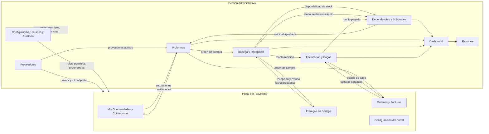
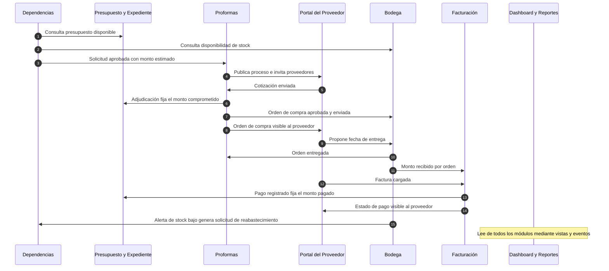
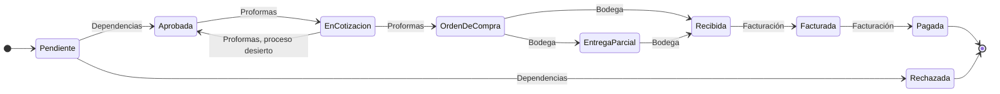

# Plan de integración y flujo de trabajo entre módulos

**Proyecto:** Sistema Web para la Gestión de la Cadena de Suministro de Proveedores — Municipalidad de Panajachel
**Fuentes:** DERCAS (27/07/2026), Tesis Final, prototipo y los planes individuales de cada módulo (Usuarios, Proveedores, Dependencias, Proformas, Facturación y Bodega)
**Metodología:** Scrum por sprints, arquitectura MVC

> Convención: lo marcado como **(propuesta)** es una recomendación mía que los documentos no mencionan. Queda a tu decisión.

**Módulos cubiertos**

| Gestión Administrativa | Portal del Proveedor |
|---|---|
| Dashboard, Dependencias, Proveedores, Proformas, Bodega, Facturación, Reportes, Configuración (con Usuarios y Auditoría) | Mis Oportunidades y Cotizaciones, Órdenes y Facturas, Entregas en Bodega, Configuración |

---

## 1. Objetivo

Que los módulos dejen de ser pantallas aisladas y funcionen como **un solo ciclo de adquisiciones**: cada módulo recibe lo que produce el anterior, actualiza lo que le corresponde y avisa al siguiente. El DERCAS lo plantea como una plataforma que "automatice e integre todo el ciclo de adquisiciones", y exige que todo quede en un **Expediente Digital único** (solicitudes, órdenes de compra, vales y demás registros de una misma transacción) con historial de auditoría de cada acción.

Este documento define: el flujo de trabajo de extremo a extremo, quién es dueño de cada dato y estado, qué se envía entre módulos, qué notificaciones se disparan, cómo alimentan el Dashboard y los Reportes, y el plan para implementarlo y probarlo.

## 2. Principios de integración

1. **Monolito modular.** Un solo backend Node.js y una sola base PostgreSQL, como describen los documentos (arquitectura MVC). Cada módulo es una carpeta con sus rutas, servicios y repositorios. No se necesitan microservicios ni colas externas.
2. **Cada dato tiene un solo dueño.** Un módulo **nunca** modifica las tablas de otro. Si necesita un cambio, llama al **servicio público** del módulo dueño (sección 6). Esto evita estados contradictorios.
3. **Lectura entre módulos por vistas.** Para consultar datos de otros módulos se usan vistas SQL de solo lectura (`v_expediente`, `v_presupuesto_dependencia`, `v_recibido_oc`). Una sola definición de cada cifra, usada por todos.
4. **Eventos internos.** Cuando algo importante ocurre, el módulo dueño emite un evento (por ejemplo `OC_APROBADA`). Los demás módulos reaccionan: crean notificaciones, actualizan indicadores o ejecutan la siguiente acción automática.
5. **Transacciones en lo crítico, efectos secundarios después.** El cambio de estado y las notificaciones internas se guardan en la misma transacción. El correo electrónico se envía después de confirmarla, para que un fallo del correo no deshaga un registro válido.
6. **Un portal, la misma API.** El Portal del Proveedor es otra interfaz sobre el mismo backend, bajo `/api/portal/*`, y siempre filtra por el proveedor de la cuenta autenticada.
7. **Todo queda en bitácora.** Un único servicio de auditoría registra usuario, módulo, entidad, estado anterior y estado nuevo.
8. **"Tiempo real" con consulta periódica (propuesta).** El DERCAS habla de métricas en tiempo real. Basta con que el frontend consulte cada 30 a 60 segundos; WebSocket o SSE no se mencionan en los documentos y no son necesarios.

## 3. Mapa de módulos



## 4. Flujo de trabajo de extremo a extremo

### 4.1 Vista general



### 4.2 Etapas del expediente

Una solicitud de compra recorre estas etapas. El módulo indicado es el **único** que puede provocar cada cambio.



La etapa visible la calcula la vista `v_expediente` (sección 7.3), no una columna que alguien deba mantener a mano. Así el estado "Pagado" que el prototipo muestra en el listado de Dependencias sale de los pagos reales.

### 4.3 Línea de vida paso a paso

| # | Módulo (dueño) | Quién | Acción | Estado que cambia | Qué recibe de otros | Qué dispara en otros |
|---|---|---|---|---|---|---|
| 1 | **Dependencias** | Dependencia solicitante | Crea la solicitud con ítems, prioridad, justificación | `requisicion` → `Pendiente` | Presupuesto disponible (vista); existencia en bodega (aviso si ya hay stock, se puede resolver con un vale de salida) | Notificación al revisor; bitácora |
| 2 | **Dependencias** | Revisor (DAFIM u otro, ver D-3) | Aprueba o rechaza, con notas | `requisicion` → `Aprobada` o `Rechazada` | Presupuesto disponible, que se revalida | A Compras: nueva solicitud aprobada para cotizar. Al solicitante: resultado. El monto estimado queda **comprometido** |
| 3 | **Proformas** | Encargado de Compras | Publica el proceso: fecha límite, proveedores invitados, mínimo de ofertas | `proceso_cotizacion` → `Publicada`; `requisicion` → `En Compra` | Lista de proveedores activos con cuenta de portal | Invitaciones: aparecen en **Mis Oportunidades** del proveedor (estado "En Licitación") con notificación |
| 4 | **Portal: Mis Oportunidades** | Proveedor | Envía su cotización con precios por ítem y PDF | `cotizacion` → `Recibida` | Ítems y fecha límite de la solicitud | Aviso a Compras; los KPI del portal suben |
| 5 | **Proformas** | Sistema / Compras | Al vencer la fecha límite (tarea programada) o al cerrar la recepción | `proceso_cotizacion` → `Comparación` | Ofertas recibidas | Aviso a Compras. Las ofertas son confidenciales hasta este punto |
| 6 | **Proformas** | Compras | Evalúa cumplimiento técnico y compara | `cotizacion` → `En Evaluación` | Documentación del proveedor (ficha de Proveedores) | — |
| 7 | **Proformas** | Compras (con motivo) | Adjudica la oferta ganadora | `cotizacion` → `Aceptada`, las demás `Rechazada`; `proceso` → `Adjudicada`; se crea `orden_compra` en `Pendiente` | Presupuesto disponible, que se revalida con el monto adjudicado | Avisos al ganador, a los no seleccionados, al solicitante y a DAFIM/Alcalde. `monto_adjudicado` reemplaza al estimado en el presupuesto |
| 8 | **Proformas** | DAFIM / Alcalde | Aprueba la orden y la envía | `orden_compra` → `Aprobada` → `Enviada` | — | La orden aparece en **Órdenes y Facturas** del proveedor. Bodega la ve como pendiente de recibir |
| 9 | **Portal: Entregas en Bodega** | Proveedor | Propone fecha y hora de entrega | `entrega_programada` → `Pendiente` | Órdenes `Enviada` del proveedor | Aviso a Bodega |
| 10 | **Bodega** | Encargado de Almacén | Confirma fecha y asigna encargado | `entrega_programada` → `Programada` | — | El proveedor ve "Programada" y el nombre del encargado |
| 11 | **Bodega** | Encargado de Almacén | Abre la recepción, verifica cada ítem (Recibido, Rechazar, Faltante) y finaliza | `recepcion_insumo` → `Completa`, `Parcial` o `Con Novedades`; `existencia` y `kardex` se actualizan; `orden_compra` → `Entregada` si todo fue aceptado; `entrega_programada` → `Completada` | Orden de compra autorizada (solo `Aprobada` o `Enviada`) | Avisos a Compras y al proveedor. Si hay rechazos o faltantes, queda pendiente una nueva entrega. Si el stock cruza el mínimo, alerta de stock |
| 12 | **Portal: Órdenes y Facturas** | Proveedor | Carga la factura (PDF/XML) vinculada a la orden | `factura` → `Recibida` | Monto recibido de la orden (vista `v_recibido_oc`) | Aviso a Compras y DAFIM. Se rechaza si excede lo recibido o es duplicada |
| 13 | **Facturación** | Compras, luego DAFIM | Revisa el expediente y aprueba | `factura` → `En Revisión` → `Aprobada` o `Rechazada` | Orden, recepción, factura | Si se rechaza, el proveedor ve el motivo y puede corregir |
| 14 | **Facturación** | DAFIM | Crea la orden de pago con partida y fuente, y la programa | `orden_pago` → `Pendiente` → `Programada` | Factura aprobada | Aparece en el cronograma; alertas 48 y 24 horas antes del vencimiento |
| 15 | **Facturación** | DAFIM (usuario distinto del que creó la orden) | Registra el pago realizado (fecha y referencia) | `orden_pago` → `Pagada` | — | El proveedor ve "Pagado". El monto **pagado** sube en el presupuesto de la dependencia. La etapa del expediente pasa a `Pagada` |
| 16 | **Dashboard y Reportes** | Todos con permiso | Consultan indicadores y reportes | — | Todo lo anterior mediante vistas | Exportan PDF o Excel; el expediente completo se puede generar para auditoría |

### 4.4 Flujos paralelos

**A. Alta de un proveedor (antes del paso 3)**
1. Compras registra o conecta al proveedor en **Proveedores** (nombre, NIT, correo, teléfono, rol, categoría).
2. Se crea su cuenta de portal con clave temporal y se envía el correo.
3. El proveedor inicia sesión y ve el **Portal** con el menú que le corresponde a su rol.
4. Desde ese momento puede ser invitado a procesos de cotización.

**B. Salida de bodega sin compra (alternativa al paso 3)**
1. La dependencia solicita un vale de salida en **Bodega** (o Dependencias avisa de que hay existencia).
2. El responsable del área lo autoriza; el stock baja y el Kardex registra la Salida.
3. Bodega entrega. El consumo por dependencia alimenta Reportes.

**C. Reabastecimiento automático (cierra el ciclo)**
1. Un movimiento deja un insumo por debajo del mínimo: **Bodega** genera la alerta y notifica a Bodega y Compras.
2. El **Dashboard** la muestra en "Alertas de Stock Bajo". Su botón **"Generar Orden de Reabastecimiento"** abre en **Dependencias** una solicitud prellenada (insumo, cantidad sugerida, unidad) del tipo "Reabastecimiento" **(propuesta)**.
3. La solicitud entra al flujo normal desde el paso 1.

## 5. Eventos y notificaciones

Un evento es una señal interna que emite el módulo dueño. Cada fila indica quién reacciona. Las notificaciones respetan las preferencias del usuario (correo, sistema, alertas de vencimiento), tal como las muestra la pantalla de Configuración del prototipo.

| Evento | Lo emite | Reaccionan | Notificación / acción automática |
|---|---|---|---|
| `PROVEEDOR_CONECTADO` | Proveedores | Usuarios | Correo con credenciales al proveedor |
| `REQ_CREADA` | Dependencias | Notificaciones | Aviso al revisor |
| `REQ_APROBADA` | Dependencias | Proformas, Presupuesto, Notificaciones | Aviso a Compras y al solicitante; reserva el monto estimado |
| `REQ_RECHAZADA` | Dependencias | Presupuesto, Notificaciones | Aviso al solicitante; libera la reserva |
| `PROCESO_PUBLICADO` | Proformas | Portal, Notificaciones | Invitación a cada proveedor; aparece en Mis Oportunidades |
| `COTIZACION_RECIBIDA` | Proformas / Portal | Notificaciones | Aviso a Compras |
| `FECHA_LIMITE_VENCIDA` | Tarea programada | Proformas | Pasa el proceso a `Comparación`; aviso a Compras |
| `ADJUDICADA` | Proformas | Presupuesto, Notificaciones | Aviso a ganador, no seleccionados, solicitante y DAFIM; fija `monto_adjudicado` |
| `PROCESO_DESIERTO` | Proformas | Dependencias, Presupuesto | La solicitud vuelve a `Aprobada`; aviso al solicitante |
| `OC_APROBADA` / `OC_ENVIADA` | Proformas | Bodega, Portal, Notificaciones | La orden queda pendiente de recibir; visible al proveedor |
| `ENTREGA_PROPUESTA` | Portal | Bodega | Aviso al Encargado de Almacén |
| `ENTREGA_PROGRAMADA` | Bodega | Portal | El proveedor ve fecha y encargado |
| `RECEPCION_FINALIZADA` | Bodega | Proformas, Facturación, Portal, Dashboard | Orden `Entregada` si está completa; habilita la facturación; avisa a Compras y proveedor |
| `RECEPCION_CON_NOVEDADES` | Bodega | Compras, Portal | Seguimiento por rechazos o faltantes |
| `STOCK_BAJO` | Bodega | Dashboard, Compras, Dependencias | Alerta; ofrece reabastecimiento |
| `FACTURA_CARGADA` | Facturación / Portal | Notificaciones | Aviso a Compras y DAFIM |
| `FACTURA_APROBADA` / `FACTURA_RECHAZADA` | Facturación | Portal, Notificaciones | El proveedor ve el estado o el motivo |
| `OP_PROGRAMADA` | Facturación | Cronograma, Notificaciones | Aparece en el calendario de pagos |
| `VENCIMIENTO_48H` / `VENCIMIENTO_24H` | Tarea programada | Notificaciones | Alerta a DAFIM y Compras, una sola vez por orden |
| `PAGO_REGISTRADO` | Facturación | Presupuesto, Portal, Dashboard, Reportes | Sube el monto pagado; el proveedor ve "Pagado" |

**Implementación (propuesta).** Un módulo `eventos` con un emisor interno (`EventEmitter` de Node.js) donde cada módulo registra sus reacciones al arrancar. Las reacciones que cambian datos van dentro de la transacción del emisor. Los correos se envían tras confirmar. Si luego se necesitara más robustez, el mismo contrato se puede pasar a una cola sin cambiar los módulos.

## 6. Contratos entre módulos

### 6.1 Servicios públicos (lo que un módulo ofrece a los demás)

| Módulo dueño | Función pública | La usan | Para qué |
|---|---|---|---|
| Presupuesto (Dependencias) | `disponible(idDependencia, idPeriodo)` | Dependencias, Proformas, Dashboard | Validar solicitudes y adjudicaciones |
| Dependencias | `marcarEnCompra(idRequisicion)` | Proformas | Pasar la solicitud a `En Compra` al publicar |
| Dependencias | `reabrir(idRequisicion)` | Proformas | Volver a `Aprobada` si el proceso queda desierto |
| Dependencias | `crearDesdeAlerta(idInsumo, cantidad)` | Dashboard, Bodega | Solicitud de reabastecimiento |
| Proformas | `marcarOrdenEntregada(idOrden)` | Bodega | Cerrar la entrega cuando todo fue aceptado |
| Proformas | `ordenesPendientesDeRecibir()` | Bodega | Alimentar el modal "Nueva Recepción" |
| Proveedores | `proveedoresInvitables()` | Proformas | Solo proveedores activos con cuenta |
| Proveedores | `proveedorDeCuenta(idUsuario)` | Portal (todos los módulos) | Identificar al proveedor autenticado |
| Bodega | `disponibilidad(insumos[])` | Dependencias | Aviso al crear la solicitud |
| Bodega | `registrarMovimiento(...)` | Recepciones, Vales, Toma física | **Único** punto que modifica existencias y Kardex |
| Bodega | vista `v_recibido_oc` | Facturación | Límite de lo que se puede facturar |
| Facturación | vista `v_factura_estado` y `ordenesPagoPorProveedor()` | Portal, Dashboard | Estado de pago visible |
| Usuarios | `notificaciones.enviar(usuario, tipo, mensaje, ref)` | Todos | Notificaciones respetando preferencias |
| Usuarios | `audit.log({modulo, accion, entidad, id, antes, despues})` | Todos | Bitácora uniforme |

### 6.2 Quién es dueño de qué

| Dato o estado | Dueño (único que escribe) | Lo leen |
|---|---|---|
| `usuario`, `rol`, `permiso`, `empleado`, `dependencia_municipal`, preferencias | Usuarios y Configuración | Todos |
| `proveedor`, `proveedor_usuario`, `tipo_proveedor` | Proveedores | Proformas, Facturación, Portal, Reportes |
| `categoria`, `unidad_medida`, `insumo`, `existencia`, `kardex`, `recepcion_insumo`, `vale_salida`, `entrega_programada` | Bodega | Dependencias, Proformas, Facturación, Dashboard, Reportes |
| `periodo_fiscal`, `presupuesto_dependencia`, `requisicion` y sus detalles | Dependencias | Proformas, Dashboard, Reportes |
| `proceso_cotizacion`, `cotizacion`, `orden_compra` | Proformas (salvo `Entregada`, que cambia vía la función de arriba) | Bodega, Facturación, Portal, Reportes |
| `factura`, `orden_pago`, `partida_presupuestaria`, `fuente_financiamiento` | Facturación | Portal, Dashboard, Reportes |
| `notificacion`, `bitacora_acceso` | Usuarios (servicios compartidos) | Todos |

## 7. Datos compartidos: vistas, presupuesto y expediente

### 7.1 Una sola definición de presupuesto

Los documentos usan "presupuesto ejecutado" en varias pantallas (Dependencias, Dashboard, Reportes) sin definirlo, y los planes anteriores dejaron la decisión abierta. Propongo tres cifras fijas:

| Cifra | Definición | Quién la usa |
|---|---|---|
| **Asignado** | Monto del período para la dependencia | Dependencias, Reportes ("presupuesto asignado") |
| **Comprometido** | Solicitudes `Aprobada` o `En Compra`, con el monto adjudicado si existe y, si no, el estimado | Validación de solicitudes y adjudicaciones |
| **Pagado** | Órdenes de pago `Pagada` | Dashboard ("presupuesto ejecutado"), Reportes ("gasto real") |

`Disponible = Asignado − Comprometido`. El pagado está **incluido** en el comprometido. Con esto, el Dashboard y los Reportes muestran el mismo número que el módulo que lo origina.

### 7.2 Script de integración

Este script se ejecuta **después** de las migraciones de todos los módulos, porque las vistas usan sus tablas.

```sql
-- 060_integracion.sql  (PostgreSQL 15+, ejecutar al final)

-- 1) Bitácora uniforme para todos los módulos
ALTER TABLE bitacora_acceso
  ADD COLUMN IF NOT EXISTS modulo          VARCHAR(50),
  ADD COLUMN IF NOT EXISTS detalle         TEXT,
  ADD COLUMN IF NOT EXISTS entidad         VARCHAR(30),
  ADD COLUMN IF NOT EXISTS id_entidad      INT,
  ADD COLUMN IF NOT EXISTS estado_anterior VARCHAR(30),
  ADD COLUMN IF NOT EXISTS estado_nuevo    VARCHAR(30);
CREATE INDEX IF NOT EXISTS idx_bitacora_entidad ON bitacora_acceso (entidad, id_entidad);

-- 2) Plazo de crédito: lo cotiza el proveedor y pasa a la orden de compra
ALTER TABLE cotizacion
  ADD COLUMN IF NOT EXISTS plazo_credito_dias INT CHECK (plazo_credito_dias >= 0);

-- 3) Preferencias de Configuración (portal y gestión administrativa)
CREATE TABLE IF NOT EXISTS usuario_preferencia (
  id_usuario          INT PRIMARY KEY REFERENCES usuario(id_usuario),
  tema                VARCHAR(10) NOT NULL DEFAULT 'claro' CHECK (tema IN ('claro','oscuro')),
  color_acento        VARCHAR(7),
  interfaz_compacta   BOOLEAN NOT NULL DEFAULT FALSE,
  animaciones         BOOLEAN NOT NULL DEFAULT TRUE,
  idioma              VARCHAR(10) NOT NULL DEFAULT 'es-GT',
  zona_horaria        VARCHAR(40) NOT NULL DEFAULT 'America/Guatemala',
  notif_correo        BOOLEAN NOT NULL DEFAULT TRUE,
  notif_sistema       BOOLEAN NOT NULL DEFAULT TRUE,
  alertas_vencimiento BOOLEAN NOT NULL DEFAULT TRUE
);

-- 4) Presupuesto: asignado, comprometido y pagado por dependencia y período
CREATE OR REPLACE VIEW v_presupuesto_dependencia AS
SELECT pd.id_dependencia, pd.id_periodo, pd.monto_asignado,
       COALESCE(SUM(CASE WHEN r.estado IN ('Aprobada','En Compra')
                         THEN COALESCE(r.monto_adjudicado, r.monto_estimado) END), 0) AS comprometido,
       COALESCE(SUM(pg.monto_pagado), 0) AS pagado,
       pd.monto_asignado
         - COALESCE(SUM(CASE WHEN r.estado IN ('Aprobada','En Compra')
                             THEN COALESCE(r.monto_adjudicado, r.monto_estimado) END), 0) AS disponible
FROM presupuesto_dependencia pd
LEFT JOIN requisicion r
       ON r.id_dependencia = pd.id_dependencia AND r.id_periodo = pd.id_periodo
LEFT JOIN (
  SELECT oc.id_requisicion, SUM(op.monto) AS monto_pagado
  FROM orden_pago op
  JOIN factura f       ON f.id_factura = op.id_factura
  JOIN orden_compra oc ON oc.id_orden_compra = f.id_orden_compra
  WHERE op.estado = 'Pagada'
  GROUP BY oc.id_requisicion
) pg ON pg.id_requisicion = r.id_requisicion
GROUP BY pd.id_dependencia, pd.id_periodo, pd.monto_asignado;

-- 5) Expediente digital: una fila por solicitud con su etapa actual
CREATE OR REPLACE VIEW v_expediente AS
SELECT r.id_requisicion, r.codigo_requisicion, r.id_dependencia, r.id_periodo,
       r.estado AS estado_solicitud, pc.fase AS fase_cotizacion,
       oc.id_orden_compra, oc.numero_orden, oc.id_proveedor,
       oc.estado AS estado_orden, oc.monto_total AS monto_orden,
       COALESCE(rc.monto_recibido, 0)  AS monto_recibido,
       COALESCE(fa.monto_facturado, 0) AS monto_facturado,
       COALESCE(pa.monto_pagado, 0)    AS monto_pagado,
       CASE
         WHEN r.estado IN ('Rechazada','Cancelada')                 THEN r.estado
         WHEN oc.id_orden_compra IS NOT NULL
              AND COALESCE(pa.monto_pagado, 0) >= oc.monto_total    THEN 'Pagada'
         WHEN COALESCE(fa.monto_facturado, 0) > 0                   THEN 'Facturada'
         WHEN oc.estado = 'Entregada'                               THEN 'Recibida'
         WHEN COALESCE(rc.monto_recibido, 0) > 0                    THEN 'Entrega parcial'
         WHEN oc.id_orden_compra IS NOT NULL                        THEN 'Orden de compra'
         WHEN pc.fase IS NOT NULL                                   THEN 'En cotización'
         ELSE r.estado
       END AS etapa
FROM requisicion r
LEFT JOIN proceso_cotizacion pc ON pc.id_requisicion = r.id_requisicion
LEFT JOIN orden_compra oc       ON oc.id_requisicion = r.id_requisicion AND oc.estado <> 'Cancelada'
LEFT JOIN v_recibido_oc rc      ON rc.id_orden_compra = oc.id_orden_compra
LEFT JOIN (SELECT id_orden_compra, SUM(monto_total) AS monto_facturado
           FROM factura WHERE estado <> 'Rechazada' GROUP BY id_orden_compra) fa
       ON fa.id_orden_compra = oc.id_orden_compra
LEFT JOIN (SELECT f.id_orden_compra, SUM(op.monto) AS monto_pagado
           FROM orden_pago op JOIN factura f ON f.id_factura = op.id_factura
           WHERE op.estado = 'Pagada' GROUP BY f.id_orden_compra) pa
       ON pa.id_orden_compra = oc.id_orden_compra;
```

### 7.3 Expediente Digital

El DERCAS pide un expediente único por transacción para las auditorías de la Contraloría, **sin** acceso directo para ella (solo reportes e historial). Con las vistas anteriores se arma así:

- `GET /api/reportes/expediente/:idRequisicion`: reúne solicitud, proceso, cotizaciones (con la comparativa), orden de compra, recepciones, facturas, órdenes de pago y la bitácora de cada una.
- `GET /api/reportes/expediente/:idRequisicion/pdf`: versión imprimible con índice.
- Los archivos adjuntos (proformas, facturas) se descargan con permiso, no por URL pública.

## 8. Dashboard, Reportes y Configuración

### 8.1 Dashboard (solo lee; no es dueño de datos)

| Elemento del prototipo | Fuente | Detalle |
|---|---|---|
| Total solicitudes (+8 % este mes) | `requisicion` | Conteo del mes y comparación con el mes anterior |
| Órdenes pendientes (monto "en trámite") | `orden_compra` | Estados `Pendiente`, `Aprobada`, `Enviada`, con suma de montos |
| Entregas parciales ("requieren seguimiento") | `recepcion_insumo` / `v_expediente` | Órdenes con etapa `Entrega parcial`; "seguimiento" = más de N días sin completar (propuesta, N configurable) |
| Presupuesto ejecutado (Q 2.9M de Q 4.5M) | `v_presupuesto_dependencia` | **Pagado** frente a **asignado** |
| Gastos por departamento (clic para ver detalle) | `v_presupuesto_dependencia` | Barras por dependencia y mes; el clic abre el detalle de sus expedientes |
| Alertas de stock bajo | `existencia` | Más críticos primero; botón de reabastecimiento (flujo C) |
| Actividad reciente / "Actividades" | `bitacora_acceso` | Últimas acciones; "Ver todo" abre la bitácora |
| Total de facturas por pagar | `v_factura_estado` | Del módulo de Facturación |

**Endpoints:** `GET /api/dashboard/resumen`, `/gastos-departamento?mes=`, `/alertas-stock`, `/actividad-reciente?limite=`.

**Alcance por rol (propuesta):** el Alcalde, DAFIM, Compras y el Administrador ven todo; una dependencia solo ve lo suyo; Almacén ve bodega y entregas.

> Los datos de ejemplo del prototipo no coinciden entre pantallas (por ejemplo, el mínimo de Papel Bond A4 aparece como 100 en el Dashboard y como 50 en Bodega, y la ejecución presupuestaria como 64.5 % y 78 %). No se deben copiar: al leer todo de las mismas vistas, esas diferencias desaparecen.

### 8.2 Reportes (solo lee; exporta)

Los documentos piden reportes sobre rotación de insumos, consumos por dependencia, historial de compras por proveedor y estado financiero del almacén, exportables a PDF o Excel.

| Reporte | Fuente | Endpoint |
|---|---|---|
| Gasto mensual por proveedor y total del mes (con variación) | `orden_pago` pagadas | `GET /api/reportes/gasto-proveedor?mes=` |
| Gastos por departamento: asignado, gasto real, estado y variación | `v_presupuesto_dependencia` | `GET /api/reportes/gasto-departamento?periodo=` |
| Eficiencia presupuestaria | `v_presupuesto_dependencia` | `GET /api/reportes/resumen-presupuestario` |
| Rotación de insumos | `kardex` | `GET /api/reportes/rotacion-insumos` |
| Consumo por dependencia | `vale_salida` | `GET /api/reportes/consumo-dependencia` |
| Historial de compras por proveedor | `orden_compra`, `cotizacion` | `GET /api/reportes/historial-proveedor/:id` |
| Estado financiero y de existencias del almacén | `existencia`, `kardex` | `GET /api/reportes/estado-almacen` |
| Expediente digital | Sección 7.3 | `GET /api/reportes/expediente/:id` |
| Exportación | Cualquiera de los anteriores | `GET /api/reportes/exportar?tipo=&formato=pdf|xlsx` |

**Fórmulas que reproducen el prototipo:** variación = (gasto real − asignado) ÷ asignado (por ejemplo, Obras Públicas: Q 425,000 sobre Q 500,000 da −15.0 %). El estado "Dentro de Límite", "Excedido" o "En Proceso" se calcula comparando el gasto con el asignado; los umbrales exactos no están en los documentos (decisión D-8).

**Complementos sugeridos (propuesta):** `exceljs` para Excel y `pdfkit` para PDF.

### 8.3 Configuración

**Gestión Administrativa** (pestañas del prototipo)

| Pestaña | Qué hace | Se conecta con |
|---|---|---|
| Apariencia y Tema | Tema oscuro, interfaz compacta, animaciones, color de acento, idioma, zona horaria | `usuario_preferencia` |
| Perfil de Usuario | Datos personales y cargo | `empleado`, `usuario` |
| Notificaciones | Canales (correo, sistema) y alertas de vencimiento | Servicio de notificaciones; el cronograma de Facturación respeta "alertas de vencimiento" |
| Seguridad y Accesos | Cambio de clave, sesiones, roles y permisos | Módulo de Usuarios |
| Auditoría | Registro de actividad con exportación a CSV | `bitacora_acceso` (el prototipo muestra "Log exportado") |

También aquí se administran los catálogos: dependencias, partidas, fuentes de financiamiento, tipos de proveedor y períodos fiscales.

**Portal del Proveedor**

| Opción | Qué hace | Se conecta con |
|---|---|---|
| Modo oscuro | Preferencia de interfaz | `usuario_preferencia` |
| Proveedor / correo de contacto | El proveedor actualiza correo, teléfono y nombre de contacto. **No** puede cambiar NIT ni razón social (solo la municipalidad) **(propuesta)** | `proveedor` (vía el servicio de Proveedores) |
| Cambio de clave | Obligatorio en el primer ingreso | Usuarios |
| Notificaciones | Canales y alertas | Servicio de notificaciones |

**Endpoints:** `GET/PUT /api/configuracion/preferencias`, `PUT /api/portal/configuracion`, `POST /api/auth/cambiar-clave`.

## 9. Portal del Proveedor: cómo se conecta con la gestión administrativa

| Pantalla del portal | Módulo interno asociado | El proveedor ve y hace | Efecto en la gestión administrativa |
|---|---|---|---|
| **Mis Oportunidades y Cotizaciones** | Proformas | Solicitudes a las que fue invitado, con fecha límite y presupuesto; envía o corrige su cotización; "Subir Proforma Directa" | Crea o actualiza la `cotizacion`; alimenta la comparativa; aviso a Compras |
| **Órdenes y Facturas** | Proformas (órdenes) y Facturación (facturas y pagos) | Sus órdenes de compra, con estado de pago (Pagado, En Proceso, Pendiente); "Carga rápida de factura FEL" | Crea la `factura`; valida contra lo recibido; aviso a Compras y DAFIM |
| **Entregas en Bodega** | Bodega | Sus entregas (Programada, Completada, Pendiente) y propone fecha | Crea `entrega_programada`; aviso a Bodega; al recibir, se marca `Completada` |
| **Configuración** | Usuarios y Proveedores | Tema, contacto, clave, notificaciones | Actualiza preferencias y datos de contacto |
| **Inicio (KPI)** | Proformas, Facturación | Cotizaciones enviadas (con las que están en revisión técnica), órdenes adjudicadas con su monto, facturas pendientes y próximo pago | `GET /api/portal/resumen` combina las tres fuentes |

**Reglas del portal**
1. Toda consulta filtra por el `id_proveedor` de la cuenta. Un proveedor **nunca** ve ofertas, precios, facturas ni entregas de otro.
2. Estados que ve el proveedor: los de la sección 5.4 y 6.5 de los planes de Proformas y Facturación (combinaciones de proceso y cotización, o de factura y pago).
3. Un proveedor `inactivo` o con cuenta bloqueada no puede enviar cotizaciones ni cargar facturas; sus registros anteriores se conservan.
4. Los nombres de los submenús del portal en la base deben coincidir exactamente con los del prototipo, porque el RBAC los usa para construir el menú.

## 10. Reversiones y excepciones

Es donde más se rompen las integraciones. Cada caso debe tener una regla única:

| Situación | Qué ocurre |
|---|---|
| Solicitud rechazada o cancelada | Se libera el monto comprometido |
| Proceso de cotización queda **desierto** | La solicitud vuelve a `Aprobada` y se puede publicar de nuevo |
| Orden de compra cancelada **sin** recepciones | Se libera el monto adjudicado; Compras decide si re-adjudica o declara desierto |
| Orden de compra con recepciones | No se cancela; solo se cierra con lo recibido (ver D-6) |
| Recepción con rechazo | No ingresa stock; el proveedor debe reentregar; Facturación solo permite facturar lo aceptado |
| Recepción cancelada antes de finalizar | Sin efecto en stock ni en Kardex |
| Factura rechazada | El proveedor ve el motivo y la **corrige y reenvía** sobre el mismo registro (`Rechazada → Recibida`). Sin esto, el control de duplicados le impediría volver a cargar el mismo número |
| Orden de pago anulada | La factura queda `Aprobada` sin orden de pago; el presupuesto no cambia |
| Vale de salida cancelado después de autorizado | Entrada de reversión en el Kardex; nunca se edita el movimiento original |
| Proveedor desactivado con procesos abiertos | Sus ofertas y órdenes se conservan; no recibe nuevas invitaciones; se avisa a Compras |
| Dependencia desactivada | No recibe nuevas solicitudes; sus expedientes abiertos continúan |
| Cierre de período fiscal | Hay que definir qué pasa con solicitudes abiertas (ver D-9) |

## 11. Ajustes necesarios a los planes individuales

Al unir los planes aparecieron estas diferencias. Corregirlas es parte de la integración:

| Plan | Ajuste | Motivo |
|---|---|---|
| Usuarios | Ampliar `bitacora_acceso` (módulo, entidad, estados); crear `usuario_preferencia`; ser dueño de `notificacion` | Auditoría uniforme y Configuración |
| Usuarios / Proveedores | `usuario.id_empleado` opcional y `tipo_usuario` | Cuentas del portal |
| Proveedores | Registrar si la documentación del proveedor fue verificada y cuándo (propuesta: `documentacion_verificada`, `fecha_verificacion`) | La comparativa muestra "cumplimiento técnico: se verificó RTU y patente de comercio" |
| Dependencias | El presupuesto sale de `v_presupuesto_dependencia`; usar `monto_adjudicado`; agregar el tipo "Reabastecimiento"; consultar disponibilidad a Bodega; la etapa "Pagado" sale de `v_expediente` | Una sola cifra |
| Proformas | `cotizacion.plazo_credito_dias`, copiado a `orden_compra.plazo_credito_dias` al adjudicar; `Entregada` solo la fija Bodega; proceso desierto reabre la solicitud | Facturación necesita un plazo numérico |
| Bodega | Recibir solo órdenes `Aprobada` o `Enviada`; exponer `v_recibido_oc`; `detalle_recepcion` enlazado por `id_detalle_orden` | Resuelve el vínculo con Facturación |
| Facturación | Permitir `Rechazada → Recibida`; limitar lo facturado con `v_recibido_oc`; al pagar, emitir `PAGO_REGISTRADO` | Evita el bloqueo por duplicado |
| Todos | Códigos únicos: `SC-AAAA-NNN` para solicitudes (se descartan los `SOL-`), `COT-`, `OC-`, `REC-`, `VS-`, `OP-` | El prototipo mezcla `SC-` y `SOL-` |
| Todos | Orden de migraciones: 001 Usuarios, 010 Proveedores, 015 Catálogo de insumos, 020 Dependencias, 030 Proformas, 040 Facturación, 050 Bodega, **060 Integración** | Las vistas dependen de todas las tablas |

## 12. Roles y permisos (propuesta base)

Basada en los grupos de usuarios del DERCAS y el proceso de gestión de usuarios de la tesis, que menciona también a **auditores**. **V** ver, **C** crear o registrar, **A** aprobar o autorizar, **X** exportar. Confirma esta matriz con los responsables antes de sembrarla.

| Función | Administrador | Alcalde | DAFIM | Compras | Almacén | Dependencia | Proveedor |
|---|---|---|---|---|---|---|---|
| Dashboard | V | V | V | V | V (bodega) | V (lo suyo) | — |
| Dependencias y solicitudes | V C A | V | V A | V | V | V C (lo suyo) | — |
| Proveedores | V C | V | V | V C | V | — | Su perfil |
| Proformas y comparativa | V | V | V | V C | — | — | Sus ofertas |
| Adjudicación | V | V | V | C | — | — | — |
| Órdenes de compra | V A | V A | V A | V C | V | — | Las suyas |
| Bodega y recepción | V | V | V | V | V C | — | Sus entregas |
| Vales de salida | V | V | V | V | V C A | C | — |
| Facturas | V | V | V A | V A | V | — | Sus facturas |
| Órdenes de pago | V | V | V C A | V | — | — | Su estado |
| Reportes | V X | V X | V X | V X | V X (bodega) | V (lo suyo) | — |
| Configuración y usuarios | V C A | — | — | — | — | Su perfil | Su perfil |
| Auditoría (bitácora) | V X | V | V | — | — | — | — |

**Separación de funciones (propuesta):** quien crea una orden de pago no la programa ni registra el pago; quien emite una orden de compra no la aprueba; quien solicita un vale no lo autoriza.

## 13. Inventario de funcionalidades por pantalla

Lista de control para comprobar que **todas** las funciones del prototipo quedaron conectadas. "Plan" indica dónde está su diseño detallado.

| Pantalla | Funcionalidad | Recibe de | Envía a | Plan |
|---|---|---|---|---|
| Inicio de sesión | Login, bloqueo, primer cambio de clave | Usuarios | Todos (menú y permisos) | Usuarios |
| Dashboard | Tarjetas, gastos por departamento, alertas de stock, actividad, reabastecimiento | Todas las vistas | Dependencias (reabastecimiento) | Este documento |
| Dependencias | Listado maestro, filtro, presupuesto, KPIs, impresión | `v_expediente`, `v_presupuesto_dependencia` | — | Dependencias |
| Dependencias | Formulario de solicitud con presupuesto restante | Presupuesto, Bodega | Proformas | Dependencias |
| Proveedores | Gestión de accesos, KPIs, bloqueo, restablecer clave | Usuarios | Portal, Proformas | Proveedores |
| Proveedores | Conectar nuevo proveedor + correo | — | Usuarios, Notificaciones | Proveedores |
| Proformas | Publicar proceso, invitar proveedores | Dependencias, Proveedores | Portal | Proformas |
| Proformas | Comparativa, exportar cuadro, adjudicar | Cotizaciones, Presupuesto | Bodega, Portal, Presupuesto | Proformas |
| Proformas | Órdenes de compra: aprobar, enviar, PDF | Adjudicación | Bodega, Portal, Facturación | Proformas |
| Bodega | Alertas de stock, resumen mensual | Existencias | Dashboard, Dependencias | Bodega |
| Bodega | Nueva recepción y verificación por ítem | Órdenes de compra | Existencias, Kardex, Proformas, Facturación | Bodega |
| Bodega | Inventario, Kardex, vales de salida, toma física | Catálogo | Reportes, Dashboard | Bodega |
| Facturación | Cargar factura (PDF/XML) y validarla | Recibido por orden | Revisión, Portal | Facturación |
| Facturación | Revisión y aprobación de facturas | Factura | Orden de pago, Portal | Facturación |
| Facturación | Nueva orden de pago con partida y fuente | Factura aprobada | Cronograma | Facturación |
| Facturación | Cronograma, alertas, registro de pago | Órdenes de pago | Presupuesto, Portal, Dashboard | Facturación |
| Reportes | Gasto por proveedor y por departamento, exportar PDF | Vistas | Archivos PDF y Excel | Este documento |
| Reportes | Expediente digital | Todos los módulos | PDF para auditoría | Este documento |
| Configuración | Apariencia, perfil, notificaciones, seguridad, auditoría | Usuarios | Preferencias, bitácora | Este documento |
| Portal: Mis Oportunidades | Ver invitaciones, enviar cotización | Proformas | Proformas | Proformas |
| Portal: Órdenes y Facturas | Ver órdenes y estado de pago, cargar factura | Proformas, Facturación | Facturación | Facturación |
| Portal: Entregas en Bodega | Ver y proponer entregas | Bodega | Bodega | Bodega |
| Portal: Configuración | Tema, contacto, clave | Usuarios, Proveedores | Usuarios, Proveedores | Este documento |

## 14. Plan de implementación de la integración

Se ejecuta **mientras** se cierra cada módulo (cada uno trae su criterio de integración) o todo junto si los módulos ya existen. Si alguno ya está construido, solo hay que comprobar su contrato de la sección 6.

> **Nota de calendario.** El cronograma de la tesis fija la conexión y despliegue inicial del 05/10 al 20/10/2026, las pruebas del 21/10 al 30/10, los manuales y la capacitación hasta el 22/11 y la entrega el 23/11. Hoy es 05/10, es decir, quedan unas siete semanas. No sé cuántos módulos tienes construidos, así que el plan está ordenado por **camino crítico**: primero el ciclo completo solicitud → proforma → orden de compra → recepción → factura → pago, y después los indicadores.

### Fase 0 — Contratos y decisiones (1–2 días)
- Cerrar las decisiones de la sección 15, en especial D-1, D-2 y D-3.
- Acordar convenciones de API: paginación, filtros, formato de error, códigos `401`, `403`, `409` y `422`.
- Crear la colección de Postman del flujo completo.

### Fase 1 — Núcleo transversal (Sprint I-1)
- Servicios compartidos: `audit.service`, `notificaciones.service` (con preferencias), módulo de eventos, `presupuesto.service`.
- Migración `060_integracion.sql` y vistas.
- **Criterio de aceptación:** un evento de prueba crea una notificación y una fila de bitácora en la misma transacción; las vistas devuelven datos con un caso de ejemplo.

### Fase 2 — Dependencias, Proveedores y Proformas con el portal (Sprint I-2)
- Pasos 1 al 8 de la línea de vida: solicitud aprobada, publicación, invitaciones, Mis Oportunidades, cotización, comparativa, adjudicación y orden de compra.
- **Criterio de aceptación:** una solicitud aprobada llega al portal del proveedor invitado; tras adjudicar, el presupuesto disponible baja y la orden aparece en su portal.

### Fase 3 — Bodega con Proformas y el portal (Sprint I-3)
- Pasos 9 al 11: entregas programadas, recepción, stock, Kardex, `Entregada`.
- Alertas de stock y flujo de reabastecimiento hacia Dependencias.
- **Criterio de aceptación:** una recepción parcial deja la orden abierta y avisa a Compras; el stock bajo genera una solicitud prellenada.

### Fase 4 — Facturación con Bodega y el portal (Sprint I-4)
- Pasos 12 al 15: carga de factura limitada por lo recibido, revisión, orden de pago, cronograma, pago y alertas.
- **Criterio de aceptación:** no se puede facturar más de lo recibido; al registrar el pago, el proveedor ve "Pagado" y el presupuesto pagado sube.

### Fase 5 — Dashboard, Reportes, Expediente y Configuración (Sprint I-5)
- Endpoints de la sección 8, expediente en PDF, exportación a Excel y PDF, preferencias y auditoría.
- **Criterio de aceptación:** las cifras del Dashboard, los Reportes y los módulos de origen coinciden para el mismo período.

### Fase 6 — Pruebas de extremo a extremo y despliegue (Sprint I-6)
- Escenarios de la sección 16, pruebas de rendimiento de las vistas, revisión de seguridad.
- Despliegue con Docker y SSL/TLS, manuales de usuario y capacitación por rol.

**Alcance mínimo si el tiempo no alcanza:** Fases 0, 1, 2, 3 y 4 con el camino crítico, Dashboard con las cuatro tarjetas y el gráfico de gastos, y el reporte de gasto por departamento. Quedan para después: vales de salida, toma física, reabastecimiento automático, exportación a Excel y personalización de Configuración.

## 15. Decisiones pendientes

- **D-1** ¿Se aprueban las tres cifras de presupuesto (asignado, comprometido, pagado) y que el Dashboard muestre "ejecutado" como **pagado**? Es la decisión que más afecta a Dependencias, Dashboard y Reportes.
- **D-2** ¿Se aprueba el monolito modular con eventos internos y vistas compartidas, sin cola externa?
- **D-3** ¿Quién aprueba las solicitudes de compra y con qué montos? Los documentos mencionan a DAFIM y al Alcalde, pero no umbrales.
- **D-4** ¿Qué documentos forman el Expediente Digital y dónde se almacenan los adjuntos (PDF y XML)? Los documentos no lo indican.
- **D-5** ¿El reabastecimiento automático crea la solicitud directamente o solo la deja prellenada para revisar? ¿Con qué cantidad sugerida? El plan propone prellenar la diferencia hasta el stock mínimo, editable.
- **D-6** ¿Cómo se cierra una orden de compra cuando el proveedor no entrega lo faltante?
- **D-7** ¿Se aprueba la matriz de roles de la sección 12, incluida la separación de funciones?
- **D-8** Umbrales de "Dentro de Límite", "Excedido" y "En Proceso" en el reporte de gastos por departamento.
- **D-9** Qué ocurre con las solicitudes abiertas al cerrar el período fiscal.
- **D-10** ¿Se permite que el proveedor edite su correo y teléfono desde el portal, con verificación, o solo la municipalidad?
- **D-11** Proveedor de correo electrónico (SMTP municipal u otro). Los documentos no lo definen.
- **D-12** Frecuencia de actualización de Dashboard y notificaciones (el plan propone consulta cada 30 a 60 segundos).

## 16. Pruebas de integración

Se automatizan con Jest + Supertest y se documentan en Postman, con un guion de datos de demostración (`seed_demo`) que arma el escenario base.

| # | Escenario | Resultado esperado |
|---|---|---|
| 1 | **Camino feliz:** solicitud → aprobación → proceso → 3 cotizaciones → adjudicación → orden → recepción completa → factura → orden de pago → pago | Etapas del expediente correctas en cada paso; etapa final `Pagada`; presupuesto pagado igual al monto; notificaciones esperadas en cada módulo |
| 2 | Solicitud por encima del presupuesto disponible | `422` y mensaje con el saldo |
| 3 | Menos ofertas que el mínimo, o ninguna | No se puede adjudicar; se puede declarar desierto y la solicitud vuelve a `Aprobada` |
| 4 | Recepción parcial y luego segunda entrega | Orden `Entregada` solo al completar; stock y Kardex correctos en ambas |
| 5 | Recepción con ítem rechazado | Stock no sube por lo rechazado; Facturación solo permite facturar lo aceptado |
| 6 | Factura que excede lo recibido, duplicada, o de otro proveedor | Rechazadas con el código y mensaje correctos |
| 7 | Factura rechazada y reenviada corregida | Vuelve a `Recibida` sin chocar con el control de duplicados |
| 8 | Dos adjudicaciones, dos recepciones o dos pagos simultáneos | Una sola se aplica; sin duplicados en orden de compra, stock ni pago |
| 9 | Stock cruza el mínimo | Una sola alerta; el Dashboard la muestra; el reabastecimiento crea la solicitud prellenada |
| 10 | Proveedor consulta datos de otro proveedor (por API) | `403` o `404`; ninguna cifra de otro proveedor aparece en sus pantallas |
| 11 | Cada rol prueba cada endpoint | La matriz de la sección 12 se cumple |
| 12 | Cifras cruzadas | Dashboard, Reportes, v_presupuesto_dependencia y cada módulo muestran los mismos totales |
| 13 | Expediente digital de una compra completa | Contiene todos los documentos y toda la bitácora, en orden cronológico |

## 17. Definición de terminado de la integración

- [ ] El escenario de camino feliz pasa de principio a fin sin intervención manual en la base de datos.
- [ ] Ningún módulo escribe en tablas de otro; todos los cambios pasan por servicios públicos.
- [ ] Cada evento de la sección 5 genera su notificación y su registro en bitácora.
- [ ] Las cifras de presupuesto son idénticas en Dependencias, Dashboard y Reportes.
- [ ] Ningún proveedor puede ver datos de otro, ni por pantalla ni por API.
- [ ] Todas las reversiones de la sección 10 tienen una prueba.
- [ ] Todas las funciones de la sección 13 funcionan con datos reales, sin datos de ejemplo en el frontend.
- [ ] Las migraciones, incluida la `060`, corren desde cero en PostgreSQL 15.
- [ ] Colección de Postman, manuales de usuario por rol y guion de demostración actualizados.
