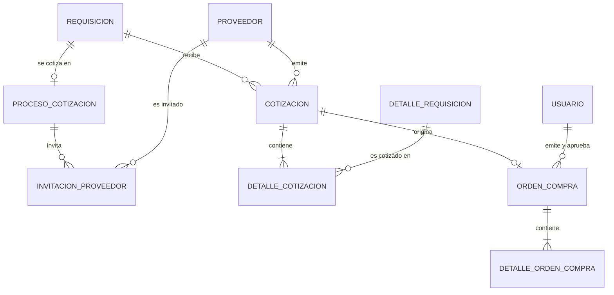
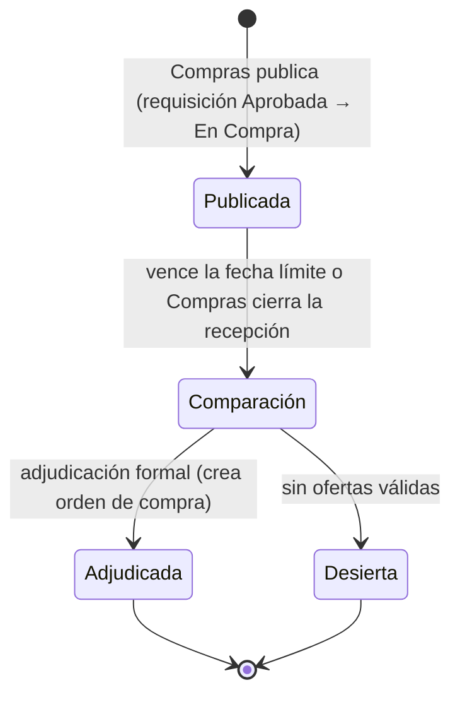

# Plan de desarrollo — Módulo de Proformas

**Proyecto:** Sistema Web para la Gestión de la Cadena de Suministro de Proveedores — Municipalidad de Panajachel
**Fuentes:** DERCAS (27/07/2026), Tesis Final y prototipo (pantallas "Comparativa de Proformas" y "Mis Oportunidades y Cotizaciones" del portal)
**Metodología:** Scrum por sprints, arquitectura MVC

> Convención: lo marcado como **(propuesta)** es una recomendación mía que los documentos no mencionan. Queda a tu decisión.

---

## 1. Objetivo y alcance

**Qué dicen los documentos.** El "Módulo de Proformas" administra el proceso de cotización y selección de ofertas. Incluye la **comparativa de proformas** para evaluar costos, tiempos de entrega y cumplimiento técnico, la **adjudicación formal** de la oferta ganadora y la **generación de la orden de compra** (DERCAS). El proceso crítico n.º 4 describe el ciclo: identificar la necesidad, solicitar cotizaciones, recibirlas, compararlas (precio, características, tiempos y condiciones de entrega) y seleccionar la oferta. El n.º 5 agrega la revisión presupuestaria y la autorización de la orden por DAFIM y el Alcalde. Los proveedores cargan sus cotizaciones desde el portal.

**Dentro del alcance**

- Proceso de cotización por solicitud aprobada: publicación, proveedores invitados y fecha límite.
- Recepción de cotizaciones: envío desde el portal del proveedor y registro manual por Compras.
- Evaluación técnica y comparativa por ítem, con indicadores de mejor precio y mejor tiempo de entrega.
- Adjudicación formal con motivo y validación de presupuesto.
- Generación, aprobación y envío de la **orden de compra**.
- Parte del portal del proveedor que corresponde a este módulo: "Mis Oportunidades y Cotizaciones".
- Notificaciones y bitácora.

**Fuera del alcance de este módulo**

- Facturas, carga de factura FEL y órdenes de pago (módulo de Facturación; el prototipo las muestra en el mismo portal, pero son otro módulo).
- Recepción física en bodega: pasa la orden a `Entregada` (módulo de Bodega).
- Integración con Guatecompras o SICOIN (delimitaciones del DERCAS).

## 2. Dependencias con otros módulos

| Módulo | Qué se usa |
|---|---|
| **Usuarios** | `usuario`, `rol`, `permiso`, `authenticate`, `authorize`, bitácora |
| **Proveedores** | `proveedor`, `proveedor_usuario` y el rol de portal; el proveedor autenticado se identifica por su cuenta |
| **Dependencias** | `requisicion` (estado `Aprobada`), `detalle_requisicion`, `presupuesto_dependencia` y el servicio de presupuesto disponible |
| **Insumos / Bodega** | `insumo` y su `precioReferencial` (ER), que sirve para medir ahorro |

**Ajuste necesario en Dependencias (propuesta):** el cálculo de presupuesto del plan de Dependencias usa `monto_estimado`. Una vez adjudicada la compra, debe usar el monto adjudicado. Hay que agregar `requisicion.monto_adjudicado` y calcular el ejecutado con `COALESCE(monto_adjudicado, monto_estimado)`.

## 3. Stack tecnológico (según los documentos)

| Capa | Tecnología |
|---|---|
| Frontend | React, HTML5, CSS3 (diseño responsivo) |
| Backend | Node.js, API REST con JSON |
| Base de datos | PostgreSQL 15+ |
| Despliegue | Docker, Microsoft Azure; el diagrama muestra Railway con SSL/TLS |
| Versiones y pruebas | Git, GitHub, Postman |

**Complementos sugeridos (propuesta):** `multer` para recibir el PDF de la proforma, `pdfkit` para la orden de compra y el cuadro comparativo, `zod` para validación, `Jest` + `Supertest` para pruebas.

## 4. Modelo entidad-relación

### 4.1 Lo que define el ER de la tesis

| Entidad | Atributos (según el ER) |
|---|---|
| `COTIZACION` | **idCotizacion** PK, idRequisicion FK, idProveedor FK, numeroCotizacion, montoTotal, estadoCotizacion, fechaCotizacion |
| `ORDEN_COMPRA` | Presente en el ER y en el diccionario del DERCAS. El recorte del diagrama no muestra su detalle |
| `REQUISICION`, `PROVEEDOR`, `INSUMO`, `USUARIO` | Ya definidos en los módulos anteriores |

El diccionario del DERCAS completa lo que el recorte del ER no muestra: `DetalleCotizacion` (insumo, cantidad cotizada, precio unitario, subtotal), `condicionesPago`, `tiempoEntrega`, `fechaValidez`, y las tablas `Orden Compra` y `Detalle Orden Compra`.

### 4.2 Lo que ni el ER ni el DERCAS cubren y el módulo necesita

| Requisito del prototipo o de los documentos | Cambio propuesto |
|---|---|
| "Publicación de requerimientos" a proveedores, con **fecha límite** y estado "En Licitación" | `proceso_cotizacion` e `invitacion_proveedor` |
| Fase del proceso ("FASE: COMPARACIÓN") | `proceso_cotizacion.fase` |
| Mejor tiempo de entrega (comparable entre ofertas) | `cotizacion.tiempo_entrega_dias` numérico; el DERCAS lo define como texto libre (`varchar(50)`) |
| Cumplimiento técnico (vigencia de RTU y patente de comercio) | `cumple_tecnico` y `observaciones_tecnicas` en la cotización |
| Selección y adjudicación con justificación (trazabilidad ante la Contraloría) | `seleccionada`, `motivo_adjudicacion` |
| Documentación de respaldo de la proforma | `archivo_nombre` y `archivo_ruta` en la cotización |
| Alinear los ítems de cada oferta en una misma fila del cuadro | `detalle_cotizacion` apunta a `detalle_requisicion` |
| Notificaciones a proveedores y a quien revisa | Tabla `notificacion` (si no la creó ya otro módulo) |

### 4.3 Diferencias entre fuentes (resolver antes de codificar)

| # | Situación | Criterio del plan |
|---|---|---|
| D-1 | El ER relaciona la cotización con `idRequisicion`; el DERCAS con `idSolicitud`. | `id_requisicion`, como en el ER y el plan de Dependencias. |
| D-2 | Los códigos de solicitud difieren: `#SC-2024-042` (pantalla de Dependencias) frente a `#SOL-2026-089` y `#SOL-2023-084` (portal y comparativa). | Un solo código por solicitud: `SC-AAAA-NNN`. El proceso de cotización se identifica con ese mismo código. Confírmalo. |
| D-3 | Estados de la cotización: DERCAS `Recibida / En Evaluación / Aceptada / Rechazada`; el portal muestra `En Licitación / Cotización Enviada / Adjudicado`. | Los del DERCAS para la cotización. Los del portal son una **vista combinada** del proceso y de la cotización del proveedor (ver 6.5). |
| D-4 | El prototipo muestra una calificación ★ por proveedor (4.8, 4.5, 4.2). Ningún documento define de dónde sale. | Fuera de la primera versión. Ver decisión D-6 en la sección 10. |
| D-5 | El texto del DERCAS usa sintaxis de SQL Server y menciona .NET; el stack es PostgreSQL y Node.js. | Se adapta a PostgreSQL y Node.js. |

## 5. Base de datos

### 5.1 Relaciones



### 5.2 Migración PostgreSQL

Las fechas límite usan `TIMESTAMPTZ` **(propuesta)** para evitar errores de zona horaria; configura la zona `America/Guatemala` (UTC-6) en la conexión.

```sql
-- 030_modulo_proformas.sql  (PostgreSQL 15+)

-- Ajuste a Dependencias: monto final de la compra
ALTER TABLE requisicion ADD COLUMN IF NOT EXISTS monto_adjudicado NUMERIC(12,2);

CREATE TABLE proceso_cotizacion (
  id_proceso          INT GENERATED ALWAYS AS IDENTITY PRIMARY KEY,
  id_requisicion      INT NOT NULL UNIQUE REFERENCES requisicion(id_requisicion),
  fase                VARCHAR(15) NOT NULL DEFAULT 'Publicada'
                      CHECK (fase IN ('Publicada','Comparación','Adjudicada','Desierta')),
  fecha_publicacion   TIMESTAMPTZ NOT NULL DEFAULT now(),
  fecha_limite        TIMESTAMPTZ NOT NULL,
  min_ofertas         INT NOT NULL DEFAULT 3 CHECK (min_ofertas >= 1),
  motivo_adjudicacion TEXT,
  id_usuario_publica  INT NOT NULL REFERENCES usuario(id_usuario),
  id_usuario_adjudica INT REFERENCES usuario(id_usuario),
  fecha_adjudicacion  TIMESTAMPTZ,
  CHECK (fecha_limite > fecha_publicacion)
);

CREATE TABLE invitacion_proveedor (
  id_invitacion    INT GENERATED ALWAYS AS IDENTITY PRIMARY KEY,
  id_proceso       INT NOT NULL REFERENCES proceso_cotizacion(id_proceso) ON DELETE CASCADE,
  id_proveedor     INT NOT NULL REFERENCES proveedor(id_proveedor),
  fecha_invitacion TIMESTAMPTZ NOT NULL DEFAULT now(),
  fecha_vista      TIMESTAMPTZ,
  UNIQUE (id_proceso, id_proveedor)
);

CREATE TABLE cotizacion (
  id_cotizacion          INT GENERATED ALWAYS AS IDENTITY PRIMARY KEY,
  id_requisicion         INT NOT NULL REFERENCES requisicion(id_requisicion),
  id_proveedor           INT NOT NULL REFERENCES proveedor(id_proveedor),
  numero_cotizacion      VARCHAR(20) NOT NULL UNIQUE,           -- COT-2026-001 (interno)
  referencia_proveedor   VARCHAR(30),                           -- número de proforma del proveedor
  fecha_cotizacion       DATE NOT NULL DEFAULT CURRENT_DATE,
  fecha_validez          DATE,
  monto_total            NUMERIC(12,2) NOT NULL CHECK (monto_total >= 0),
  condiciones_pago       VARCHAR(255),
  tiempo_entrega_dias    INT CHECK (tiempo_entrega_dias >= 0),
  tiempo_entrega_texto   VARCHAR(50),
  estado_cotizacion      VARCHAR(15) NOT NULL DEFAULT 'Recibida'
                         CHECK (estado_cotizacion IN ('Recibida','En Evaluación','Aceptada','Rechazada')),
  cumple_tecnico         BOOLEAN,                               -- NULL = sin evaluar
  observaciones_tecnicas TEXT,
  seleccionada           BOOLEAN NOT NULL DEFAULT FALSE,
  motivo_rechazo         VARCHAR(255),
  origen                 VARCHAR(10) NOT NULL DEFAULT 'PORTAL' CHECK (origen IN ('PORTAL','MANUAL')),
  archivo_nombre         VARCHAR(150),
  archivo_ruta           VARCHAR(255),
  id_usuario_registra    INT NOT NULL REFERENCES usuario(id_usuario),
  fecha_registro         TIMESTAMPTZ NOT NULL DEFAULT now(),
  UNIQUE (id_requisicion, id_proveedor)                         -- una oferta por proveedor y solicitud
);
CREATE UNIQUE INDEX uq_cot_seleccionada ON cotizacion (id_requisicion) WHERE seleccionada;
CREATE UNIQUE INDEX uq_cot_aceptada     ON cotizacion (id_requisicion) WHERE estado_cotizacion = 'Aceptada';

CREATE TABLE detalle_cotizacion (
  id_detalle_cotizacion  INT GENERATED ALWAYS AS IDENTITY PRIMARY KEY,
  id_cotizacion          INT NOT NULL REFERENCES cotizacion(id_cotizacion) ON DELETE CASCADE,
  id_detalle_requisicion INT NOT NULL REFERENCES detalle_requisicion(id_detalle),
  cantidad_cotizada      NUMERIC(12,2) NOT NULL CHECK (cantidad_cotizada > 0),
  precio_unitario        NUMERIC(12,2) NOT NULL CHECK (precio_unitario >= 0),
  subtotal               NUMERIC(14,2) GENERATED ALWAYS AS (cantidad_cotizada * precio_unitario) STORED,
  descripcion_oferta     VARCHAR(150),                          -- marca, modelo, especificación
  UNIQUE (id_cotizacion, id_detalle_requisicion)
);

CREATE TABLE orden_compra (
  id_orden_compra        INT GENERATED ALWAYS AS IDENTITY PRIMARY KEY,
  numero_orden           VARCHAR(20) NOT NULL UNIQUE,           -- OC-2026-001
  id_requisicion         INT NOT NULL REFERENCES requisicion(id_requisicion),
  id_cotizacion          INT NOT NULL UNIQUE REFERENCES cotizacion(id_cotizacion),
  id_proveedor           INT NOT NULL REFERENCES proveedor(id_proveedor),
  fecha_emision          TIMESTAMP NOT NULL DEFAULT now(),
  fecha_entrega_estimada DATE,
  monto_total            NUMERIC(12,2) NOT NULL CHECK (monto_total >= 0),
  estado                 VARCHAR(15) NOT NULL DEFAULT 'Pendiente'
                         CHECK (estado IN ('Pendiente','Aprobada','Enviada','Entregada','Cancelada')),
  id_usuario_emite       INT NOT NULL REFERENCES usuario(id_usuario),
  id_usuario_aprobador   INT REFERENCES usuario(id_usuario),
  fecha_aprobacion       TIMESTAMP
);

CREATE TABLE detalle_orden_compra (
  id_detalle_orden       INT GENERATED ALWAYS AS IDENTITY PRIMARY KEY,
  id_orden_compra        INT NOT NULL REFERENCES orden_compra(id_orden_compra) ON DELETE CASCADE,
  id_detalle_requisicion INT NOT NULL REFERENCES detalle_requisicion(id_detalle),
  cantidad_comprada      NUMERIC(12,2) NOT NULL CHECK (cantidad_comprada > 0),
  precio_unitario        NUMERIC(12,2) NOT NULL,
  subtotal               NUMERIC(14,2) GENERATED ALWAYS AS (cantidad_comprada * precio_unitario) STORED
);

-- Compartida con otros módulos: crear solo si aún no existe
CREATE TABLE IF NOT EXISTS notificacion (
  id_notificacion INT GENERATED ALWAYS AS IDENTITY PRIMARY KEY,
  id_usuario      INT NOT NULL REFERENCES usuario(id_usuario),
  tipo            VARCHAR(30) NOT NULL,
  titulo          VARCHAR(100) NOT NULL,
  mensaje         VARCHAR(255),
  referencia      VARCHAR(50),
  leida           BOOLEAN NOT NULL DEFAULT FALSE,
  fecha           TIMESTAMPTZ NOT NULL DEFAULT now()
);

CREATE INDEX idx_cot_requisicion ON cotizacion (id_requisicion);
CREATE INDEX idx_cot_proveedor   ON cotizacion (id_proveedor);
CREATE INDEX idx_oc_estado       ON orden_compra (estado);
CREATE INDEX idx_invitacion_prov ON invitacion_proveedor (id_proveedor);
CREATE INDEX idx_notif_usuario   ON notificacion (id_usuario, leida);
```

### 5.3 Datos semilla

- **Menú "Proformas"** con los submenús "Procesos de Cotización" y "Órdenes de Compra", con permisos para Administrador, Encargado de Compras y su asistente; DAFIM y Alcalde con permiso de consulta y aprobación de órdenes.
- **Portal del proveedor:** el submenú "Mis Oportunidades y Cotizaciones" ya queda sembrado por el módulo de Proveedores.

### 5.4 Estados



- **Cotización:** `Recibida` → `En Evaluación` → `Aceptada` (la adjudicada) o `Rechazada` (las demás o las que no cumplen).
- **Orden de compra:** `Pendiente` → `Aprobada` → `Enviada` → `Entregada` (la marca Bodega); `Cancelada` en cualquier punto antes de la entrega.

## 6. Backend (rutas `/api`)

### 6.1 Estructura

```
backend/src/
├── routes/        procesos.routes.js, cotizaciones.routes.js, ordenesCompra.routes.js, portalProformas.routes.js
├── controllers/
├── services/
│   ├── procesos.service.js        # publicar, invitar, cambiar fase
│   ├── cotizaciones.service.js    # recepción, validaciones, monto total
│   ├── comparativa.service.js     # matriz, mejores precios, ahorro
│   ├── adjudicacion.service.js    # adjudicar, rechazar, declarar desierto
│   ├── ordenCompra.service.js     # generar, aprobar, enviar, PDF
│   └── notificaciones.service.js
├── repositories/
├── validators/
└── migrations/030_modulo_proformas.sql
```

### 6.2 Endpoints internos (Compras, DAFIM, Alcalde)

| Método | Ruta | Descripción |
|---|---|---|
| GET | `/api/procesos` | Lista de procesos con filtros (fase, dependencia, fechas) |
| POST | `/api/requisiciones/:id/proceso` | Publica el proceso: fecha límite, proveedores invitados y mínimo de ofertas. Solo para solicitudes `Aprobada` |
| GET | `/api/procesos/:id` | Resumen del requerimiento: dependencia, fecha, presupuesto estimado, categoría, ítems |
| PUT | `/api/procesos/:id/invitaciones` | Agrega o quita proveedores invitados mientras esté `Publicada` |
| POST | `/api/procesos/:id/cotizaciones` | Registro manual de una proforma recibida por otro canal (correo, mensajería) |
| GET | `/api/procesos/:id/cotizaciones` | Ofertas recibidas |
| PATCH | `/api/cotizaciones/:id/evaluacion` | Registra `cumple_tecnico`, observaciones y pasa a `En Evaluación` |
| PATCH | `/api/procesos/:id/cerrar-recepcion` | Pasa a fase `Comparación` |
| GET | `/api/procesos/:id/comparativa` | Matriz de comparación (ver 6.4) |
| GET | `/api/procesos/:id/comparativa/exportar` | "Exportar Cuadro" en PDF o CSV |
| PATCH | `/api/cotizaciones/:id/seleccionar` | "Seleccionar Ganadora": marca la oferta de forma provisional |
| POST | `/api/procesos/:id/adjudicar` | "Finalizar Comparativa" / "Adjudicar Oferta": adjudicación formal (ver 6.3) |
| POST | `/api/procesos/:id/declarar-desierto` | Cierra sin adjudicar, con motivo |
| GET | `/api/ordenes-compra` | Lista y filtros |
| GET | `/api/ordenes-compra/:id` | Detalle |
| PATCH | `/api/ordenes-compra/:id/estado` | Aprobar, enviar o cancelar |
| GET | `/api/ordenes-compra/:id/pdf` | Documento imprimible |

### 6.3 Flujo de adjudicación (`POST /api/procesos/:id/adjudicar`)

1. Validar el rol y que el proceso esté en fase `Comparación`.
2. **Abrir transacción** y bloquear la fila del proceso (`SELECT … FOR UPDATE`) para que dos usuarios no adjudiquen a la vez.
3. Validar la oferta elegida: tiene todos los ítems de la solicitud, `fecha_validez` vigente, `cumple_tecnico = true`.
4. Validar el mínimo de ofertas (`min_ofertas`).
5. Pedir el **motivo**; es obligatorio, y con más razón si la oferta no es la de menor precio.
6. Validar presupuesto con el servicio de Dependencias: el monto adjudicado no debe superar el disponible más lo ya reservado por esa solicitud.
7. Marcar la oferta como `Aceptada` y las demás como `Rechazada`; guardar `monto_adjudicado`; pasar el proceso a `Adjudicada`.
8. **Generar la orden de compra** (`OC-AAAA-NNN`, con secuencia dentro de la transacción) con su detalle copiado de la cotización, en estado `Pendiente`.
9. Registrar en bitácora y confirmar.
10. Notificar al proveedor ganador, a los no seleccionados, al solicitante y a DAFIM/Alcalde para la aprobación.

El índice único `uq_cot_aceptada` y la restricción `UNIQUE` sobre `orden_compra.id_cotizacion` impiden adjudicar o generar órdenes duplicadas aunque falle la lógica de la aplicación.

### 6.4 Comparativa (`GET /api/procesos/:id/comparativa`)

Devuelve la matriz del prototipo:

- **Encabezado:** código de la solicitud, dependencia, fecha, presupuesto estimado y categoría; fase del proceso.
- **Filas por ítem:** descripción, especificación, cantidad y, por cada proveedor, precio unitario y subtotal.
- **Indicadores:** "Mejor precio" por ítem (el menor precio unitario; en empate se marcan todos), tiempo de entrega por proveedor y total general por oferta.
- **Tarjetas inferiores:** oferta más económica (con el ahorro), mejor tiempo de entrega y cumplimiento técnico (si todos cumplen, o cuáles no).
- **Ofertas incompletas** (no cotizan todos los ítems): se muestran como "incompleta" y no se pueden adjudicar.

> El prototipo dice "Ahorro del 2.5 % respecto a la media de mercado". Con los precios que muestra, el total más bajo (Q 7,340) está 1.8 % por debajo del promedio de las tres ofertas (Q 7,471.67), así que ese 2.5 % no se reproduce con esos datos. Defino el cálculo en la decisión D-8 de la sección 10.

### 6.5 Endpoints del portal del proveedor

Todos filtran por el `id_proveedor` de la cuenta autenticada (`proveedor_usuario`). **Un proveedor nunca ve ofertas ni precios de otros.**

| Método | Ruta | Descripción |
|---|---|---|
| GET | `/api/portal/oportunidades` | Solicitudes a las que fue invitado. Pestañas: Todas, Pendientes de Cotizar, Enviadas |
| GET | `/api/portal/oportunidades/:idProceso` | Detalle del requerimiento: ítems, fecha límite y presupuesto de referencia |
| POST | `/api/portal/cotizaciones` | "Enviar Cotización" / "Subir Proforma Directa": ítems con precio, condiciones, tiempo de entrega y PDF |
| PUT | `/api/portal/cotizaciones/:id` | Corrige su propia oferta mientras la fase sea `Publicada` y no venza la fecha límite |
| GET | `/api/portal/cotizaciones/:id` | "Ver Mi Proforma" |
| GET | `/api/portal/resumen` | Cotizaciones enviadas (con las que están en revisión técnica) y órdenes adjudicadas con su monto |
| GET | `/api/portal/ordenes-compra` | "Ver Orden de Compra" de sus adjudicaciones |

**Estado que ve el proveedor** (combina proceso y su cotización):

| Condición | Se muestra |
|---|---|
| Invitado, sin cotización y antes de la fecha límite | En Licitación |
| Tiene cotización y el proceso no se resolvió | Cotización Enviada |
| Su cotización es `Aceptada` | Adjudicado |
| Su cotización es `Rechazada` o el proceso quedó `Desierta` | No adjudicado (se puede ver el motivo general, sin datos de otros) |

### 6.6 Reglas de negocio

1. Solo se publica un proceso para una solicitud `Aprobada`; al hacerlo, la solicitud pasa a `En Compra`.
2. Una sola cotización por proveedor y solicitud. El proveedor puede corregirla hasta la fecha límite; después queda bloqueada.
3. El `monto_total` lo calcula siempre el servidor como suma de los subtotales; nunca se acepta el valor que envía el cliente.
4. Un proveedor `inactivo` o con cuenta bloqueada no recibe invitaciones ni envía ofertas.
5. Las cantidades cotizadas deben coincidir con las solicitadas; una diferencia se registra como observación y se advierte.
6. **Separación de funciones (propuesta):** quien emite la orden de compra no puede aprobarla. La aprobación corresponde a DAFIM o al Alcalde, según el flujo descrito en el DERCAS.
7. Una orden `Aprobada` o `Enviada` no se edita; solo se cancela con motivo.
8. Las cotizaciones y las adjudicaciones no se borran. Todo cambio queda en bitácora con usuario, fecha y estado anterior y nuevo.
9. Las ofertas recibidas son **confidenciales hasta que cierre la recepción**; Compras no abre la comparativa antes de la fase `Comparación` (propuesta, para transparencia del proceso).

## 7. Frontend (React)

### 7.1 Archivos sugeridos

Siguen la convención de los módulos anteriores:

| Archivo | Responsabilidad |
|---|---|
| `api/proformas.ts`, `api/ordenesCompra.ts`, `api/portalProformas.ts` | Clientes HTTP y tipos |
| `useProformasController.ts` | Estado de procesos y comparativa |
| `ProformasView` | Lista de procesos de cotización con filtros |
| `PublicarProcesoModal` | Fecha límite, proveedores invitados y mínimo de ofertas |
| `ComparativaProformasView` | Pantalla "Comparativa de Proformas" |
| `RegistrarCotizacionModal` | Registro manual de proforma |
| `AdjudicarModal` | Confirmación con motivo obligatorio |
| `OrdenesCompraView` | Lista, detalle, aprobación y PDF de órdenes |
| `PortalOportunidadesView`, `EnviarCotizacionModal` | Parte del portal del proveedor |

### 7.2 Comportamiento esperado, según el prototipo

**Comparativa**
- Migas de pan "Adquisiciones › Proformas › Comparativa de Precios" y etiqueta de fase.
- Tarjeta de resumen del requerimiento y tabla con una columna por proveedor.
- Insignia **"Mejor precio"** por ítem, fila de tiempo de entrega y fila de total general (resaltado el menor).
- Botones **Seleccionar Ganadora** y **Adjudicar Oferta** al pie de cada columna; **Exportar Cuadro** y **Finalizar Comparativa** arriba.
- Tres tarjetas inferiores: oferta más económica, mejor tiempo de entrega y cumplimiento técnico.
- En pantallas pequeñas, la tabla se desplaza horizontalmente dentro de su contenedor.

**Portal**
- Tarjetas: cotizaciones enviadas, órdenes adjudicadas y facturas pendientes (esta última la alimenta Facturación; hasta que exista, se oculta o se muestra en cero).
- Tabla "Solicitudes de Compra Activas" con pestañas, fecha límite, presupuesto, estado y la acción que corresponde: Enviar Cotización, Ver Mi Proforma o Ver Orden de Compra.
- La carga de factura FEL del costado **no** pertenece a este módulo.

Además: confirmaciones antes de adjudicar o declarar desierto, notificaciones (toast), y estados de carga, vacío y error, importantes por la conexión inestable que documenta el proyecto.

## 8. Plan de trabajo por sprints

Seis sprints más un Sprint 0, de una semana cada uno, con un solo desarrollador.

> **Nota de calendario.** El cronograma de la tesis asigna "Desarrollo e integración del Portal del Proveedor y módulo de proformas" al 18/09–03/10/2026 (15 días), el despliegue inicial al 05/10–20/10 y las pruebas al 21/10–30/10. Con los seis sprints de este plan no se cumple esa ventana. Si el tiempo es corto, recomiendo un **alcance mínimo**: Sprints 1 al 5 con una adjudicación simple, dejando para después el PDF de la orden de compra, la exportación del cuadro, el registro manual de proformas y las notificaciones por correo.

### Sprint 0 — Alineación (1–2 días)

- Cerrar las decisiones de la sección 10, en especial D-1 a D-4.
- Confirmar que Proveedores y Dependencias ya exponen lo indicado en la sección 2.
- Rama `feature/proformas` y colección de Postman.

### Sprint 1 — Base de datos

- Migración `030`, semillas de menús y permisos.
- **Criterio de aceptación:** las restricciones rechazan dos ofertas del mismo proveedor para una solicitud, dos adjudicaciones y dos órdenes para la misma cotización.

### Sprint 2 — Procesos de cotización e invitaciones

- Publicar proceso, invitar proveedores, notificaciones y listado interno.
- Lado del portal: lista de oportunidades con pestañas y vista de detalle.
- **Criterio de aceptación:** al publicar, la solicitud pasa a `En Compra` y cada invitado la ve en su portal; un proveedor no invitado recibe `403`.

### Sprint 3 — Recepción de cotizaciones

- Envío y corrección desde el portal, registro manual por Compras, subida del PDF y cálculo de monto en el servidor.
- Bloqueo por fecha límite.
- **Criterio de aceptación:** una oferta fuera de plazo se rechaza; el monto guardado coincide con la suma de los subtotales; un proveedor no puede leer la oferta de otro.

### Sprint 4 — Evaluación y comparativa

- `comparativa.service`, evaluación técnica, cierre de recepción, pantalla de comparativa y exportación.
- **Criterio de aceptación:** con los datos del prototipo (3 proveedores, 3 ítems) se obtienen los totales Q 7,340.00, Q 7,535.00 y Q 7,540.00 y las insignias de mejor precio correctas.

### Sprint 5 — Adjudicación y orden de compra

- `adjudicacion.service` transaccional, validación de presupuesto, generación de `OC-AAAA-NNN`, aprobación y envío.
- **Criterio de aceptación:** dos adjudicaciones simultáneas producen una sola orden; sin motivo o sin presupuesto se rechaza; la orden queda en `Pendiente` y solo la aprueba un usuario distinto del emisor.

### Sprint 6 — Pruebas, seguridad y despliegue

- Pruebas unitarias del cálculo de comparativa y de adjudicación; integración de la API; matriz RBAC rol × endpoint.
- Revisión de seguridad: confidencialidad de ofertas, subida de archivos (tipo y tamaño), inyección SQL.
- Despliegue con Docker y SSL/TLS, PDF de la orden y manual de usuario.

## 9. Riesgos

| Riesgo | Mitigación |
|---|---|
| Un proveedor ve precios de otros | Todas las consultas del portal filtran por la cuenta autenticada; pruebas dedicadas en el Sprint 6 |
| Adjudicación doble por concurrencia | Bloqueo de fila, índices únicos y transacción |
| Fecha límite mal interpretada por la zona horaria | `TIMESTAMPTZ` y zona `America/Guatemala` configurada |
| Archivos de proforma sin lugar de almacenamiento definido | Decidir D-7 antes del Sprint 3 |
| Ofertas que llegan por correo o mensajería (el DERCAS lo documenta) | Registro manual con adjunto y marca `origen = MANUAL` |
| Alcance mayor al tiempo disponible | Recortar al alcance mínimo de la nota de calendario |

## 10. Decisiones pendientes

- **D-1** ¿Se acepta la nomenclatura de la sección 4.3 (`id_requisicion`, un solo código `SC-AAAA-NNN`)?
- **D-2** ¿Se aprueban `proceso_cotizacion` e `invitacion_proveedor`? Sin ellas no hay fecha límite ni invitados.
- **D-3** ¿Cuál es el mínimo de ofertas y desde qué monto se exige cotizar? El plan asume 3 (como el prototipo) y configurable. Los umbrales legales de la Ley de Contrataciones del Estado no están en los documentos; confírmalos con la normativa y con DAFIM.
- **D-4** ¿La adjudicación es de la **oferta completa** (como muestra el prototipo) o puede ser **por ítem**? El plan asume oferta completa.
- **D-5** Significado de los botones del prototipo. Interpreté: "Seleccionar Ganadora" marca una oferta de forma provisional; "Finalizar Comparativa" cierra la comparación y ejecuta la adjudicación sobre la seleccionada. Confírmalo.
- **D-6** La calificación ★ de proveedores no tiene definición en los documentos. ¿Se calculará (por entregas a tiempo, cumplimiento) o se omite?
- **D-7** ¿Dónde se guardan los PDF de las proformas (disco del servidor, volumen del hosting, almacenamiento externo)? Los documentos no lo indican.
- **D-8** Fórmula del ahorro: propongo compararlo con la suma de `precioReferencial` × cantidad de cada ítem (dato del ER) y, si falta, con el promedio de las ofertas.
- **D-9** ¿Se aprueba agregar `requisicion.monto_adjudicado` y ajustar el cálculo de presupuesto de Dependencias?
- **D-10** Criterios de "cumplimiento técnico": el prototipo menciona vigencia de RTU y patente de comercio. ¿Hay más requisitos o se usa una lista de verificación por categoría?
- **D-11** ¿Quién aprueba la orden de compra según el monto: DAFIM, el Alcalde o ambos?

## 11. Definición de terminado

- [ ] Una solicitud no puede adjudicarse dos veces ni generar dos órdenes de compra.
- [ ] Ninguna respuesta del portal incluye datos de otro proveedor.
- [ ] Los totales y los indicadores de mejor precio coinciden con el cálculo manual del ejemplo del prototipo.
- [ ] La adjudicación exige motivo y valida el presupuesto disponible.
- [ ] Quien emite una orden de compra no puede aprobarla.
- [ ] Toda transición de estado queda en bitácora con usuario, fecha y estados anterior y nuevo.
- [ ] El frontend no usa datos de ejemplo: todo viene de la API.
- [ ] La migración corre desde cero en PostgreSQL 15.
- [ ] Colección de Postman y manual de usuario actualizados.
