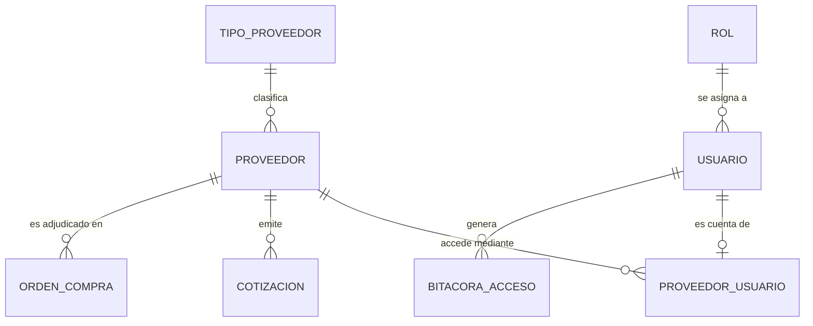

# Plan de desarrollo — Módulo de Proveedores

**Proyecto:** Sistema Web para la Gestión de la Cadena de Suministro de Proveedores — Municipalidad de Panajachel
**Fuentes:** DERCAS (27/07/2026), Tesis Final, prototipo (pantallas "Gestión de Accesos — Proveedores" y "Conectar Nuevo Proveedor") y el plan sugerido por OpenCode
**Metodología:** Scrum por sprints, arquitectura MVC

> Convención: lo marcado como **(propuesta)** es una recomendación mía que no aparece en los documentos ni en el plan de OpenCode. Queda a tu decisión.

---

## 1. Objetivo y alcance

**Qué piden los documentos.** El "Módulo de Proveedores" administra la red de empresas abastecedoras: el personal de compras puede **buscar, registrar y conectar** proveedores, gestionar sus datos generales (NIT, razón social, contactos) y **activar o suspender las credenciales** de acceso al portal (DERCAS, definición del sistema). El proceso crítico n.º 1 agrega el registro de la ficha técnica (datos fiscales, NIT, representación legal, categorías de suministro) y el historial de adjudicaciones. Además, el "Encargado de Compras" crea el usuario del proveedor y le envía sus credenciales (tesis).

**Dentro del alcance**

- CRUD de proveedores (datos fiscales, contacto, tipo/categoría), con baja lógica.
- Conexión al portal: crear la cuenta del proveedor, asignarle un rol y enviarle sus credenciales por correo.
- Gestión de accesos (pantalla del prototipo): ver estado de conexión, cambiar rol, restablecer credenciales, bloquear/desbloquear.
- Bitácora de las acciones sobre proveedores y sus accesos.
- Catálogo `TIPO_PROVEEDOR`.

**Fuera del alcance de este módulo**

- Pantallas del **Portal del Proveedor** (Mis Oportunidades y Cotizaciones, Órdenes y Facturas, Entregas en Bodega): son otro módulo. Aquí solo se deja listo el inicio de sesión y el rol.
- Cotizaciones, órdenes de compra y facturas (solo se respeta que referencian a `PROVEEDOR`).
- Integración con Guatecompras/SICOIN y pagos (delimitaciones del DERCAS).

## 2. Dependencias con el módulo de Usuarios

Este plan **asume** que ya existe (o se desarrolla antes) el módulo de Gestión de Usuarios con las tablas `usuario`, `rol`, `menu`, `submenu`, `permiso` y `bitacora_acceso`, y los middlewares `authenticate`, `authorize` y `audit`. El portal del proveedor **reutiliza** esa autenticación y ese RBAC; no se crea un sistema de login paralelo.

## 3. Stack tecnológico (según los documentos)

| Capa | Tecnología |
|---|---|
| Frontend | React, HTML5, CSS3 |
| Backend | Node.js, API REST con JSON |
| Base de datos | PostgreSQL 15+ |
| Despliegue | Docker, Microsoft Azure; el diagrama de arquitectura muestra Railway con SSL/TLS |
| Versiones y pruebas | Git, GitHub, Postman |

El plan de OpenCode usa archivos `.ts` (`api/proveedores.ts`, `useProveedoresController.ts`). Los documentos no mencionan TypeScript, pero es compatible con React y no cambia el stack; mantengo esos nombres.

**Complementos sugeridos (propuesta):** `Nodemailer` para el correo de credenciales, `zod` para validar entradas, `bcrypt`, `jsonwebtoken` (ya usados en Usuarios) y `Jest` + `Supertest` para pruebas.

## 4. Conciliación: plan de OpenCode vs. modelo ER vs. DERCAS

OpenCode propone una tabla `proveedor` y una `proveedor_usuario`. Las comparé con el diagrama ER de la tesis y con el diccionario de datos del DERCAS:

| Concepto | OpenCode | Diagrama ER (tesis) | Diccionario DERCAS | **Decisión del plan** |
|---|---|---|---|---|
| Nombre de la empresa | `nombre` | `razonSocial` | `nombreEmpresa` | `razon_social` (sigue el ER) |
| Representante legal | — | `representanteLegal` | — | `representante_legal` |
| Contacto | `contacto_nombre`, `contacto_telefono` | — | `nombreContacto` | Se agregan `nombre_contacto` y `telefono_contacto` (los pide el prototipo y el DERCAS) |
| Categoría | `categoria` (texto) | `TIPO_PROVEEDOR` (entidad) | `CategoriaInsumo` (otra cosa) | **FK `id_tipo_proveedor`** a `tipo_proveedor` (el ER no usa texto libre) |
| Estado | `activo` | `activo` | `estado` Activo/Inactivo/Suspendido | `activo` BOOLEAN (como el ER). La "suspensión" se aplica al **usuario del portal** (bloqueo), no al proveedor |
| Relación con usuario | `proveedor_usuario` | No existe (`USUARIO` exige `idEmpleado`) | — | Se **adopta** `proveedor_usuario` y se ajusta `usuario` (sección 5.2). Resuelve la decisión D-3 del plan de Usuarios |

El ER confirma que `PROVEEDOR` pertenece a un `TIPO_PROVEEDOR` y que `COTIZACION` y `ORDEN_COMPRA` referencian a `PROVEEDOR`.

## 5. Modelo de datos

### 5.1 Relaciones



`COTIZACION` y `ORDEN_COMPRA` pertenecen a otros módulos; se muestran solo para fijar la dependencia.

### 5.2 Migración PostgreSQL

Se usa `snake_case` y los tamaños del diccionario del DERCAS (NIT 15, teléfono 8, correo 100).

```sql
-- 010_modulo_proveedores.sql  (PostgreSQL 15+)

CREATE TABLE tipo_proveedor (
  id_tipo_proveedor INT GENERATED ALWAYS AS IDENTITY PRIMARY KEY,
  descripcion       VARCHAR(100) NOT NULL UNIQUE,
  activo            BOOLEAN NOT NULL DEFAULT TRUE
);

CREATE TABLE proveedor (
  id_proveedor        INT GENERATED ALWAYS AS IDENTITY PRIMARY KEY,
  id_tipo_proveedor   INT NOT NULL REFERENCES tipo_proveedor(id_tipo_proveedor),
  nit                 VARCHAR(15)  NOT NULL UNIQUE,
  razon_social        VARCHAR(100) NOT NULL,
  representante_legal VARCHAR(100),
  nombre_contacto     VARCHAR(100),
  telefono_contacto   VARCHAR(8),
  telefono            VARCHAR(8),
  correo              VARCHAR(100) NOT NULL,
  direccion           VARCHAR(255),
  activo              BOOLEAN   NOT NULL DEFAULT TRUE,
  fecha_registro      TIMESTAMP NOT NULL DEFAULT now(),
  CONSTRAINT ck_proveedor_telefono CHECK (telefono IS NULL OR telefono ~ '^[0-9]{8}$')
);

-- Ajuste a usuario: permitir cuentas de proveedor (sin empleado)
ALTER TABLE usuario ALTER COLUMN id_empleado DROP NOT NULL;
ALTER TABLE usuario ADD COLUMN tipo_usuario VARCHAR(15) NOT NULL DEFAULT 'INTERNO'
  CHECK (tipo_usuario IN ('INTERNO','PROVEEDOR'));
ALTER TABLE usuario ADD CONSTRAINT ck_usuario_tipo CHECK (
  (tipo_usuario = 'INTERNO'   AND id_empleado IS NOT NULL) OR
  (tipo_usuario = 'PROVEEDOR' AND id_empleado IS NULL)
);

CREATE TABLE proveedor_usuario (
  id_proveedor_usuario INT GENERATED ALWAYS AS IDENTITY PRIMARY KEY,
  id_proveedor         INT NOT NULL REFERENCES proveedor(id_proveedor),
  id_usuario           INT NOT NULL UNIQUE REFERENCES usuario(id_usuario),
  es_principal         BOOLEAN   NOT NULL DEFAULT TRUE,
  fecha_conexion       TIMESTAMP NOT NULL DEFAULT now()
);

-- Una sola cuenta principal por proveedor
CREATE UNIQUE INDEX uq_proveedor_principal
  ON proveedor_usuario (id_proveedor) WHERE es_principal;

CREATE INDEX idx_proveedor_tipo   ON proveedor (id_tipo_proveedor);
CREATE INDEX idx_proveedor_nombre ON proveedor (lower(razon_social));
```

> Si ya existen `intentos_fallidos`, `bloqueado_hasta` y `fecha_ultimo_acceso` en `usuario` (extensiones del plan de Usuarios), este módulo los reutiliza para el bloqueo y la "última actividad". Si no, hay que agregarlos antes.

### 5.3 Datos semilla

- **Tipos de proveedor** (del prototipo): Insumos Generales, Ferretería y Construcción, Distribución General, Construcción. Ajusta la lista con el Encargado de Compras.
- **Roles de portal** (del prototipo): Proveedor Estándar, Proveedor Premium, Distribuidor Mayorista.
- **Menús**: "Proveedores" con el submenú "Gestión de Accesos" (y "Directorio" **(propuesta)**) para el personal interno, y un menú "Portal Proveedor" con los submenús de las pantallas del prototipo: Mis Oportunidades y Cotizaciones, Órdenes y Facturas, Entregas en Bodega, Configuración.
- **Permisos** de los roles de portal solo sobre el menú "Portal Proveedor"; los roles internos de Compras y Administrador sobre "Proveedores".

## 6. Backend (rutas `/api/proveedores`)

### 6.1 Estructura

```
backend/src/
├── routes/proveedores.routes.js
├── controllers/proveedores.controller.js
├── services/
│   ├── proveedores.service.js        # reglas de negocio y validación de NIT único
│   ├── portalProveedor.service.js    # conectar, rol, bloqueo, reset
│   └── correo.service.js             # envío de credenciales
├── repositories/proveedores.repository.js
├── validators/proveedores.validator.js
└── migrations/010_modulo_proveedores.sql
```

### 6.2 Endpoints

| Método | Ruta | Descripción | Origen |
|---|---|---|---|
| GET | `/api/proveedores` | Lista paginada. Filtros: búsqueda por nombre/NIT, `tipo`, `estado` (todos/activos/inactivos) | OpenCode (CRUD) |
| GET | `/api/proveedores/resumen` | KPIs: total usuarios, activos portal, sin conexión, acceso bloqueado | Prototipo |
| GET | `/api/proveedores/:id` | Detalle con datos de acceso | OpenCode |
| POST | `/api/proveedores` | Registra un proveedor **sin** acceso al portal | OpenCode |
| PUT | `/api/proveedores/:id` | Edita datos generales | OpenCode |
| DELETE | `/api/proveedores/:id` | Baja lógica (`activo = false`) y bloquea su cuenta | OpenCode |
| **POST** | **`/api/proveedores/conectar`** | Crea el proveedor (o lo encuentra por NIT) **y** su usuario del portal, y envía las credenciales | OpenCode |
| POST | `/api/proveedores/:id/conectar` | Crea el acceso al portal de un proveedor que ya existe | (propuesta) |
| PATCH | `/api/proveedores/:id/portal/rol` | Cambia el rol asignado (selector de la tabla) | Prototipo |
| POST | `/api/proveedores/:id/portal/reset-clave` | Restablece credenciales (icono de llave) | Prototipo |
| PATCH | `/api/proveedores/:id/portal/bloqueo` | Bloquea o desbloquea (icono de candado) | Prototipo |
| GET | `/api/tipos-proveedor` | Catálogo para el selector "Categoría" | Prototipo |

Todas protegidas con `authenticate` + `authorize('Proveedores')`. La respuesta nunca incluye la clave ni su hash.

### 6.3 Flujo de `POST /conectar`

Corresponde al modal del prototipo: nombre, NIT, correo, teléfono, rol asignado y categoría.

1. Validar entrada: nombre y NIT obligatorios, correo válido, teléfono de 8 dígitos (se acepta `7762-0000` y se normaliza quitando el guion), rol que sea de tipo portal, categoría existente.
2. **Abrir una transacción.**
3. Si el NIT ya existe: devolver el proveedor existente y, si ya tiene acceso, responder `409`. Si no existe: crear el `proveedor`.
4. Crear el `usuario` con `tipo_usuario = 'PROVEEDOR'`, `id_empleado = NULL`, el rol elegido, `debe_cambiar_clave = TRUE` y una clave temporal generada con aleatoriedad criptográfica, guardada con bcrypt.
5. Crear la fila en `proveedor_usuario`.
6. Registrar en `bitacora_acceso` (acción "CONECTAR_PROVEEDOR", módulo "Proveedores").
7. **Confirmar la transacción** y recién entonces enviar el correo. Si el correo falla, el acceso queda creado y el endpoint devuelve una advertencia para reenviar (acción "restablecer clave"), en vez de perder el registro.

El mensaje del prototipo indica que el proveedor recibe un correo con sus credenciales de acceso; la clave temporal solo viaja en ese correo y se obliga a cambiarla en el primer ingreso. Alternativa más segura **(propuesta)**: enviar un enlace de activación con token de un solo uso y expiración corta, en lugar de la clave.

### 6.4 Reglas de negocio

1. **NIT único** (`UNIQUE`) y con formato válido (dígitos, guion opcional y dígito verificador, p. ej. `459823-1`, `554433-K`). La validación del dígito verificador contra la regla de la SAT es opcional; verifícala antes de implementarla.
2. **No se eliminan proveedores**: tienen cotizaciones y órdenes de compra asociadas (trazabilidad exigida por la fiscalización). Se desactivan.
3. Un proveedor **desactivado** no puede iniciar sesión, no recibe nuevos requerimientos ni puede ser adjudicado. No se desactiva si tiene órdenes de compra abiertas, o se advierte primero **(propuesta)**.
4. Un proveedor tiene **una cuenta principal** en la versión inicial.
5. Estado de conexión, derivado de `usuario`:
   - **Acceso Bloqueado**: `activo = false` o `bloqueado_hasta` en el futuro.
   - **Conectado**: tiene cuenta y su último acceso es reciente.
   - **Sin Conexión**: tiene cuenta pero sin acceso reciente.

   El umbral de "reciente" no está en los documentos. El prototipo muestra "Conectado" con actividad de ayer y "Sin Conexión" con actividad de hace 3 días, así que propongo **48 horas**, configurable.
6. Todas las acciones (conectar, editar, cambiar rol, reset, bloqueo, baja) quedan en bitácora.
7. Un proveedor solo puede ver y gestionar **sus propios datos** en el portal: el `authorize` del portal filtra siempre por el `id_proveedor` de su cuenta.

## 7. Frontend (React)

OpenCode indica que las vistas ya existen y que solo hay que conectarlas. El trabajo se centra en reemplazar datos de ejemplo por llamadas reales.

### 7.1 Archivos

| Archivo | Responsabilidad |
|---|---|
| `api/proveedores.ts` | Cliente HTTP: tipos TypeScript de las respuestas y una función por endpoint de la sección 6.2 |
| `useProveedoresController.ts` | Estado (lista, KPIs, filtros, paginación, carga, errores) y acciones (conectar, cambiar rol, reset, bloqueo) |
| `ProveedoresView` | Pantalla "Gestión de Accesos — Proveedores": tarjetas de resumen, pestañas Todos/Activos/Inactivos, tabla y acciones |
| `ConectarProveedorModal` | Panel lateral "Conectar Nuevo Proveedor" con el formulario y el aviso del correo |

### 7.2 Comportamiento esperado, según el prototipo

- **Tarjetas:** Total usuarios, Activos portal, Sin conexión y Acceso bloqueado, desde `/resumen`.
- **Tabla:** avatar con iniciales, razón social y NIT, selector de rol, insignia de estado (Conectado / Sin Conexión / Acceso Bloqueado), última actividad con la categoría, y acciones (llave = restablecer, candado = bloquear/desbloquear, menú ⋮ = editar y baja).
- **Pestañas y "Filtros Avanzados":** se traducen a parámetros del GET (`estado`, `tipo`).
- **Modal:** validación en cliente (campos obligatorios, formato de NIT y correo, teléfono), botón deshabilitado mientras se envía, notificación (toast) de éxito o error y recarga de lista y KPIs.
- **Confirmaciones** antes de bloquear, restablecer y dar de baja.
- **Sin permiso:** el menú "Proveedores" solo aparece a quien lo tenga asignado, y la ruta usa el `ProtectedRoute` del módulo de Usuarios.
- **Estados vacío, de carga y de error** en la tabla, importante dado que la municipalidad tiene conexión inestable (limitación documentada).

## 8. Plan de trabajo por sprints

Una semana por sprint con un solo desarrollador; ajusta a tu disponibilidad. Según el cronograma de la tesis, el desarrollo del Portal del Proveedor y de proformas está previsto del 18/09 al 03/10/2026, por lo que este módulo debe estar listo antes de esa fecha.

### Sprint 0 — Alineación (1–2 días)

- Cerrar las decisiones de la sección 11 (sobre todo D-1 y D-2).
- Confirmar que el módulo de Usuarios ya expone `authenticate`, `authorize` y bitácora.
- Crear la rama `feature/proveedores` y la colección de Postman del módulo.

### Sprint 1 — Base de datos

- Migración `010`, semillas de tipos y roles de portal, menús y permisos.
- Revisar que la migración corre desde cero y sobre la base existente.
- **Criterio de aceptación:** las restricciones rechazan NIT duplicado, teléfono mal formado y un `usuario` de proveedor con `id_empleado`.

### Sprint 2 — Backend CRUD de proveedores

- Repositorio, servicio, controlador y rutas: listar, detalle, crear, editar, baja lógica y catálogo de tipos.
- Validadores, filtros, paginación y `/resumen`.
- **Criterio de aceptación:** pruebas en Postman de todos los endpoints; `401` sin token y `403` sin permiso; el NIT duplicado devuelve `409` con mensaje claro.

### Sprint 3 — Conexión al portal

- `POST /conectar` transaccional, generación de clave temporal, hash, vínculo en `proveedor_usuario` y envío de correo.
- Cambio de rol, restablecimiento de credenciales y bloqueo/desbloqueo.
- **Criterio de aceptación:** el proveedor conectado inicia sesión con la clave recibida, el sistema le exige cambiarla, y solo ve el menú "Portal Proveedor". Si el correo falla, el registro persiste y se informa.

### Sprint 4 — Frontend

- `api/proveedores.ts`, `useProveedoresController.ts`; conectar `ProveedoresView` y `ConectarProveedorModal`.
- Filtros, pestañas, estados de carga/error, confirmaciones y notificaciones.
- **Criterio de aceptación:** el flujo del prototipo funciona de punta a punta con datos reales y los KPIs coinciden con la tabla.

### Sprint 5 — Pruebas, seguridad y despliegue

- Pruebas unitarias del servicio y de integración de la API (Jest + Supertest).
- Matriz de pruebas RBAC: rol × endpoint, incluyendo que un proveedor no acceda a datos de otro.
- Revisión de seguridad: inyección SQL, enumeración de NIT/correos, límite de intentos, el hash nunca en respuestas.
- Despliegue con Docker y SSL/TLS; configuración del servicio de correo en el entorno.
- Documentar en el manual de usuario cómo conectar, bloquear y restablecer.

## 9. Definición de terminado

- [ ] Ninguna respuesta de la API incluye la clave ni su hash.
- [ ] No se puede registrar un NIT duplicado, ni dos cuentas principales para un proveedor.
- [ ] Conectar un proveedor es atómico: o se crea todo o no se crea nada.
- [ ] La clave temporal solo existe en el correo y obliga al cambio en el primer ingreso.
- [ ] Un proveedor desactivado o bloqueado no puede iniciar sesión.
- [ ] Las seis acciones sensibles aparecen en la bitácora con usuario, fecha y módulo.
- [ ] El frontend no usa datos de ejemplo: todo viene de la API.
- [ ] La migración corre desde cero en PostgreSQL 15.
- [ ] Colección de Postman actualizada.

## 10. Riesgos

| Riesgo | Mitigación |
|---|---|
| Un correo mal escrito entrega credenciales a un tercero | Enlace de activación con token y expiración corta; validar el correo; reenvío controlado |
| Falla del servicio de correo deja un acceso sin notificar | Enviar el correo después de confirmar la transacción y permitir reenviar |
| Cambiar `usuario.id_empleado` a opcional afecta al módulo de Usuarios | Probar la migración con datos existentes; el `CHECK` garantiza que cada cuenta tenga empleado o sea de proveedor |
| Desacuerdo entre los tres modelos de datos | Cerrar la sección 4 antes del Sprint 1 y actualizar el diccionario del DERCAS |
| Conexión inestable de la municipalidad | Estados de error y reintento en el frontend; mensajes claros |

## 11. Decisiones pendientes

- **D-1** ¿Se acepta conciliar el modelo como en la sección 4 (`razon_social`, `tipo_proveedor` como FK, `activo`)? Si prefieres el diccionario del DERCAS (`estado` con "Suspendido"), cambia la migración.
- **D-2** ¿Se acepta hacer `usuario.id_empleado` opcional con `tipo_usuario`, o prefieres una tabla de credenciales separada para proveedores?
- **D-3** ¿Clave temporal por correo o enlace de activación con token? Recomiendo el enlace.
- **D-4** ¿Se permite más de una cuenta por proveedor? El plan asume una principal.
- **D-5** ¿Qué proveedor de correo se usará (SMTP municipal, otro)? Los documentos no lo definen.
- **D-6** ¿Umbral de "Conectado" en 48 horas?
- **D-7** ¿Se valida el dígito verificador del NIT contra la regla de la SAT?
