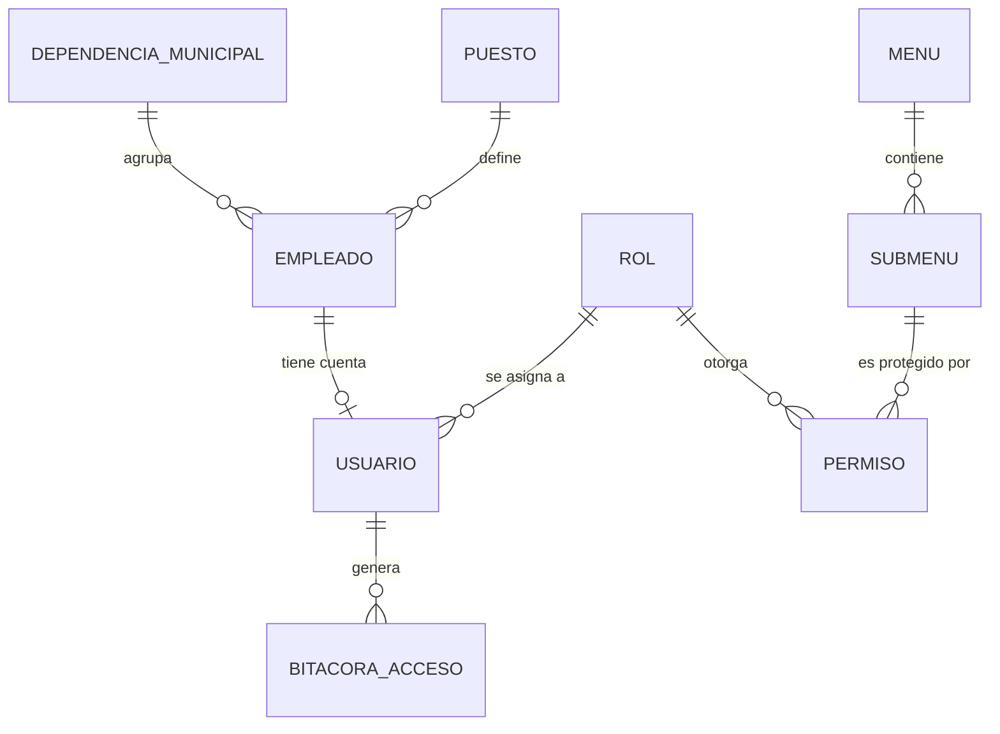

# Plan de desarrollo — Módulo de Gestión de Usuarios y Accesos

**Proyecto:** Sistema Web para la Gestión de la Cadena de Suministro de Proveedores — Municipalidad de Panajachel
**Autor del proyecto:** Bryan Danilo de León Ixtán
**Fuentes:** DERCAS (versión final, 27/07/2026) y Tesis Final
**Metodología:** Scrum por sprints, arquitectura MVC (según DERCAS)

> Convención de este documento: lo que proviene de los documentos se indica como tal. Lo marcado como **(propuesta)** es una recomendación mía que los documentos no mencionan, y queda a tu decisión.

---

## 1. Objetivo y alcance del módulo

**Qué dicen los documentos.** El módulo "Gestión de Usuarios y Accesos" controla el ciclo de vida de las cuentas y la seguridad del sistema: creación, edición y desactivación de perfiles, asignación de roles con permisos específicos, restablecimiento de credenciales y monitoreo de la actividad. Además, el proceso crítico n.º 8 exige controles de seguridad por perfil y un historial de auditoría de cada acción, y la tabla de alineación normativa lo liga al "Módulo de Auditoría y Bitácora de Transacciones por Usuario".

**Dentro del alcance**

- Autenticación (login / logout) y control de acceso por rol (RBAC).
- CRUD de usuarios (alta, edición, consulta, activar/desactivar) vinculados a un empleado.
- Administración de roles y de sus permisos sobre menús y submenús.
- Restablecimiento de credenciales.
- Bitácora de acceso y actividad, con consulta y exportación a CSV (el prototipo muestra "Log exportado").
- Catálogos de soporte que el ER requiere: Dependencia Municipal y Puesto, y el registro de Empleado.

**Fuera del alcance de este módulo**

- Portal del Proveedor (autenticación de proveedores externos): es otro módulo en el DERCAS. Ver decisión pendiente D-3.
- Acceso directo para la Contraloría General de Cuentas (delimitación 4.a del DERCAS: solo se generan reportes e historial).
- Integraciones con SICOIN, Guatecompras, FEL o bancos (delimitaciones 1 y 2).

## 2. Stack tecnológico (según los documentos)

El diagrama de arquitectura de la tesis y la sección "Descripción del Stack Tecnológico" del DERCAS coinciden en:

| Capa | Tecnología |
|---|---|
| Frontend | React, HTML5, CSS3 (diseño responsivo con Flexbox/Grid) |
| Backend | Node.js, API REST con respuestas JSON |
| Base de datos | PostgreSQL v15+ |
| Despliegue / infraestructura | Docker, Microsoft Azure; el diagrama muestra la aplicación alojada en Railway y tráfico protegido con SSL/TLS |
| Control de versiones y pruebas | Git, GitHub, Postman |
| Calidad y proceso | ISO/IEC 25010, IEEE 830 / 29148, Scrum, MVC |

**Complementos sugeridos (propuesta, no están en los documentos):** Express como framework HTTP de Node.js; `pg` (o un query builder) para PostgreSQL; `bcrypt` para hash de claves; `jsonwebtoken` para sesiones; `zod` o `joi` para validación; `helmet`, `cors` y `express-rate-limit` para seguridad; `node-pg-migrate` para migraciones; `React Router` en el frontend; `Jest` + `Supertest` para pruebas automáticas.

## 3. Modelo entidad-relación del módulo

El diagrama ER (figura 10 de la tesis, idéntico al del DERCAS) define las siguientes entidades para este módulo.

### 3.1 Entidades y atributos

| Entidad | Atributos (según el ER) | Notas |
|---|---|---|
| `DEPENDENCIA_MUNICIPAL` | **idDependencia** PK, nombreDependencia, ubicacion, activo, fechaRegistro | DMP, DAFIM, DMM, DIGAM, OMSAN, etc. |
| `PUESTO` | **idPuesto** PK, descripcion, salarioBase, activo | |
| `EMPLEADO` | **idEmpleado** PK, idDependencia FK, idPuesto FK, dpi, nombre, apellido, telefono, direccion, correo, activo, fechaIngreso | Persona que puede recibir una cuenta |
| `ROL` | **idRol** PK, descripcion, activo, fechaRegistro | |
| `MENU` | **idMenu** PK, nombre, icono, activo, fechaRegistro | Módulos del menú lateral |
| `SUBMENU` | **idSubMenu** PK, idMenu FK, nombre, controlador, vista, icono, activo, fechaRegistro | Pantallas / recursos protegidos |
| `PERMISO` | **idPermiso** PK, idRol FK, idSubMenu FK, activo, fechaRegistro | Tabla asociativa Rol ↔ SubMenu |
| `USUARIO` | **idUsuario** PK, idEmpleado FK, idRol FK, nombreUsuario, clave, correo, activo, fechaRegistro | Cuenta de acceso |
| `BITACORA_ACCESO` | **idBitacora** PK, idUsuario FK, accion, ipAcceso, fechaAcceso | Auditoría |

### 3.2 Relaciones



Los demás módulos (Requisición, Proveedor, Cotización, etc.) referencian a `USUARIO` y a `DEPENDENCIA_MUNICIPAL`. Por eso este módulo se construye **primero**: es la base de seguridad y de identidad del resto del sistema.

### 3.3 Diferencias detectadas entre los documentos (resolver antes de codificar)

| # | Situación | Criterio que aplico en este plan |
|---|---|---|
| D-1 | El **diccionario de datos del DERCAS** usa otro esquema (`Persona`, `Permiso`, `Rol_Permiso`, `nombreRol`, estado `Activo/Inactivo/Bloqueado`, `fechaUltimoAcceso`) y sintaxis de SQL Server (`IDENTITY`, `GETDATE()`), mientras que el **diagrama ER** usa `EMPLEADO`, `MENU`, `SUBMENU`, `PERMISO(idRol,idSubMenu)`. | Sigo el **diagrama ER** (es el modelo pedido y coincide en ambos documentos). Del diccionario tomo solo lo útil como extensiones (sección 3.4). La sintaxis se adapta a PostgreSQL. |
| D-2 | La sección de factibilidad del DERCAS menciona **.NET Core** en el backend; el stack y el diagrama de arquitectura indican **Node.js**. | Uso **Node.js**, que aparece en dos lugares y en el diagrama. Conviene corregir la mención de .NET en el documento. |
| D-3 | `USUARIO` exige `idEmpleado`, por lo que un **proveedor externo** no puede tener cuenta con este modelo. | Este módulo cubre usuarios internos. Para el Portal del Proveedor **(propuesta)**: hacer `idEmpleado` opcional, agregar `idProveedor` opcional y un `CHECK` que obligue a que exista exactamente uno de los dos. Decide si se hace ahora o en el módulo de proveedores. |
| D-4 | El prototipo captura primer y segundo nombre, primer y segundo apellido y fecha de nacimiento, y muestra un código `USR-001`; el ER solo tiene `nombre`, `apellido` y no tiene fecha de nacimiento. | Guardo `nombre`/`apellido` como campos completos; el código `USR-00X` se genera en la vista a partir de `idUsuario`. La fecha de nacimiento se agrega solo si la necesitas **(propuesta)**. |

### 3.4 Extensiones sugeridas al ER (propuesta)

Necesarias para cumplir lo que piden los documentos y que el ER actual no cubre:

| Requisito documentado | Cambio propuesto |
|---|---|
| Estado "Bloqueado" y protección ante intentos fallidos | `USUARIO.intentos_fallidos INT DEFAULT 0`, `USUARIO.bloqueado_hasta TIMESTAMP NULL` |
| Último acceso (diccionario del DERCAS) | `USUARIO.fecha_ultimo_acceso TIMESTAMP NULL` |
| Restablecimiento de credenciales | `USUARIO.debe_cambiar_clave BOOLEAN DEFAULT TRUE` y una tabla `TOKEN_RESET(id, id_usuario, token_hash, expira, usado)` |
| La bitácora registra "usuario, hora y **módulo**" (tesis, 4.5.1) | `BITACORA_ACCESO.modulo VARCHAR(50)` y `BITACORA_ACCESO.detalle TEXT` |
| Nombre visible del rol | `ROL.nombre_rol` (el ER solo tiene `descripcion`) |

## 4. Base de datos: script PostgreSQL

Se usa `snake_case` porque PostgreSQL pone en minúsculas los identificadores sin comillas; el ER usa camelCase y el mapeo es directo. La longitud de los campos VARCHAR sale del diccionario de datos del DERCAS cuando existe.

```sql
-- 001_modulo_usuarios.sql  (PostgreSQL 15+)

CREATE TABLE dependencia_municipal (
  id_dependencia     INT GENERATED ALWAYS AS IDENTITY PRIMARY KEY,
  nombre_dependencia VARCHAR(100) NOT NULL UNIQUE,
  ubicacion          VARCHAR(150),
  activo             BOOLEAN   NOT NULL DEFAULT TRUE,
  fecha_registro     TIMESTAMP NOT NULL DEFAULT now()
);

CREATE TABLE puesto (
  id_puesto    INT GENERATED ALWAYS AS IDENTITY PRIMARY KEY,
  descripcion  VARCHAR(100) NOT NULL UNIQUE,
  salario_base NUMERIC(10,2),
  activo       BOOLEAN NOT NULL DEFAULT TRUE
);

CREATE TABLE empleado (
  id_empleado    INT GENERATED ALWAYS AS IDENTITY PRIMARY KEY,
  id_dependencia INT NOT NULL REFERENCES dependencia_municipal(id_dependencia),
  id_puesto      INT NOT NULL REFERENCES puesto(id_puesto),
  dpi            VARCHAR(13) NOT NULL UNIQUE,
  nombre         VARCHAR(100) NOT NULL,
  apellido       VARCHAR(100) NOT NULL,
  telefono       VARCHAR(8),
  direccion      VARCHAR(255),
  correo         VARCHAR(100) NOT NULL UNIQUE,
  activo         BOOLEAN NOT NULL DEFAULT TRUE,
  fecha_ingreso  DATE
);

CREATE TABLE rol (
  id_rol         INT GENERATED ALWAYS AS IDENTITY PRIMARY KEY,
  descripcion    VARCHAR(100) NOT NULL UNIQUE,
  activo         BOOLEAN   NOT NULL DEFAULT TRUE,
  fecha_registro TIMESTAMP NOT NULL DEFAULT now()
);

CREATE TABLE menu (
  id_menu        INT GENERATED ALWAYS AS IDENTITY PRIMARY KEY,
  nombre         VARCHAR(50) NOT NULL UNIQUE,
  icono          VARCHAR(50),
  activo         BOOLEAN   NOT NULL DEFAULT TRUE,
  fecha_registro TIMESTAMP NOT NULL DEFAULT now()
);

CREATE TABLE submenu (
  id_submenu     INT GENERATED ALWAYS AS IDENTITY PRIMARY KEY,
  id_menu        INT NOT NULL REFERENCES menu(id_menu),
  nombre         VARCHAR(50)  NOT NULL,
  controlador    VARCHAR(100) NOT NULL,
  vista          VARCHAR(100) NOT NULL,
  icono          VARCHAR(50),
  activo         BOOLEAN   NOT NULL DEFAULT TRUE,
  fecha_registro TIMESTAMP NOT NULL DEFAULT now(),
  UNIQUE (id_menu, nombre)
);

CREATE TABLE permiso (
  id_permiso     INT GENERATED ALWAYS AS IDENTITY PRIMARY KEY,
  id_rol         INT NOT NULL REFERENCES rol(id_rol),
  id_submenu     INT NOT NULL REFERENCES submenu(id_submenu),
  activo         BOOLEAN   NOT NULL DEFAULT TRUE,
  fecha_registro TIMESTAMP NOT NULL DEFAULT now(),
  UNIQUE (id_rol, id_submenu)
);

CREATE TABLE usuario (
  id_usuario     INT GENERATED ALWAYS AS IDENTITY PRIMARY KEY,
  id_empleado    INT NOT NULL UNIQUE REFERENCES empleado(id_empleado),
  id_rol         INT NOT NULL REFERENCES rol(id_rol),
  nombre_usuario VARCHAR(50)  NOT NULL UNIQUE,
  clave          VARCHAR(255) NOT NULL,          -- SIEMPRE hash bcrypt, nunca texto plano
  correo         VARCHAR(100) NOT NULL UNIQUE,
  activo         BOOLEAN   NOT NULL DEFAULT TRUE,
  fecha_registro TIMESTAMP NOT NULL DEFAULT now()
);

CREATE TABLE bitacora_acceso (
  id_bitacora  BIGINT GENERATED ALWAYS AS IDENTITY PRIMARY KEY,
  id_usuario   INT NOT NULL REFERENCES usuario(id_usuario),
  accion       VARCHAR(100) NOT NULL,
  ip_acceso    VARCHAR(45),
  fecha_acceso TIMESTAMP NOT NULL DEFAULT now()
);

CREATE INDEX idx_bitacora_usuario_fecha ON bitacora_acceso (id_usuario, fecha_acceso DESC);
CREATE INDEX idx_permiso_rol            ON permiso (id_rol);
CREATE INDEX idx_empleado_dependencia   ON empleado (id_dependencia);
```

```sql
-- 002_extensiones_propuestas.sql  (aplicar si apruebas la sección 3.4)
ALTER TABLE usuario
  ADD COLUMN intentos_fallidos     INT NOT NULL DEFAULT 0,
  ADD COLUMN bloqueado_hasta       TIMESTAMP,
  ADD COLUMN fecha_ultimo_acceso   TIMESTAMP,
  ADD COLUMN debe_cambiar_clave    BOOLEAN NOT NULL DEFAULT TRUE;

ALTER TABLE rol ADD COLUMN nombre_rol VARCHAR(50) UNIQUE;

ALTER TABLE bitacora_acceso
  ADD COLUMN modulo  VARCHAR(50),
  ADD COLUMN detalle TEXT;

CREATE TABLE token_reset (
  id_token   INT GENERATED ALWAYS AS IDENTITY PRIMARY KEY,
  id_usuario INT NOT NULL REFERENCES usuario(id_usuario),
  token_hash VARCHAR(255) NOT NULL,
  expira     TIMESTAMP NOT NULL,
  usado      BOOLEAN NOT NULL DEFAULT FALSE
);
```

### 4.1 Datos semilla (seeds)

- **Roles iniciales**, tomados de los "grupos de usuarios propuestos" del DERCAS: Administrador General, Encargado de Almacén y Suministros, Encargado de Compras / Asistente, DAFIM, Alcalde Municipal, Dependencia Solicitante, Soporte Técnico. (Proveedor Externo queda para el portal, ver D-3.)
- **Dependencias**: DMP, DAFIM, DMM, OMSAN, DIGAM, Secretaría, Despacho, Compras y Almacén.
- **Menús**, según el menú lateral del prototipo: Dashboard, Dependencias, Proveedores, Proformas, Facturación, Bodega, Reportes, Usuarios, Configuración.
- **Usuario administrador inicial**, con `debe_cambiar_clave = TRUE`.

## 5. Arquitectura del módulo

### 5.1 Backend (Node.js, patrón MVC por capas)

```
backend/
├── src/
│   ├── config/            # env, conexión PostgreSQL
│   ├── routes/            # auth.routes, usuarios.routes, roles.routes, ...
│   ├── controllers/       # reciben la petición y responden JSON
│   ├── services/          # reglas de negocio (hash, bloqueo, permisos)
│   ├── repositories/      # consultas SQL parametrizadas
│   ├── middlewares/       # authenticate, authorize(submenu), validate, audit, errorHandler
│   ├── validators/        # esquemas de entrada
│   └── app.js
├── migrations/            # 001_modulo_usuarios.sql, 002_...
├── seeds/
├── tests/
└── Dockerfile
```

### 5.2 Frontend (React)

```
frontend/src/
├── api/                   # cliente HTTP (auth, usuarios, roles, bitácora)
├── context/AuthContext    # usuario en sesión + menú/permisos
├── components/            # Tabla, Modal, Badge de estado, ConfirmDialog, Toast
├── pages/
│   ├── Login
│   ├── Usuarios           # listado con KPIs, búsqueda, filtro, modal de alta/edición
│   ├── Roles              # matriz rol × submenú
│   └── Bitacora           # consulta y exportación CSV
├── routes/ProtectedRoute  # bloquea rutas sin permiso
└── styles/                # CSS3 modular, tema y color de acento
```

### 5.3 Endpoints REST

| Método | Ruta | Descripción | Permiso (submenú) |
|---|---|---|---|
| POST | `/api/auth/login` | Autentica y devuelve token + menú permitido | público |
| POST | `/api/auth/logout` | Cierra sesión y registra en bitácora | autenticado |
| POST | `/api/auth/cambiar-clave` | Cambio de clave propia | autenticado |
| POST | `/api/auth/recuperar` / `/restablecer` | Solicitud y confirmación de restablecimiento | público |
| GET | `/api/usuarios` | Lista con paginación, búsqueda por nombre/código/DPI y filtro por estado | Usuarios |
| GET | `/api/usuarios/resumen` | KPIs: total, activos, inactivos, con acceso | Usuarios |
| GET | `/api/usuarios/:id` | Detalle | Usuarios |
| POST | `/api/usuarios` | Crea empleado (si no existe) y cuenta | Usuarios |
| PUT | `/api/usuarios/:id` | Edita datos y rol | Usuarios |
| PATCH | `/api/usuarios/:id/estado` | Activar / desactivar / desbloquear | Usuarios |
| POST | `/api/usuarios/:id/reset-clave` | Clave temporal por un administrador | Usuarios |
| GET / POST / PUT | `/api/roles` | Administración de roles | Configuración |
| GET / PUT | `/api/roles/:id/permisos` | Matriz de permisos del rol | Configuración |
| GET | `/api/menus` | Menús y submenús | Configuración |
| GET / POST / PUT | `/api/dependencias`, `/api/puestos` | Catálogos de soporte | Configuración |
| GET | `/api/bitacora` | Consulta filtrable (usuario, fecha, módulo, acción) | Auditoría |
| GET | `/api/bitacora/exportar` | Descarga CSV | Auditoría |

## 6. Reglas de negocio y seguridad

1. **Nunca texto plano.** La columna `clave` guarda un hash `bcrypt` (el DERCAS pide almacenamiento con hash). Política mínima: 8 caracteres, coincide con el prototipo ("Mínimo 8 caracteres"), con confirmación de clave.
2. **No se borran usuarios**, se desactivan (`activo = FALSE`). Esto preserva la trazabilidad exigida por la fiscalización.
3. **Un empleado, una cuenta** (`UNIQUE` sobre `id_empleado`) y `nombre_usuario` único.
4. **Usuario inactivo no inicia sesión**; un rol inactivo tampoco otorga permisos.
5. **RBAC dinámico.** Tras el login, el backend devuelve los menús y submenús permitidos según `PERMISO`. El frontend construye el menú lateral con eso, y el middleware `authorize` valida el permiso en **cada** endpoint. Ocultar el botón no basta.
6. **Bloqueo por intentos fallidos** (propuesta: 5 intentos, bloqueo temporal) y limitación de peticiones en el login.
7. **Bitácora automática** de: login exitoso y fallido, logout, alta/edición/desactivación de usuarios, cambios de rol o de permisos, restablecimiento de clave y exportaciones. Guarda usuario, acción, IP, fecha/hora y (con la extensión) módulo. La bitácora es solo de lectura desde la interfaz.
8. **Transporte seguro** con SSL/TLS (el diagrama de arquitectura lo incluye), consultas parametrizadas contra inyección SQL, y variables de entorno para secretos.
9. **El usuario no puede desactivarse ni quitarse el rol de administrador a sí mismo**, y siempre debe existir al menos un administrador activo.

## 7. Plan de trabajo por sprints

Se asume un desarrollador único (el "desarrollador analista" de la tesis). El módulo se ubica en la **fase 5 (Desarrollo)** del cronograma y sus pruebas RBAC en la **fase 6**. Cada sprint dura una semana; ajusta la duración a tu disponibilidad real.

### Sprint 0 — Preparación (2–3 días)

- Repositorio en GitHub, ramas (`main`, `develop`, `feature/*`) y convención de commits.
- Proyecto Node.js y proyecto React; `Dockerfile` y `docker-compose` con PostgreSQL 15 para desarrollo local.
- Configuración de variables de entorno y colección de Postman.
- **Entregable:** entorno reproducible con `docker compose up`.

### Sprint 1 — Base de datos y autenticación

- Migraciones 001 y 002 y seeds (roles, menús, dependencias, administrador).
- Endpoint de login/logout, hash bcrypt, emisión y validación de token.
- Middlewares `authenticate` y `errorHandler`; pantalla de Login.
- **Criterio de aceptación:** el administrador inicial inicia sesión; credenciales erróneas devuelven error genérico; cada intento queda en `bitacora_acceso`.

### Sprint 2 — CRUD de usuarios (backend y frontend)

- Servicios y endpoints de usuarios, empleados, dependencias y puestos.
- Pantalla **Usuarios** según prototipo: tarjetas de resumen, búsqueda por nombre/código/DPI, filtro por estado, paginación y acciones editar / ver / activar-desactivar.
- Modal "Registrar Usuario": datos personales, interruptor "Acceso al Sistema", usuario, rol, clave temporal y confirmación.
- **Criterio de aceptación:** se crea, edita y desactiva un usuario; DPI y correo duplicados se rechazan con mensaje claro; los KPIs coinciden con los datos.

### Sprint 3 — Roles, permisos y control de acceso

- CRUD de roles, catálogo de menús/submenús y matriz de permisos por rol.
- Middleware `authorize` aplicado a todas las rutas; menú lateral dinámico y `ProtectedRoute` en React.
- **Criterio de aceptación:** un usuario con rol "Bodega" no ve ni puede invocar (ni por API) los submenús que no tiene asignados; el intento queda auditado.

### Sprint 4 — Bitácora, restablecimiento de credenciales y configuración

- Middleware `audit` transversal y pantalla de Bitácora con filtros y exportación a CSV.
- Flujo de restablecimiento (clave temporal por administrador y/o enlace con token de un solo uso), cambio obligatorio de clave en el primer ingreso, bloqueo por intentos.
- Sección "Seguridad y Accesos" y "Auditoría" dentro de Configuración, según prototipo.
- **Criterio de aceptación:** toda acción sensible aparece en la bitácora con usuario, IP y hora; el CSV se descarga con los filtros aplicados.

### Sprint 5 — Pruebas, despliegue y capacitación

- Pruebas unitarias e integración, colección completa de Postman y matriz de pruebas RBAC (rol × endpoint).
- Revisión de seguridad básica (inyección SQL, XSS, fuerza bruta, exposición de hash en respuestas).
- Despliegue con Docker en la nube (Railway, según el diagrama; Azure figura en el stack) con SSL/TLS y respaldo de la base de datos.
- Manual de usuario del módulo y sesión de capacitación con Soporte Técnico y Administrador.
- **Criterio de aceptación:** el módulo funciona en producción y pasa la lista de verificación de la sección 8.

## 8. Definición de terminado y pruebas

- [ ] Ninguna respuesta de la API incluye el campo `clave`.
- [ ] Cada endpoint protegido responde `401` sin token y `403` sin permiso.
- [ ] Usuario inactivo o bloqueado no puede autenticarse.
- [ ] Los seis usuarios del prototipo se pueden registrar y listar con paginación.
- [ ] La bitácora registra las acciones listadas en la regla 7.
- [ ] La exportación CSV coincide con lo mostrado en pantalla.
- [ ] Interfaz usable en escritorio y móvil (diseño responsivo, ISO/IEC 25010).
- [ ] Migraciones ejecutan desde cero sin errores en PostgreSQL 15.
- [ ] Documentación de endpoints actualizada en Postman.

## 9. Riesgos

| Riesgo | Mitigación |
|---|---|
| Diferencias entre ER y diccionario (D-1) generan retrabajo | Cerrar las decisiones D-1 a D-4 antes del Sprint 1 y actualizar el diccionario del DERCAS |
| Conexión a internet inestable en la municipalidad (limitación documentada) | Sesiones con expiración razonable, mensajes de error claros y reintentos en el frontend |
| Poco tiempo del personal para validar | Validar con capturas del prototipo y demos cortas al final de cada sprint |
| Alcance que crece hacia otros módulos | Mantener la frontera del punto 1; el portal del proveedor va aparte |

## 10. Decisiones pendientes

- **D-1** ¿Se mantiene el ER (`EMPLEADO`/`MENU`/`SUBMENU`) o el esquema del diccionario (`Persona`/`Rol_Permiso`)? Este plan asume el ER.
- **D-2** Confirmar Node.js como backend y corregir la mención de .NET Core en el DERCAS.
- **D-3** ¿El proveedor externo tendrá cuenta en `USUARIO` o en un esquema aparte?
- **D-4** ¿Se agregan fecha de nacimiento y nombres separados al empleado?
- **D-5** ¿Se aprueban las extensiones de la sección 3.4 (bloqueo, último acceso, reset, módulo en bitácora)?
